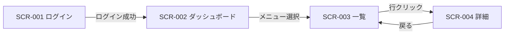
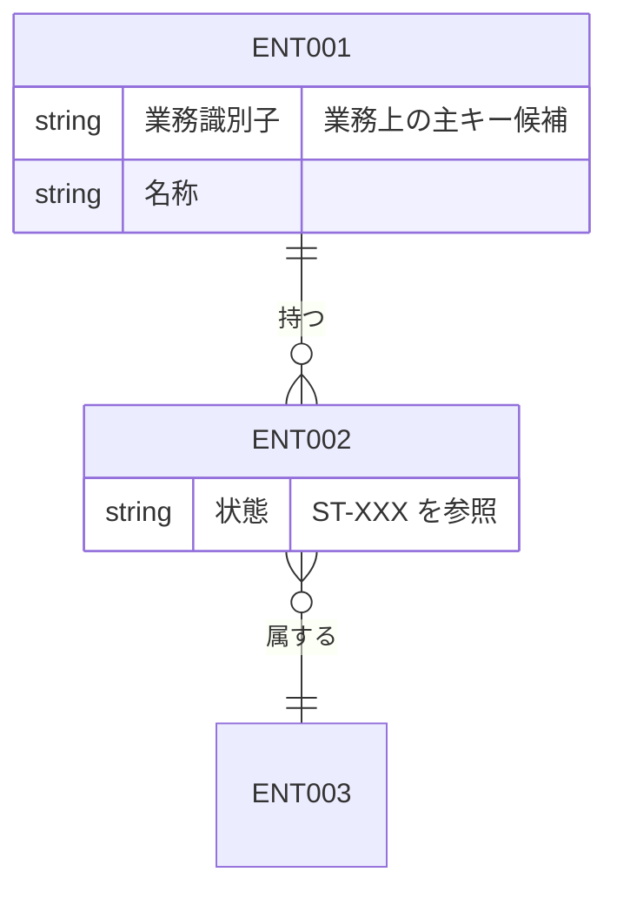
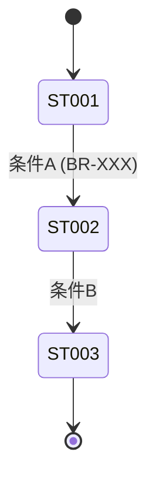

## 画面一覧.md

```markdown
# 画面一覧と画面遷移

## 画面一覧

| 画面 ID | 画面名 | 目的 | 主要遷移元 | 主要遷移先 | 認証 |
|--------|------|------|----------|----------|------|
| SCR-001 |      |      |          |          | 要/不要 |
| SCR-002 |      |      |          |          | 要/不要 |

> サブ画面・モーダルは `SCR-001-01` のように枝番で表現する。

## 画面遷移図



## 画面ごとの目的・主要操作

### SCR-001 ログイン画面

- 目的:
- 主要操作:
- 表示する主要情報:
- 関連機能要件:
```

---

## データモデル.md

> 必須成果物。要件フェーズでは **概念データモデル**（論理エンティティと関係）と、ステータスを持つエンティティの **状態遷移** を定義する。物理テーブル設計（カラム型・PK/FK・インデックス）は後続の design-from-requirements の責務であり、ここでは扱わない。

```markdown
# データモデル（概念モデル）

## ID 凡例

| ID 体系 | 形式例 | 用途 |
|---------|-------|------|
| `ENT-XXX` | `ENT-001` | 概念エンティティ ID（3 桁ゼロ埋め） |
| `ST-XXX` | `ST-001` | エンティティ状態 ID（3 桁ゼロ埋め） |

> 物理テーブル ID は設計フェーズで別途採番する（本ファイルでは扱わない）。

## 1. 主要エンティティ一覧

| ENT ID | エンティティ名 | 概要 | 主要属性（業務観点） | 関連機能 / UC | 関連業務ルール |
|--------|------------|------|----------------|-------------|------------|
| ENT-001 |            |      |                |             |            |

## 2. 概念 ER 図

> 業務観点での「もの」と「関係」を 1 枚に図示する。多重度（1:1 / 1:N / N:M）と必須/任意は明記する。
> 物理キー・データ型・カラム名はここでは書かない（設計フェーズで決める）。



## 3. エンティティ状態と状態遷移

> ステータスを持つエンティティ（例: 案件・応募・契約 等）について、状態と遷移ルールを記述する。状態には ST-XXX を採番し、遷移条件は関連業務ルール（BR-XXX）から引用する。
> 状態を持たないエンティティについては本章を省略してよい。

### ENT-002 [エンティティ名] の状態遷移

| ST ID | 状態名 | 説明 | 遷移先（ST-XXX） | 遷移条件（BR-XXX 等） |
|-------|------|------|------------------|--------------------|
| ST-001 |      |      |                  |                    |



## 4. データ保持・スナップショット方針

| 対象エンティティ（ENT-XXX） | 保持期間 | スナップショット要否 | 関連業務ルール |
|---------------------------|---------|-------------------|------------|
|                           |         |                   |            |

## 5. 開かれた論点

> 業務上未決のエンティティ・関係・状態について、`オープン課題.md` の `Q-DM*` 系へ逃がす。本表は索引として残す。

| # | 論点 | 影響範囲（ENT-XXX / 機能） | 対応する Q-ID |
|---|------|------------------------|--------------|
|   |      |                        |              |
```
