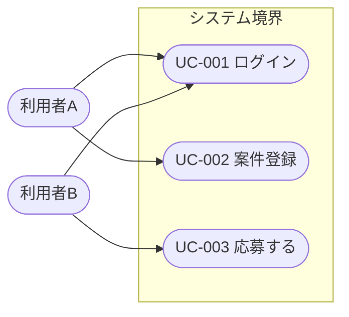
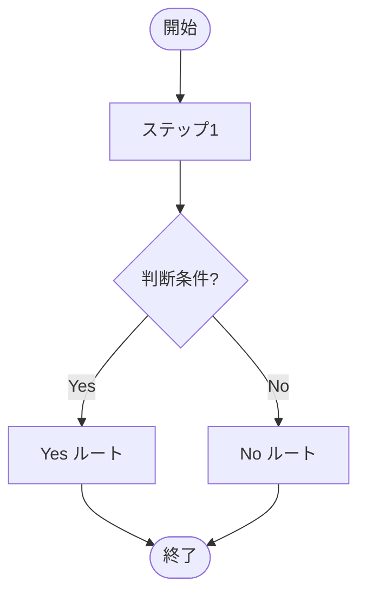

## ユースケース図.md

> 必須成果物。**全アクター × 全ユースケースの俯瞰** を 1 枚にまとめる。Mermaid は `flowchart` を使い、システム境界は `subgraph` で囲む。各ユースケースには UC-XXX を採番し、本ドキュメント以外（`概要.md` の主要ユースケース表、`functional/[機能名].md` の関連ユースケース欄、`activities/[フロー名].md` の関連ユースケース欄）からは同じ ID で引用する。

```markdown
# ユースケース図

## ID 凡例

| ID 体系 | 形式例 | 用途 |
|---------|-------|------|
| `UC-XXX` | `UC-001` | ユースケース ID（3 桁ゼロ埋め） |

> アクター名やシステム境界名で略号を使う場合は、本ファイル内に凡例を追加する。

## アクター一覧

| アクター | 種別（人/外部システム） | 説明 |
|---------|------------------|------|
|         |                  |      |

## ユースケース図



> `include` / `extend` は破線矢印 + ラベル（例: `UC002 -. include .-> UC010`）で表現する。

## ユースケース一覧

| UC ID | ユースケース名 | 主アクター | 関連機能 | 関連業務フロー（ACT-XXX） | 概要 |
|-------|------------|----------|---------|------------------------|------|
| UC-001 |            |          |         |                        |      |
```

---

## activities/[フロー名].md

> 必須成果物（業務プロセスに分岐や複数アクター間の引き継ぎが存在する場合）。**業務フロー単位** に 1 ファイル作成する。ファイル名は業務用語の日本語名（例: `案件成約フロー.md`、`評価完了フロー.md`）。Mermaid は `flowchart` を使い、判断ノードは `{ ... }` で表現する。

```markdown
# 業務アクティビティ: [フロー名]

## ID 凡例

| ID 体系 | 形式例 | 用途 |
|---------|-------|------|
| `ACT-XXX` | `ACT-001` | 業務アクティビティ ID（フロー単位、3 桁ゼロ埋め） |

## メタデータ

- アクティビティ ID:
- 主アクター:
- 関連ユースケース（UC-XXX）:
- 関連業務ルール（BR-XXX）:
- 関連受け入れ条件（AC-XXX）:
- トリガー（開始条件）:
- 終了条件（成功 / 失敗）:

## 業務フロー図



## ステップ詳細

| # | ステップ | 担当アクター | 入力 | 出力 | 関連 UC / BR / AC |
|---|--------|------------|------|------|------------------|
| 1 |        |            |      |      |                  |

## 例外フロー・代替フロー

- 例外1: （発生条件と分岐先）
- 代替1: （代替ルートの説明）
```
