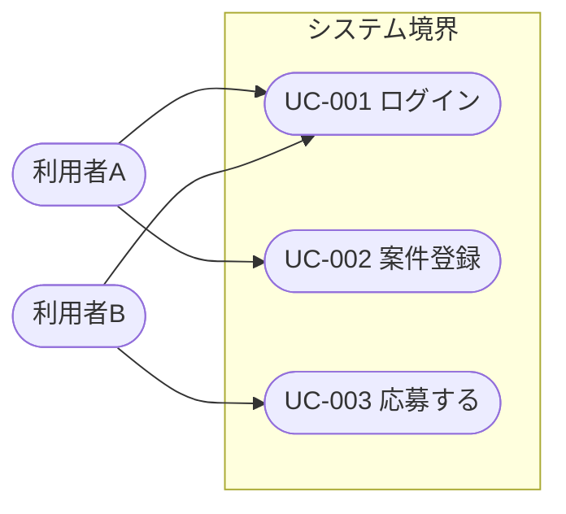
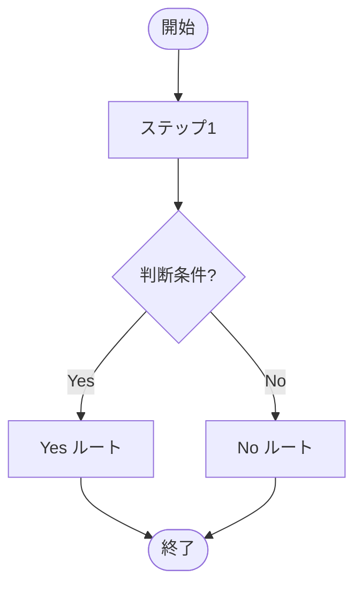
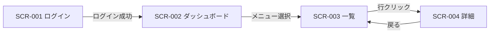
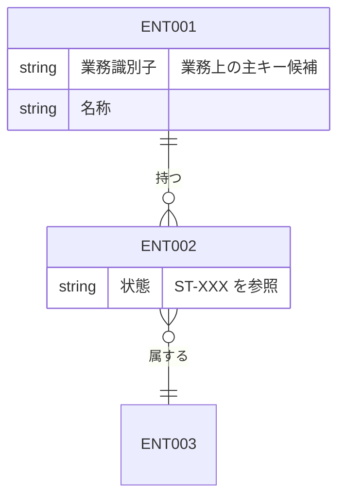
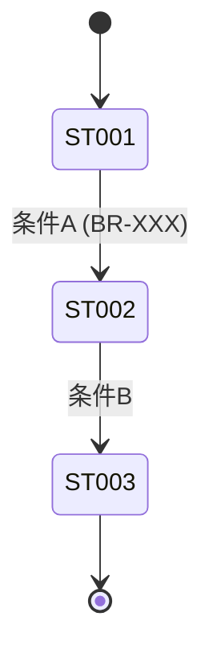

# 要件定義書テンプレート

要件定義書は以下のディレクトリ構成で出力する。各セクションのテンプレートを参照してファイルを作成すること。

```
docs/requirements/
├── 概要.md
├── 業務ルール.md
├── functional/
│   └── [機能名].md             # 機能ごとに 1 ファイル（業務用語の日本語名。例: アカウント登録.md, 仕事検索.md）
├── ユースケース図.md            # 全アクター × 全ユースケースの俯瞰図（UC-XXX 採番、Mermaid flowchart）
├── activities/
│   └── [フロー名].md            # 業務フローごとに 1 ファイル（ACT-XXX 採番、Mermaid flowchart。例: 案件成約フロー.md）
├── 画面一覧.md
├── データモデル.md              # 概念データモデル（ENT-XXX 採番、Mermaid erDiagram + 状態遷移）
├── 外部インターフェース一覧.md  # 外部 IF（メール送信・バッチ・外部システム連携、EXT-XXX 採番）
├── 移行要件.md                  # 初期データ・マスタデータ・データ移行方針（MIG-XXX 採番）
├── 非機能要件.md
├── ブランドガイドライン.md          # ブランド/UI ガイドライン（後続の UI 設計で参照）
├── 用語集.md
└── オープン課題.md
```

ファイル名は固定部・可変部とも日本語名で統一する。可変部（`functional/[機能名].md` の `[機能名]` 部分）は業務用語の日本語名とする（例: `アカウント登録.md`, `仕事検索.md`）。本文はすべて日本語で記述する。

### 略号・ID 採用時の凡例必須ルール

CLAUDE.md の開発ルールに従い、各ドキュメントで **ID または略号を導入する場合は、当該ドキュメントの冒頭付近に凡例（略号一覧表）を必ず出力する**。本テンプレートで採用している既知の ID 体系は以下のとおりで、ドキュメントごとに自ドキュメント内で参照される範囲を凡例化する。

| ID / 略号体系 | 形式例 | 用途 | 出力先（凡例を必ず置くファイル） |
|--------------|-------|------|------------------------------|
| `SCR-XXX` | `SCR-001`、サブ画面は `SCR-001-01` | 画面 ID（要件・設計・テスト全体で同じ ID を使用） | `画面一覧.md` |
| `UC-XXX` | `UC-001` | ユースケース ID（要件・設計・テスト全体で同じ ID を使用） | `ユースケース図.md` |
| `ACT-XXX` | `ACT-001` | 業務アクティビティ（業務フロー）ID。要件フェーズでフロー単位に採番し、設計のシーケンスや受け入れ条件と紐付ける | `activities/[フロー名].md` 各ファイル冒頭 |
| `AC-XXX` | `AC-001` / `AC-101` / `AC-201` / `AC-301` | 受け入れ条件 ID（正常系=001番台、異常系=101番台 等の区分は各機能ファイルで明示） | `functional/[機能名].md` 各ファイル |
| `BR-XXX` | `BR-001` | 業務ルール ID | `業務ルール.md` |
| `ENT-XXX` | `ENT-001` | 概念エンティティ ID（要件フェーズの論理データモデル単位、3 桁ゼロ埋め）。設計フェーズの物理テーブル ID とは独立。 | `データモデル.md` |
| `ST-XXX` | `ST-001` | エンティティ状態 ID（ステータスを持つエンティティの状態名に採番、3 桁ゼロ埋め）。状態遷移図および業務ルールから引用される。 | `データモデル.md` |
| `EXT-XXX` | `EXT-001` | 外部インターフェース ID（メール送信・バッチ・外部システム連携など、要件フェーズで識別される外部 IF 単位、3 桁ゼロ埋め） | `外部インターフェース一覧.md` |
| `MIG-XXX` | `MIG-001` | 移行要件 ID（初期データ・マスタデータ投入・既存データ移行の各単位、3 桁ゼロ埋め） | `移行要件.md` |
| `Q-{機能カテゴリ略号}{連番}` | `Q-A1`、`Q-NF1`、`Q-BR1` 等 | オープン課題 ID。`{機能カテゴリ略号}` は機能ごとに 1〜3 文字を採番（例: A=アカウント登録、NF=非機能、BR=ブランドガイドライン、DM=データモデル、EI=外部インターフェース、MIG=移行） | `オープン課題.md`（必ず冒頭に **機能カテゴリ略号 → 正式名称** の凡例表を含める） |

新規に略号や ID 体系を追加する場合は、対応する凡例表に行を追加する。略号を導入したのに凡例が無い状態は `/review-requirements` で検出される。

---

## 概要.md

```markdown
# 要件サマリー

## 1. 背景と目的

## 2. スコープ

### 対象

### 対象外（やらないこと）

## 3. 主要ステークホルダと利用者像

| 区分 | 役割 | 主要な関心事 |
|------|------|------------|
|      |      |            |

## 4. 主要ユースケース（概要）

> 全体俯瞰のユースケース図は `ユースケース図.md` を参照。本表ではユースケース ID（UC-XXX）と概要のみを掲載する。

| UC ID | ユースケース名 | 利用者 | 概要 | 関連業務フロー（ACT-XXX） |
|-------|------------|------|------|------------------------|
| UC-001 |            |      |      |                        |

## 5. 前提条件

## 6. リスク・制約

## 7. 後続工程

- [ ] 人手レビュー・採択
- [ ] /design-from-requirements の起動
```

---

## 業務ルール.md

```markdown
# 業務ルール

## ルール一覧

| ルール ID | ルール名 | 概要 | 関連機能 |
|---------|--------|------|---------|
| BR-001  |        |      |         |

## ルール詳細

### BR-001: [ルール名]

- **条件**: （いつ・どのような状態のとき）
- **結果**: （何が起こる / 何をしなければならない）
- **例外**: （例外的に許容される条件、または例外時の挙動）
- **メッセージ**: （ユーザーへ提示するメッセージがあれば）

## 制約事項

| # | 制約 | 影響範囲 |
|---|------|--------|
|   |      |        |
```

---

## functional/[機能名].md

```markdown
# 機能要件: [機能名]

## 機能概要

- 機能 ID:
- 利用者:
- 目的:
- 関連画面（画面 ID）:
- 関連ユースケース（UC-XXX、`ユースケース図.md` を参照）:
- 関連業務フロー（ACT-XXX、`activities/[フロー名].md` を参照）:
- 関連業務ルール:

## ユーザーストーリー

> [利用者] として、[行動] したい。なぜなら [目的] だから。

## 入力（ユーザーが与える情報）

| 項目名 | 型 / 形式 | 必須 | 取りうる値 | 説明 |
|-------|---------|------|----------|------|
|       |         |      |          |      |

## 出力（システムが返す情報）

| 項目名 | 型 / 形式 | 説明 |
|-------|---------|------|
|       |         |      |

## 受け入れ条件

> 受け入れ条件は実行可能な単位で記述する。後続の単体テスト・E2E が「受け入れ条件 → 実行可能テスト」の対応を取れる粒度まで分解すること。

### 正常系

- [ ] AC-001: Given [前提] / When [操作] / Then [期待結果]

### 異常系

- [ ] AC-101: Given [前提] / When [操作] / Then [期待結果（エラー表示等）]

### 境界値・特殊条件

- [ ] AC-201: [境界値や特殊条件の振る舞い]

### 権限境界（該当する場合）

- [ ] AC-301: [認可・権限による差分挙動]

## 関連未解決事項

| # | 内容 | 影響 |
|---|------|------|
|   |      |      |
```

---

## ユースケース図.md

> 必須成果物。**全アクター × 全ユースケースの俯瞰** を 1 枚にまとめる。Mermaid は `flowchart` を使い、システム境界は `subgraph` で囲む。各ユースケースには UC-XXX を採番し、本ドキュメント以外（`概要.md` の主要ユースケース表、`functional/[機能名].md` の関連ユースケース欄、`activities/[フロー名].md` の関連ユースケース欄）からは同じ ID で引用する。

```markdown
# ユースケース図

## ID 凡例

| ID 体系 | 形式例 | 用途 |
|---------|-------|------|
| `UC-XXX` | `UC-001` | ユースケース ID（3 桁ゼロ埋め） |

> アクター名やシステム境界名で略号を使う場合は、本ファイル内に凡例を追加する。

## アクター一覧

| アクター | 種別（人/外部システム） | 説明 |
|---------|------------------|------|
|         |                  |      |

## ユースケース図



> `include` / `extend` は破線矢印 + ラベル（例: `UC002 -. include .-> UC010`）で表現する。

## ユースケース一覧

| UC ID | ユースケース名 | 主アクター | 関連機能 | 関連業務フロー（ACT-XXX） | 概要 |
|-------|------------|----------|---------|------------------------|------|
| UC-001 |            |          |         |                        |      |
```

---

## activities/[フロー名].md

> 必須成果物（業務プロセスに分岐や複数アクター間の引き継ぎが存在する場合）。**業務フロー単位** に 1 ファイル作成する。ファイル名は業務用語の日本語名（例: `案件成約フロー.md`、`評価完了フロー.md`）。Mermaid は `flowchart` を使い、判断ノードは `{ ... }` で表現する。

```markdown
# 業務アクティビティ: [フロー名]

## ID 凡例

| ID 体系 | 形式例 | 用途 |
|---------|-------|------|
| `ACT-XXX` | `ACT-001` | 業務アクティビティ ID（フロー単位、3 桁ゼロ埋め） |

## メタデータ

- アクティビティ ID:
- 主アクター:
- 関連ユースケース（UC-XXX）:
- 関連業務ルール（BR-XXX）:
- 関連受け入れ条件（AC-XXX）:
- トリガー（開始条件）:
- 終了条件（成功 / 失敗）:

## 業務フロー図



## ステップ詳細

| # | ステップ | 担当アクター | 入力 | 出力 | 関連 UC / BR / AC |
|---|--------|------------|------|------|------------------|
| 1 |        |            |      |      |                  |

## 例外フロー・代替フロー

- 例外1: （発生条件と分岐先）
- 代替1: （代替ルートの説明）
```

---

## 画面一覧.md

```markdown
# 画面一覧と画面遷移

## 画面一覧

| 画面 ID | 画面名 | 目的 | 主要遷移元 | 主要遷移先 | 認証 |
|--------|------|------|----------|----------|------|
| SCR-001 |      |      |          |          | 要/不要 |
| SCR-002 |      |      |          |          | 要/不要 |

> サブ画面・モーダルは `SCR-001-01` のように枝番で表現する。

## 画面遷移図



## 画面ごとの目的・主要操作

### SCR-001 ログイン画面

- 目的:
- 主要操作:
- 表示する主要情報:
- 関連機能要件:
```

---

## データモデル.md

> 必須成果物。要件フェーズでは **概念データモデル**（論理エンティティと関係）と、ステータスを持つエンティティの **状態遷移** を定義する。物理テーブル設計（カラム型・PK/FK・インデックス）は後続の design-from-requirements の責務であり、ここでは扱わない。

```markdown
# データモデル（概念モデル）

## ID 凡例

| ID 体系 | 形式例 | 用途 |
|---------|-------|------|
| `ENT-XXX` | `ENT-001` | 概念エンティティ ID（3 桁ゼロ埋め） |
| `ST-XXX` | `ST-001` | エンティティ状態 ID（3 桁ゼロ埋め） |

> 物理テーブル ID は設計フェーズで別途採番する（本ファイルでは扱わない）。

## 1. 主要エンティティ一覧

| ENT ID | エンティティ名 | 概要 | 主要属性（業務観点） | 関連機能 / UC | 関連業務ルール |
|--------|------------|------|----------------|-------------|------------|
| ENT-001 |            |      |                |             |            |

## 2. 概念 ER 図

> 業務観点での「もの」と「関係」を 1 枚に図示する。多重度（1:1 / 1:N / N:M）と必須/任意は明記する。
> 物理キー・データ型・カラム名はここでは書かない（設計フェーズで決める）。



## 3. エンティティ状態と状態遷移

> ステータスを持つエンティティ（例: 案件・応募・契約 等）について、状態と遷移ルールを記述する。状態には ST-XXX を採番し、遷移条件は関連業務ルール（BR-XXX）から引用する。
> 状態を持たないエンティティについては本章を省略してよい。

### ENT-002 [エンティティ名] の状態遷移

| ST ID | 状態名 | 説明 | 遷移先（ST-XXX） | 遷移条件（BR-XXX 等） |
|-------|------|------|------------------|--------------------|
| ST-001 |      |      |                  |                    |



## 4. データ保持・スナップショット方針

| 対象エンティティ（ENT-XXX） | 保持期間 | スナップショット要否 | 関連業務ルール |
|---------------------------|---------|-------------------|------------|
|                           |         |                   |            |

## 5. 開かれた論点

> 業務上未決のエンティティ・関係・状態について、`オープン課題.md` の `Q-DM*` 系へ逃がす。本表は索引として残す。

| # | 論点 | 影響範囲（ENT-XXX / 機能） | 対応する Q-ID |
|---|------|------------------------|--------------|
|   |      |                        |              |
```

---

## 外部インターフェース一覧.md

> 必須成果物。本システムが連携する **外部 IF**（メール送信、バッチ起動、外部システム API 連携、ファイル授受 等）を要件レベルで列挙する。**送信先・データ・トリガ・冪等性要件・障害時挙動** までを業務観点で記述し、プロトコル詳細（SMTP 設定値・OAuth フロー等）は設計フェーズに委ねる。

```markdown
# 外部インターフェース一覧

## ID 凡例

| ID 体系 | 形式例 | 用途 |
|---------|-------|------|
| `EXT-XXX` | `EXT-001` | 外部インターフェース ID（3 桁ゼロ埋め） |

## 1. 外部 IF 一覧

| EXT ID | IF 名 | 種別 | 方向 | 連携相手 | トリガ（起動条件） | 関連 UC / BR | 第 1 版での要否 |
|--------|------|------|------|---------|----------------|-------------|--------------|
| EXT-001 |     | メール送信 / バッチ / 外部 API / ファイル | 送信 / 受信 / 双方向 |          |                |             | 必須 / 任意 / 対象外 |

## 2. メール送信 IF（該当する場合）

| EXT ID | 用途（パスワードリセット / 通知 等） | 宛先 | テンプレ名 | 必須項目 | 失敗時挙動 | 関連 BR |
|--------|--------------------------------|------|----------|----------|------------|---------|
| EXT-001 |                                |      |          |          |            |         |

## 3. バッチ IF（該当する場合）

| EXT ID | バッチ名 | 起動契機（cron / 手動 / イベント） | 入力 | 出力 | 冪等性 | 失敗時挙動 | 関連 BR |
|--------|--------|--------------------------------|------|------|--------|------------|---------|
| EXT-010 |        |                                |      |      |        |            |         |

## 4. 外部システム連携 IF（該当する場合）

| EXT ID | 連携相手 | 連携内容 | 認証方式（業務観点） | リトライ方針 | 関連 BR |
|--------|---------|---------|--------------------|-------------|---------|
| EXT-020 |         |         |                    |             |         |

## 5. 対象外として明示する外部 IF

> 第 1 版では実装しないが、将来検討対象として要件素材に登場した外部 IF（SSO、決済、Push 通知 等）を明示しておく。

| # | 対象外とする IF | 理由 | 将来検討の有無 |
|---|----------------|------|--------------|
|   |                |      |              |

## 6. 開かれた論点

> 詳細仕様未決の項目は `オープン課題.md` の `Q-EI*` 系に逃がす。

| # | 論点 | 影響 EXT ID | 対応する Q-ID |
|---|------|-----------|--------------|
|   |      |           |              |
```

---

## 移行要件.md

> 必須成果物。第 1 版稼働時に投入する初期データ・マスタデータ、および既存データの移行があればその要件を記述する。**第 1 版で移行が無いと判断する場合も「移行なし」と明示**し、根拠を残す。

```markdown
# 移行要件

## ID 凡例

| ID 体系 | 形式例 | 用途 |
|---------|-------|------|
| `MIG-XXX` | `MIG-001` | 移行要件 ID（3 桁ゼロ埋め） |

## 1. 移行方針サマリ

- 移行の有無（あり / なし）:
- 移行の種別（初期データ投入 / マスタデータ投入 / 既存データ移行）:
- 移行のタイミング（リリース前 / リリース時 / リリース後）:
- 移行の責任主体（業務 / 開発 / 運用）:

## 2. 移行対象一覧

| MIG ID | 対象データ | 種別 | 件数規模（想定） | 投入タイミング | 投入方法（業務観点） | 関連 ENT-XXX |
|--------|----------|------|---------------|--------------|--------------------|------------|
| MIG-001 |          | 初期データ / マスタ / 既存移行 |               |              |                    |            |

## 3. 投入手順・検証要件

| MIG ID | 投入手順の概要 | 完了判定基準 | リハーサル要否 | 切り戻し方針 |
|--------|--------------|------------|-------------|------------|
| MIG-001 |              |            |             |            |

## 4. 第 1 版で対象外とする移行

> 将来取り込み候補・他システム連携で発生する可能性がある移行のうち、第 1 版では対象外とするものを明示する。

| # | 対象外とする移行 | 理由 | 将来検討の有無 |
|---|----------------|------|--------------|
|   |                |      |              |

## 5. 開かれた論点

> 移行範囲・件数規模・投入手順が確定していない項目は `オープン課題.md` の `Q-MIG*` 系に逃がす。

| # | 論点 | 影響 MIG ID | 対応する Q-ID |
|---|------|-----------|--------------|
|   |      |           |              |
```

---

## 非機能要件.md

> 非機能要件のうち **以下のベースライン項目は設計着手前にクローズ必須**（空欄 / 「TBD」 / 「オープン課題」のままで設計に進ませない）:
> - セキュリティ: パスワードポリシー、セッション有効時間、通信暗号化（HTTPS 要否）
> - アクセシビリティ・ブラウザ: 対象ブラウザ、対象デバイス（PC / モバイル / タブレット）
> - 運用: バックアップ最低頻度、障害検知・通知方法、稼働時間帯
>
> 未確定の項目は本ファイルに「TBD」のまま残さず、`オープン課題.md` の `Q-NF*` へ逃がして本ファイルからは参照する。

```markdown
# 非機能要件

## 性能

| 項目 | 要件 | 備考 |
|------|------|------|
| 想定同時アクセス数 |  |  |
| 想定データ規模（主要エンティティの件数） |  | データモデル.md の ENT-XXX 単位で記述 |
| 主要画面の応答時間 |  |  |
| バッチの実行時間枠 |  | 該当バッチは 外部インターフェース一覧.md の EXT-XXX を参照 |

## 可用性

| 項目 | 要件 |
|------|------|
| 稼働時間帯 |  |
| 計画停止 |  |
| 目標稼働率 |  |
| RTO（目標復旧時間） |  |
| RPO（目標復旧時点） |  |

## セキュリティ

| 項目 | 要件 |
|------|------|
| 認証方式 |  |
| 認可ポリシー |  |
| パスワードポリシー（最小桁数 / 文字種 / 有効期間 / ロックアウト） |  |
| セッション管理（有効時間 / 同時ログイン制御） |  |
| 通信暗号化（HTTPS 必須性 / 証明書運用） |  |
| CSRF / XSS 対策方針 |  |
| PII（個人情報）取り扱い方針 |  |

## ログ・監査

| 項目 | 要件 |
|------|------|
| 監査対象操作 |  |
| ログ保管期間 |  |
| アプリケーションログレベル方針 |  |
| 集計指標（取得する KPI 一覧） |  |

## 運用・障害対応

| 項目 | 要件 |
|------|------|
| バックアップ（対象データ / 頻度 / 世代数） |  |
| 障害検知方法 |  |
| 障害通知方法（宛先 / チャネル） |  |
| 問い合わせ受付方法 |  |
| 計画停止時の周知方法 |  |

## アクセシビリティ・ブラウザ要件

| 項目 | 要件 |
|------|------|
| 対象ブラウザ |  |
| 対象デバイス（PC / モバイル / タブレット） |  |
| アクセシビリティ準拠レベル（WCAG 2.x 等） |  |
| キーボード操作要件 |  |
| スクリーンリーダー対応要件 |  |

## データ保持

| 項目 | 要件 |
|------|------|
| 取引データの保持期間 |  |
| 論理削除データの物理削除タイミング |  |
| ログ・監査記録の保持期間 |  |

> 関連バッチ（物理削除バッチ等）は `外部インターフェース一覧.md` の EXT-XXX を参照する。
```

---

## ブランドガイドライン.md

> 任意成果物。UI デザイン（後続の Claude Design への投入）で参照するため、
> 既知のブランド方針・トーン・想定デバイス・想定ユーザー像をここに集約する。
> 不明な項目は無理に埋めず `オープン課題.md` に逃がす。

```markdown
# ブランド / UI ガイドライン

## 1. ブランド方針

- ブランドの位置付け / 想起させたい印象:
- トーン & ボイス（例: 落ち着いた／親しみやすい／プロフェッショナル）:
- 競合・参考事例（任意）:

## 2. ペルソナ / 想定ユーザー

| ペルソナ | 役割 | 利用シーン | 主要デバイス | リテラシー |
|---------|------|----------|------------|-----------|
|         |      |          |            |           |

## 3. 想定デバイスとレスポンシブ方針

| デバイス | 優先度 | 想定解像度 | 備考 |
|---------|-------|----------|------|
| デスクトップ |  |  |  |
| タブレット |  |  |  |
| モバイル   |  |  |  |

- レスポンシブ戦略（モバイルファースト / デスクトップファースト 等）:

## 4. ビジュアルガイドライン（既知の範囲のみ）

- 主要カラー（プライマリ / セカンダリ / アクセント / 警告）:
- 背景・テキストのコントラスト方針:
- フォントファミリ / ウェイト:
- 角丸・余白・グリッドの基本ルール（あれば）:

## 5. コンポーネント・パターン方針

- 既存デザインシステム / UI ライブラリ（例: Material UI、社内 DS、未定）:
- 採用するコンポーネント命名規約（あれば）:
- 共通コンポーネントとして切り出したい要素（例: AppHeader, DataTable）:

## 6. アクセシビリティ要件

- 準拠レベル（WCAG 2.x AA など）:
- キーボード操作要件:
- スクリーンリーダー対応要件:
- カラーコントラスト最低比:

## 7. 多言語 / ローカライズ方針（該当する場合）

| 項目 | 要件 |
|------|------|
| 対応言語 |  |
| 文字長変動の許容 |  |
| 日付・通貨フォーマット |  |

## 8. 禁止事項・制約

- 使ってはいけない表現・色・パターン:
- 法務 / コンプライアンス上の制約:
```

---

## 用語集.md

```markdown
# 用語集

| 用語 | 英語表記 | 定義 |
|------|--------|------|
|      |        |      |
```

---

## オープン課題.md

オープン課題 ID は `Q-{機能カテゴリ略号}{連番}` 形式（例: `Q-A1`, `Q-NF1`, `Q-BR1`）。**冒頭に必ず機能カテゴリ略号の凡例表を出力する**（CLAUDE.md「略号には凡例を明記」ルール）。番号を欠番にする場合は冒頭注記で理由を明示する。

```markdown
# 未解決事項・確認待ち事項

## 機能カテゴリ略号の凡例

> 課題 ID `Q-{略号}{連番}` の `{略号}` は以下の機能カテゴリを指す。本ドキュメントに登場する略号はすべてここに掲載すること（新規追加時は本表も更新）。

| 略号 | 対応する機能カテゴリ（正式名称） | 補足 |
|------|------------------------------|------|
| A    | アカウント登録                 |      |
| NF   | 非機能                         |      |
| BR   | ブランドガイドライン           |      |
| DM   | データモデル                   |      |
| EI   | 外部インターフェース           |      |
| MIG  | 移行                           |      |
| ...  | ...                            |      |

> 欠番がある場合はここに注記する（例: 「Q-U2 / Q-AU2 は Q-A2 に統合済みのため欠番」）。

## クローズ運用ルール

> オープン課題は要件定義書として「open のまま設計フェーズに送り込んでよい課題」と「クローズしないと設計に進めない課題」を区別する。判定と運用は以下に従う。

### 設計着手前にクローズ必須の課題区分

以下のいずれかに該当する課題は、`/design-loop` を起動する前に必ず closed にする（または「対象外」として明示クローズする）。

| 区分 | 該当する Q-ID プレフィックス例 | クローズが必須な理由 |
|------|----------------------------|--------------------|
| パスワードポリシー・セッション・通信暗号化 | `Q-NF*`（セキュリティ系） | 認証認可・セッション管理の物理設計に直結 |
| 対象ブラウザ・対象デバイス | `Q-NF*`（クライアント環境系） | フロントエンド設計・E2E テスト戦略に直結 |
| バックアップ・障害検知・稼働時間 | `Q-NF*`（運用系） | 運用基盤・バッチ設計に直結 |
| 主要エンティティ・状態定義・スナップショット方針 | `Q-DM*` | 物理 DB 設計・状態遷移 API 設計に直結 |
| メール送信・バッチ・外部連携 | `Q-EI*` | 外部 IF 設計・実装計画に直結 |
| 初期データ・マスタデータ・移行範囲 | `Q-MIG*` | 投入手順・テストデータ設計に直結 |
| 主要業務ルール（金額単位・物品種別・状態遷移境界条件 等） | `Q-J*` `Q-B*` 等 | 業務ロジック実装・受け入れ条件確定に直結 |

### 設計フェーズへ持ち越して良い課題区分

- 細部の文言・メッセージ表記
- UI 細部の見栄え（ブランド方針確定後で設計時に詰めるもの）
- 将来拡張候補（第 1 版対象外と明示済みのもの）

### クローズ手順

1. 課題ごとに **確認先（業務 / セキュリティ / 法務 / UI / 運用）** を明示する。
2. クローズには **確認先の承認結果（合意事項・対象外判断のいずれか）** を「決定内容」列に記録する。
3. 状態を `open` → `closed` に変更し、`closed 日` と `決定者` を残す。
4. クローズ内容が本文側のドキュメント（業務ルール / 非機能要件 / データモデル / 外部 IF / 移行要件 等）に反映されていることを確認する。
5. 設計着手前に「設計着手前にクローズ必須の課題区分」が全て closed であることをチェックする。

## 課題一覧

| # | Q-ID | 事項 | 影響範囲（機能/画面/IF/DB） | 確認先 | 期限 | 状態 | 決定内容 | closed 日 | 決定者 |
|---|------|------|------------------------|------|------|------|---------|---------|--------|
|   |      |      |                        |      |      | open / closed |         |         |        |
```
