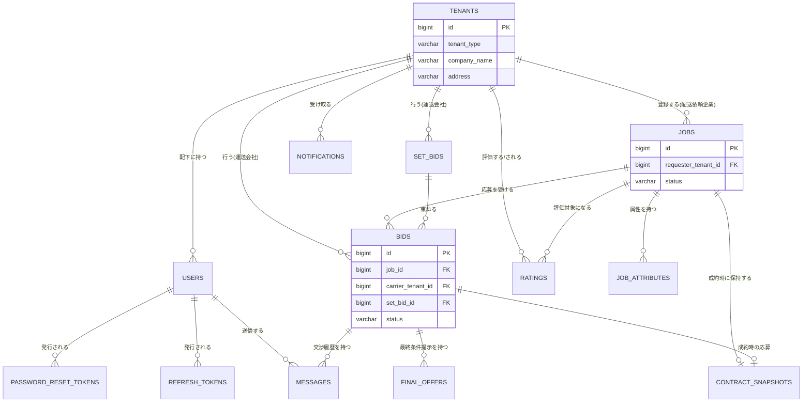

# DB 設計（全体方針）

> ID 凡例: [docs/凡例.md](../凡例.md) 参照

## 全体方針

- 想定 RDB: PostgreSQL 16（`claude-poc-backend/.claude/rules/backend-00-stack.md` #7 参照。バージョン等の技術詳細は同ファイルを正典とし本書では再掲しない）
- 文字コード / 照合順序: UTF-8（`en_US.UTF-8` 相当）。日本語ソートの厳密な照合順序要件は第 1 版では規定しない。
- タイムゾーン方針: 全 DATETIME 列は UTC で保存する。表示時に FE 側で `Asia/Tokyo` へ変換する（`非機能要件.md` の日本フォーマット要件はブランドガイドライン.md 7節を参照）。時刻取得はアプリ層で `Clock` 経由に統一する（セキュリティ設計.md 参照、監査可能性）。
- 命名規約: テーブル名・カラム名は snake_case 英語（複数形テーブル名）。インデックス名は `idx_<table>_<column(s)>`、外部キー制約名は `fk_<table>_<ref_table>`、一意制約名は `uq_<table>_<column(s)>`。
- 主キー: 全テーブル `id BIGINT` の単一サロゲートキー（AUTO INCREMENT / `GENERATED ALWAYS AS IDENTITY`）。
- 楽観ロック: 状態遷移・更新対象となる集約（tenants, users, jobs, bids, set_bids, final_offers）に `version` 列（`@Version`）を付与する。追記のみ（messages, ratings, contract_snapshots, notifications 等）は付与しない（各 `tables/*.md` の「排他制御」節に理由を明記）。
- テーブル物理生成: デモ期間は migration ツールを導入せず `ddl-auto` で運用する（`backend-00-stack.md` #8 の例外を正典とする。本設計書もこれに従う）。

## テーブル一覧

| テーブル名 | Entity クラス名 | 説明 | 詳細ファイル |
|----------|---------------|------|------------|
| tenants | Tenant | 企業アカウント（ENT-001） | `tables/tenants.md` |
| users | User | テナント配下ユーザー（ENT-002） | `tables/users.md` |
| password_reset_tokens | PasswordResetToken | パスワード再設定トークン（EXT-001） | `tables/password_reset_tokens.md` |
| refresh_tokens | RefreshToken | JWT リフレッシュトークン（セキュリティ設計.md） | `tables/refresh_tokens.md` |
| jobs | Job | 案件（ENT-003） | `tables/jobs.md` |
| job_attributes | JobAttributeEntry | 案件属性（複数選択、ENT-003 の属性） | `tables/job_attributes.md` |
| bids | Bid | 応募（ENT-004） | `tables/bids.md` |
| set_bids | SetBid | セット応募（ENT-005） | `tables/set_bids.md` |
| final_offers | FinalOffer | 最終条件提示（BR-012 の状態表現、設計新設） | `tables/final_offers.md` |
| messages | Message | 連絡メッセージ（ENT-006） | `tables/messages.md` |
| contract_snapshots | ContractSnapshot | 成約スナップショット（ENT-007） | `tables/contract_snapshots.md` |
| ratings | Rating | 評価（ENT-008） | `tables/ratings.md` |
| notifications | Notification | 通知（ENT-009、宛先粒度はテナント単位。概要.md「前提条件」参照） | `tables/notifications.md` |

## 全体 ER 図

## migration 方針

- ツール: なし（デモ期間限定・`ddl-auto` 運用。`backend-00-stack.md` #8 が正典）。本番移行時に Flyway 等の導入を再検討する。
- ファイル命名規約: 対象外（上記の通り migration ファイルは作成しない）。
- 既存データ移行方針: 移行対象データなし（要件 `移行要件.md` 参照）。マスタデータ（支払方法種別・物品種別等）の初期投入は `_common.yaml` の enum 値を初期データ投入スクリプト（アプリ起動時 or 専用データローダー）で登録する。DB 上はマスタテーブルを持たず enum（VARCHAR + アプリ層 enum）で表現する（第 1 版はマスタ件数が少なく変更頻度も低いため、マスタテーブル化は将来課題とする）。

## index 方針（全体ガイドライン）

| 観点 | 方針 |
|------|------|
| 主キー | 単一サロゲートキー（bigint） |
| 外部キー | 参照先カラムへ自動的に index を張る（PostgreSQL は明示的な追加 index 作成が必要な場合がある。各 `tables/*.md` の「インデックス」節で明示） |
| テナント境界検索 | `requester_tenant_id` / `carrier_tenant_id` 等のテナント境界カラムに複合 index を張り、全クエリ種別（SELECT/UPDATE/DELETE/COUNT）でテナントフィルタが効率的に効くようにする |
| 状態遷移検索 | `status` カラムに index（一覧のステータス絞り込みが頻出のため） |
| 一意制約 | 業務上の重複防止単位（例: `bids(job_id, carrier_tenant_id)`）に UNIQUE index を張り、DB レベルで二重防止を保証する（B-1/B-6 是正） |
