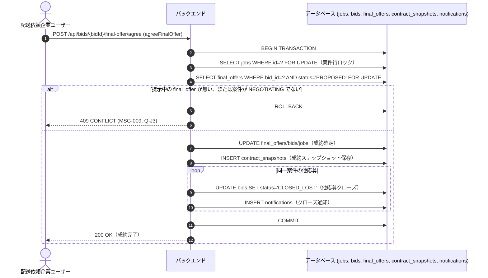

# 設計サマリー

> **このドキュメントの目的**: 設計の全体像を最初の30秒で把握するための入口。
> 元設計書: `docs/design/概要.md`, `方式設計.md`, `sequences/*.md`, `セキュリティ設計.md`

## 要約

配送依頼企業と運送会社をマッチングする Web アプリ。配送依頼企業が案件（積荷1件分の依頼）を登録し、運送会社が応募（単体・複数案件をまとめた「セット応募」）する。連絡・最終条件提示・合意を経て成約し、成約内容はスナップショットとして固定保存される。以後、運送開始・完了報告、双方の★評価登録、取引履歴の閲覧までを一気通貫でカバーする。第 1 版はテナント内「同権限のみ」でロール分離は行わない。

> **⚠️ スコープ外**: 決済機能、成約後のキャンセル/ペナルティ、ロール分離・承認フロー、二要素認証、リアルタイム Push 通知は第 1 版では設計しない（要件 `概要.md` の「対象外」節を踏襲）。

---

## アーキテクチャ

FE（React/Next.js）と BE（Spring Boot）を別リポジトリ・別デプロイ単位とし、OpenAPI 3.1（`docs/design/api/`）の REST API のみで結合する。BE は単一 Spring Boot アプリケーションのモジュラモノリス（マイクロサービス分割なし）。

```mermaid
flowchart LR
    subgraph Client["利用者端末（PCブラウザ）"]
        Browser["Webブラウザ (Chrome/Edge/Safari 直近2メジャーバージョン)"]
    end

    subgraph FE["フロントエンド (claude-poc-frontend)"]
        NextApp["Next.js App Router\n(SSR/CSR混在、認証前/認証後route group)"]
    end

    subgraph BE["バックエンド (claude-poc-backend)"]
        API["Spring Boot REST API\n(モジュラモノリス: auth/tenant/job/bid/deal/delivery/notification/query/shared)"]
        Batch["夜間バッチ (案件物理削除、EXT-010)"]
    end

    subgraph Data["データストア"]
        DB[("PostgreSQL 16")]
    end

    subgraph Mail["メール送信基盤"]
        SMTP["SMTP / メール送信サービス"]
    end

    Browser -->|HTTPS| NextApp
    NextApp -->|HTTPS REST (JWT Bearer)| API
    API -->|JDBC| DB
    Batch -->|JDBC| DB
    API -->|メール送信 (EXT-001)| SMTP
```

想定同時アクセス数は最大 100 ユーザー。水平スケーリング・オートスケールは第 1 版では必須としない（単一インスタンス構成前提）。

---

## 主要業務フロー

全 13 本のシーケンス（SEQ-001〜SEQ-013）を業務ドメイン別に一覧する。詳細図は各 `docs/design/sequences/*.md` を参照。

| SEQ-ID | シーケンス名 | 対応画面 | 対応 API（operationId） |
|--------|------------|---------|----------------------|
| SEQ-001 | ログイン | SCR-001, 共通ヘッダー | login, getCurrentUser, logout, refreshAccessToken |
| SEQ-002 | アカウント登録 | SCR-002, SCR-005 | registerTenant, createUser |
| SEQ-003 | パスワードリセット | SCR-003, SCR-004 | requestPasswordReset, resetPassword |
| SEQ-004 | 案件登録 | SCR-007, SCR-008 | createJob, listJobs |
| SEQ-005 | 応募 | SCR-014, SCR-015 | listJobs, createBid, updateBid |
| SEQ-006 | セット応募 | SCR-014, SCR-015, SCR-015-01 | createSetBid |
| SEQ-007 | 交渉合意成約（単体応募） | SCR-009, SCR-015 | createMessage, proposeFinalOffer, agreeFinalOffer, discardFinalOffer |
| SEQ-008 | セット応募一括合意 | SCR-009, SCR-009-01 | agreeSetBid |
| SEQ-009 | 運送ステータス報告 | SCR-009, SCR-015 | reportDeparture, reportCompletion, confirmCompletion |
| SEQ-010 | 評価登録 | SCR-010, SCR-017 | createRating, listRatingsForJob |
| SEQ-011 | 通知確認 | SCR-012, 共通ヘッダー | getUnreadNotificationCount, listNotifications, markNotificationRead, getJobById |
| SEQ-012 | 案件編集 | SCR-009 | updateJob |
| SEQ-013 | 案件削除 | SCR-009, SCR-008 | deleteJob |

### 中心フロー: SEQ-007 交渉合意成約（合意・成約処理の排他制御）

案件成約は競合頻度が高い操作であるため、悲観ロック（`SELECT ... FOR UPDATE`）で直列化する。



セット応募（SEQ-006/SEQ-008）は、対象案件群を **ID 昇順で一括ロック**することでデッドロックを防止する（`sequences/セット応募一括合意.md`）。

---

## セキュリティ方針サマリー

| 項目 | 方針 |
|------|------|
| 認証方式 | JWT（Bearer）。アクセストークン有効期限 30 分、リフレッシュトークン絶対有効期限 8 時間 |
| セッション | アイドル 30 分でタイムアウト、最大セッション長 8 時間。同時ログイン制御は行わない |
| ログイン失敗ロック | 連続 5 回失敗で 15 分間ロック |
| パスワードポリシー | 最小 8 文字以上、英字＋数字を各 1 文字以上含む |
| 認可方式 | `@PreAuthorize` に集約。テナント越境は 404、自テナント内の権限不足は 403 |
| CORS | FE デプロイ先オリジンのみ許可（ワイルドカード不使用） |
| CSRF | JWT Bearer 方式のため Cookie を用いず、Spring Security の CSRF 保護は無効化 |

詳細: `docs/design/セキュリティ設計.md`

---

## 前提となるリスクと対応方針

| # | リスク | 対応方針 |
|---|-------|---------|
| 1 | 応募枠上限（20社）・応募締切（from の2時間前）・成約処理は競合頻度が高く read-modify-write では二重許可・上限超過が起こり得る | 悲観ロック（`SELECT ... FOR UPDATE`）＋ DB 一意制約で保証 |
| 2 | セット応募の連鎖クローズは複数案件・複数応募を同一トランザクションで更新するためデッドロックのリスクがある | 対象案件群を ID 昇順で一括ロックする方針に統一 |
| 3 | 通知の宛先粒度をテナント単位とした設計判断は将来ロール分離導入時に見直しが必要 | Decision Log（`docs/process/decision-log.md`）へ記録を推奨 |
| 4 | デモ期間の `ddl-auto` 運用は本番移行時に Flyway 等への切り替えが必要 | `DB定義.md` migration 方針に解除条件を明記済み |

## レビュー観点（人手レビュー時に重点確認を推奨）

1. 通知の宛先粒度をテナント単位とした設計判断が業務要件と整合しているか。
2. テナント情報更新 API を第 1 版で設計しない判断が妥当か。
3. 応募枠・締切・成約処理の並行制御方針（悲観ロック＋一意制約）がパフォーマンス要件（最大同時アクセス100ユーザー）と両立するか。
4. テナント越境（404）／権限不足（403）の使い分けが全 operationId で一貫しているか。
