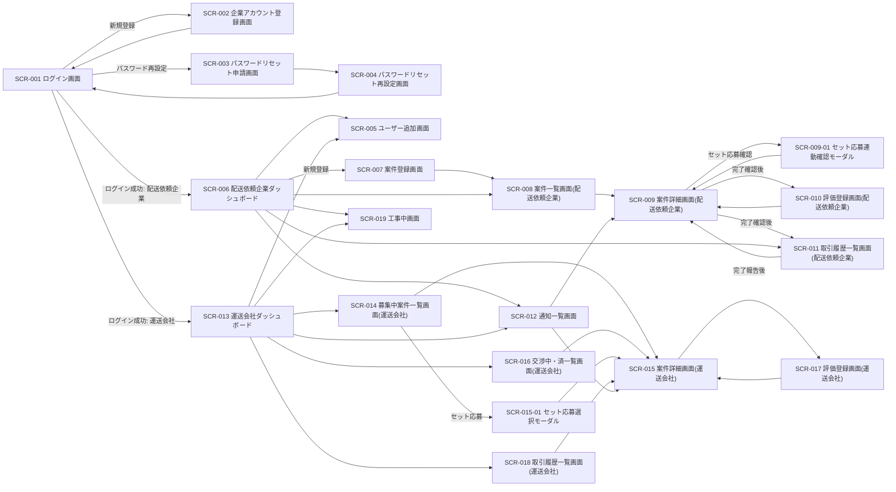
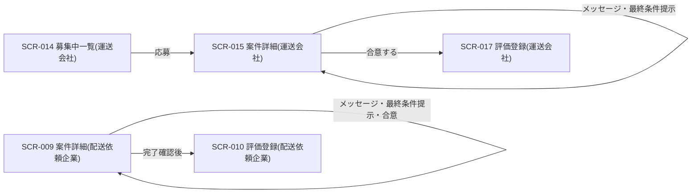
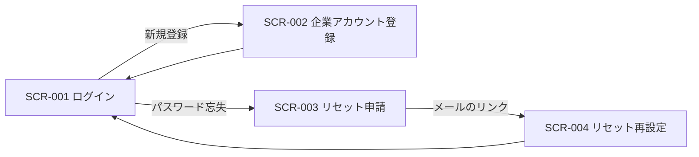

# 画面一覧と遷移

> 元設計書: `docs/design/screens/画面遷移.md`, `screens/共通レイアウト.md`, 各 `screens/SCR-*.md`

## 画面遷移図（全体）

### 案件成約フロー（ACT-001）中心の遷移

### 認証フロー

---

## 画面一覧

| 画面 ID | 画面名 | 目的（1行） | 認証 | 主要遷移先 |
|--------|------|-----------|------|----------|
| SCR-001 | ログイン | メールID+パスワードで認証 | 不要 | SCR-006 / SCR-013 |
| SCR-002 | 企業アカウント登録 | テナント＋初回ユーザーを新規登録 | 不要 | SCR-001 |
| SCR-003 | パスワードリセット申請 | 再設定メールの送信を申請 | 不要 | SCR-001 |
| SCR-004 | パスワードリセット再設定 | メールのリンクから新パスワード設定 | 不要（トークン） | SCR-001 / SCR-003 |
| SCR-005 | ユーザー追加 | 自テナント配下へユーザーを追加 | 要 | SCR-006 / SCR-013 |
| SCR-006 | 配送依頼企業ダッシュボード | ステータス別件数・通知のサマリ表示 | 要 | SCR-007, SCR-008, SCR-011, SCR-012 |
| SCR-007 | 案件登録 | 積荷案件を新規登録 | 要 | SCR-008 |
| SCR-008 | 案件一覧（配送依頼企業） | 自社案件を「募集中」「交渉中・済」で一覧 | 要 | SCR-009 |
| SCR-009 | 案件詳細（配送依頼企業） | 編集・削除・連絡・合意・完了確認 | 要 | SCR-009-01, SCR-010, SCR-008 |
| SCR-009-01 | セット応募連動確認モーダル | セット応募を一括承認（案件個別合意はしない） | 要 | SCR-009 |
| SCR-010 | 評価登録（配送依頼企業） | 完了案件の相手への★評価登録 | 要 | SCR-009 |
| SCR-011 | 取引履歴一覧（配送依頼企業） | 成約済〜評価済の履歴閲覧 | 要 | SCR-009 |
| SCR-012 | 通知一覧 | 通知の一覧・既読化 | 要 | SCR-009 / SCR-015 |
| SCR-013 | 運送会社ダッシュボード | 募集中案件サマリ・自社応募状況・通知 | 要 | SCR-014, SCR-016, SCR-018 |
| SCR-014 | 募集中案件一覧（運送会社） | 募集中案件の検索・応募・セット応募起動 | 要 | SCR-015, SCR-015-01 |
| SCR-015 | 案件詳細（運送会社） | 応募・編集・連絡・合意・運送報告 | 要 | SCR-015-01, SCR-017 |
| SCR-015-01 | セット応募選択モーダル | 複数案件をまとめてセット応募 | 要 | SCR-015 |
| SCR-016 | 交渉中・済一覧（運送会社） | 自社応募済み案件の一覧 | 要 | SCR-015 |
| SCR-017 | 評価登録（運送会社） | 完了案件の相手への★評価登録 | 要 | SCR-015 / SCR-018 |
| SCR-018 | 取引履歴一覧（運送会社） | 自社成約済〜評価済の履歴閲覧 | 要 | SCR-015 |
| SCR-019 | 工事中 | 未整備機能への簡易案内（問い合わせ導線） | 要 | 直前の画面 |

---

## ロール別アクセス可否

| 画面 ID | 配送依頼企業(REQUESTER) | 運送会社(CARRIER) | 備考 |
|--------|:---:|:---:|------|
| SCR-001〜004 | ○ | ○ | 未認証で到達（認証前独立レイアウト） |
| SCR-005 | ○ | ○ | 同権限のみのため全ロール共通（BR-003） |
| SCR-006〜011 | ○ | × | 配送依頼企業専用ダッシュボード配下 |
| SCR-012 | ○ | ○ | 通知一覧は両ロール共通 |
| SCR-013〜018 | × | ○ | 運送会社専用ダッシュボード配下 |
| SCR-019 | ○ | ○ | 全ロール共通表示 |

> SCR-014/SCR-015 の募集中案件情報自体は「全運送会社テナントに公開」される仕様であり、配送依頼企業からの参照導線は無い（権限マトリクス.md 5節）。
