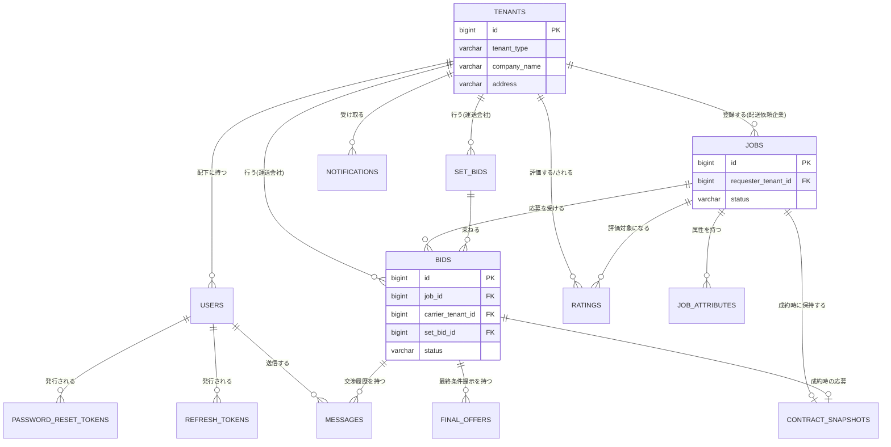
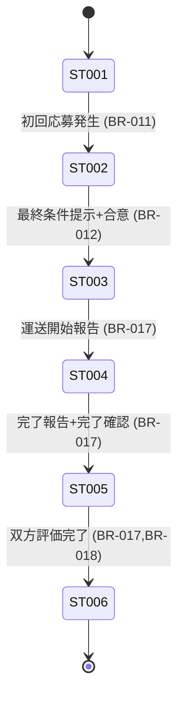
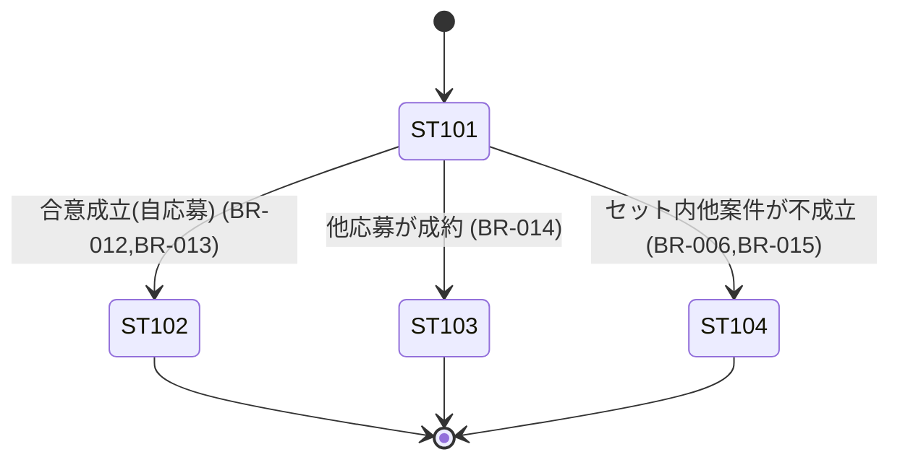

# データモデルサマリー

> 元設計書: `docs/design/DB定義.md`, `tables/*.md`, `docs/requirements/データモデル.md`
> RDB: PostgreSQL 16。主キーは全テーブル `id BIGINT` の単一サロゲートキー。命名は snake_case（複数形テーブル名）。

## 全体 ER 図

---

## テーブル一覧

| テーブル名 | Entity クラス | 概要 | 詳細ファイル |
|----------|-------------|------|------------|
| tenants | Tenant | 企業アカウント（配送依頼企業／運送会社共通、ENT-001） | `tables/tenants.md` |
| users | User | テナント配下のログイン単位ユーザー（ENT-002） | `tables/users.md` |
| password_reset_tokens | PasswordResetToken | パスワード再設定トークン（EXT-001） | `tables/password_reset_tokens.md` |
| refresh_tokens | RefreshToken | JWT リフレッシュトークン | `tables/refresh_tokens.md` |
| jobs | Job | 案件（積荷1件分の依頼、ENT-003） | `tables/jobs.md` |
| job_attributes | JobAttributeEntry | 案件の複数選択属性（危険物・要冷蔵等） | `tables/job_attributes.md` |
| bids | Bid | 運送会社による1案件への応募（ENT-004） | `tables/bids.md` |
| set_bids | SetBid | 複数応募を束ねるセット応募（ENT-005） | `tables/set_bids.md` |
| final_offers | FinalOffer | 最終条件提示の履歴（設計新設テーブル） | `tables/final_offers.md` |
| messages | Message | 応募単位の交渉メッセージ（ENT-006） | `tables/messages.md` |
| contract_snapshots | ContractSnapshot | 成約時点の合意内容の複製・以後編集不可（ENT-007） | `tables/contract_snapshots.md` |
| ratings | Rating | 完了案件への双方向★評価（ENT-008） | `tables/ratings.md` |
| notifications | Notification | テナント宛てのアプリ内通知（ENT-009、宛先粒度はテナント単位） | `tables/notifications.md` |

> 全 13 テーブルを収録（`DB定義.md` テーブル一覧と一致）。

---

## 排他制御方針の要点

| 対象操作 | テーブル | 方式 |
|---------|---------|------|
| 応募受付（上限20社・締切判定） | jobs, bids | 悲観ロック（`SELECT ... FOR UPDATE`）＋実 COUNT＋UNIQUE 制約（重複応募防止） |
| 成約処理（単体応募） | jobs, bids, final_offers | 悲観ロック（対象案件行を FOR UPDATE） |
| セット応募一括合意 | jobs, bids, set_bids | 悲観ロック（対象案件群を ID 昇順で一括 FOR UPDATE、デッドロック防止） |
| 案件編集・削除 | jobs | 楽観ロック（version） |
| 最終条件の二重提示防止 | final_offers | 部分 UNIQUE 制約（`bid_id` かつ `status='PROPOSED'`） |
| 評価の重複登録防止 | ratings | UNIQUE 制約（job_id, rater_tenant_id） |
| 通知既読化 | notifications | 排他制御不要（`read_at` は一方向・冪等な更新） |

追記専用テーブル（messages, contract_snapshots, ratings, notifications, job_attributes）には `version` 列を付与しない。状態遷移・更新対象の集約（tenants, users, jobs, bids, set_bids, final_offers）にのみ `version`（`@Version`）を付与する。

---

## 状態遷移サマリー

> 名称・意味の正典は要件 `用語集.md`「ステータス定義」。詳細な遷移条件・図は `docs/requirements/データモデル.md` 3節を参照。

| エンティティ | 状態数 | 初期状態 | 最終状態 | 備考 |
|-----------|------|--------|--------|------|
| 案件（Job、ST-001〜ST-007） | 7 | ST-001 募集中 | ST-006 評価済 | ST-007（キャンセル）は第1版未使用（将来用の予約コードのみ） |
| 応募（Bid、ST-101〜ST-104） | 4 | ST-101 応募中 | ST-102/103/104（いずれかで終端） | セット応募自体は独立した状態を持たず、内包する応募群の状態から導出される |

### 案件（Job）の状態遷移

ST-001=募集中／ST-002=交渉中／ST-003=成約済／ST-004=運送中／ST-005=完了／ST-006=評価済。

### 応募（Bid）の状態遷移

ST-101=応募中／ST-102=成約／ST-103=クローズ（他社成約）／ST-104=クローズ（セット連動不成立）。

---

## データ保持・スナップショット方針

| 対象エンティティ | 保持期間 | スナップショット要否 |
|---------------|---------|-------------------|
| 案件（募集中・交渉中） | 論理削除後24時間、その後物理削除 | 不要 |
| 案件（成約済〜評価済） | 無期限 | 成約時にContractSnapshotとして保持 |
| 応募・連絡メッセージ | 案件（募集中・交渉中）の物理削除と同時に物理削除 | 不要（内容はContractSnapshotに転記） |
| 成約スナップショット | 案件の取引履歴保存期間に準ずる（無期限） | 該当（本体） |
| 評価 | 無期限、登録後編集不可 | 不要 |
| 通知 | 90日間、経過後自動削除。案件物理削除後も通知自体は保持 | 不要 |
