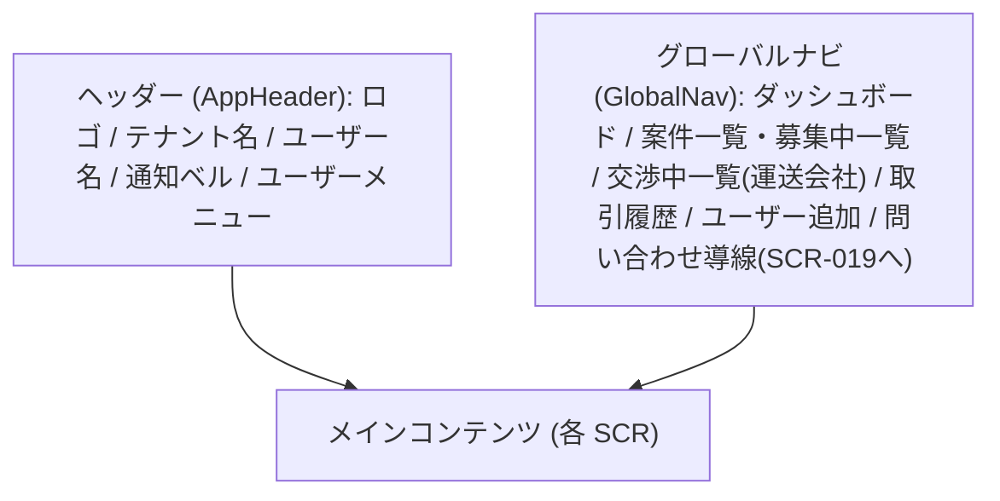

# 共通レイアウト設計

> ID 凡例: [docs/凡例.md](../../凡例.md) 参照

全画面共通のアプリシェル（ヘッダー／グローバルナビ／フッター）を本ファイルで一元設計する。各画面 md は「所属レイアウト」欄で本ファイルを参照し、差分のみを記述する（共通項目の重複記載はしない）。

## レイアウト区分

| 区分 | 説明 | 適用画面 |
|------|------|---------|
| 共通シェル | ヘッダー＋グローバルナビ＋メインの共通枠 | SCR-005, SCR-006, SCR-007, SCR-008, SCR-009, SCR-009-01, SCR-010, SCR-011, SCR-012, SCR-013, SCR-014, SCR-015, SCR-015-01, SCR-016, SCR-017, SCR-018, SCR-019 |
| 認証前独立レイアウト | 共通シェルに乗らない（未認証で到達する画面） | SCR-001, SCR-002, SCR-003, SCR-004 |

## 共通シェル構成

## 共通シェルの構成要素

| 要素 | 表示内容 | データ源（operationId.フィールド） | 表示条件（ロール等） | 挙動・遷移 |
|------|---------|--------------------------------|------------------|-----------|
| ヘッダー: アプリ名/ロゴ | 固定文言 | — | 全ロール | クリックでダッシュボード（配送依頼企業: SCR-006 / 運送会社: SCR-013）へ遷移 |
| ヘッダー: テナント名 | 所属テナント名 | `login.user.tenantName`（ログイン直後）/ `getCurrentUser.tenantName`（画面リロード時、D-2 対応） | 認証済 | — |
| ヘッダー: ユーザー名 | ログインユーザーの表示名 | `login.user.displayName` / `getCurrentUser.displayName` | 認証済 | — |
| ヘッダー: 通知ベル | 未読件数（9件超は「9+」、BR-024） | `getUnreadNotificationCount.unreadCount` | 認証済 | クリックで SCR-012（通知一覧）へ遷移 |
| ヘッダー: ユーザーメニュー | ログアウト | — | 認証済 | 「ログアウト」選択 → `logout` 呼び出し → アクセストークン/リフレッシュトークン破棄 → SCR-001 へ遷移 |
| グローバルナビ: ダッシュボード | メニュー項目 | — | 全ロール | 配送依頼企業: SCR-006 / 運送会社: SCR-013 |
| グローバルナビ: 案件系メニュー | 「案件登録」「案件一覧」（配送依頼企業）/「募集中一覧」「交渉中・済一覧」（運送会社） | — | `getCurrentUser.tenantType` で出し分け | 配送依頼企業: SCR-007, SCR-008 / 運送会社: SCR-014, SCR-016 |
| グローバルナビ: 取引履歴 | メニュー項目 | — | 全ロール | 配送依頼企業: SCR-011 / 運送会社: SCR-018 |
| グローバルナビ: ユーザー追加 | メニュー項目 | — | 全ロール（同権限のみ、BR-003） | SCR-005 |
| グローバルナビ: お問い合わせ | 案内リンク（独立フッターではなく GlobalNav 内に配置） | — | 全ロール | SCR-019（工事中画面）へ遷移 |

## 共通の挙動

- **認証切れ（401）時**: いずれの画面でも API が 401（UNAUTHENTICATED）を返した場合、アクセストークンをリフレッシュトークンで再取得（`refreshAccessToken`）を試み、失敗した場合は SCR-001 へリダイレクトする。再ログイン後は直前の画面への復帰は行わず、ロール別ダッシュボード（SCR-006/SCR-013）へ遷移する（第1版はディープリンク復帰を必須としない）。
- **権限による非表示**: `getCurrentUser.tenantType` により、配送依頼企業向けメニュー（案件登録・案件一覧）と運送会社向けメニュー（募集中一覧・交渉中一覧）を出し分ける。テナント種別は登録後変更不可（アカウント登録.md 前提条件）のため、ログイン中の切り替えは発生しない。
- **グローバルエラー表示**: `ErrorResponse` を受けた API 呼び出しは、`code=VALIDATION_ERROR` の場合はフィールド直下、それ以外（`FORBIDDEN`/`NOT_FOUND`/`CONFLICT`/`INTERNAL_ERROR` 等）は画面右上のトースト表示とする。実装方式は `フロントエンド共通設計.md` に従う。
- **モーダル画面（SCR-009-01, SCR-015-01）**: 独立レイアウトを持たず、親画面（SCR-009, SCR-014/SCR-015）上にオーバーレイ表示する共通シェルの一部として扱う。
