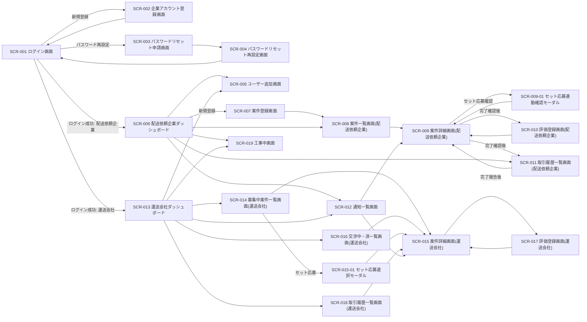
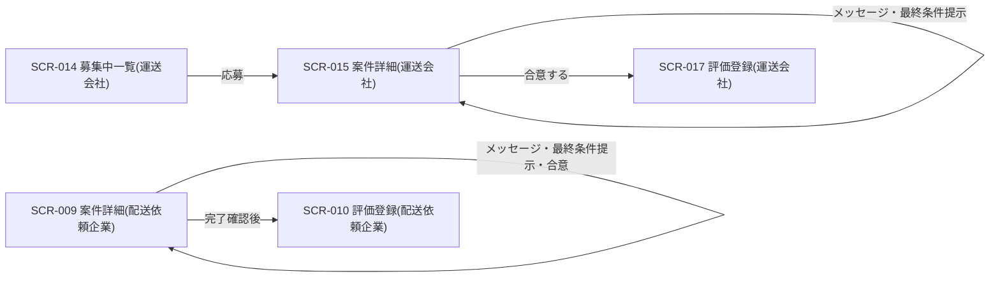
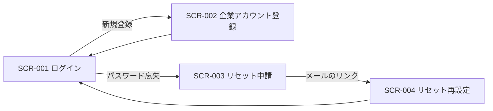

# 画面遷移図

> ID 凡例: [docs/凡例.md](../../凡例.md) 参照

要件定義 `docs/requirements/画面一覧.md` の画面 ID 一覧をもとに、画面遷移を Mermaid で表現する。ノードは画面 ID（SCR-XXX）を使う。

## 全体遷移

## 業務フローごとの遷移

### 案件成約フロー（ACT-001）中心の遷移

### 認証フロー

