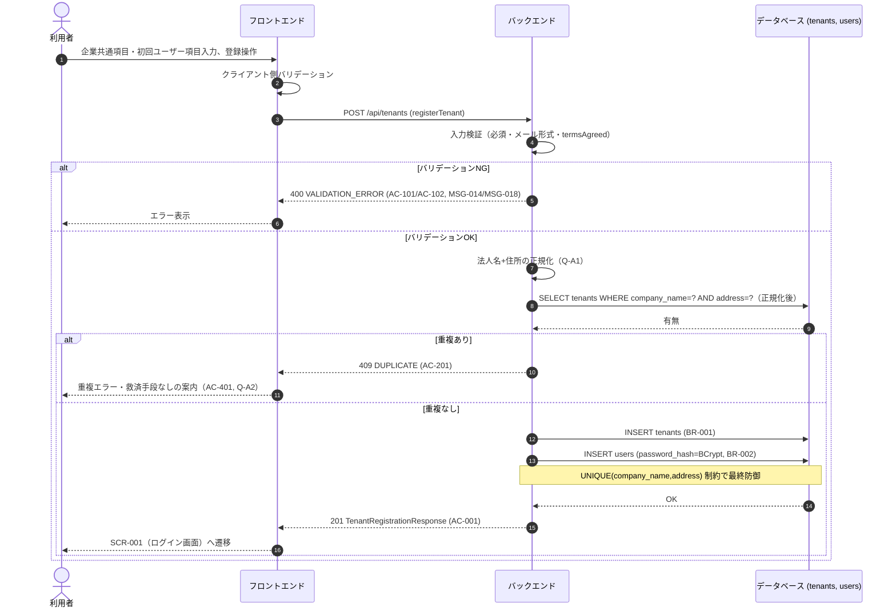
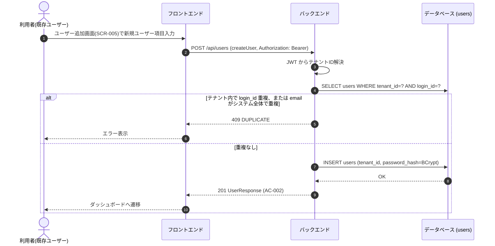

# シーケンス: SEQ-002 アカウント登録

## ID 凡例

| ID 体系 | 形式例 | 用途 |
|---------|-------|------|
| `SEQ-XXX` | `SEQ-002` | シーケンス ID |

## メタデータ

- シーケンス ID: SEQ-002
- シーケンス名: アカウント登録
- 対応画面: SCR-002 企業アカウント登録画面, SCR-005 ユーザー追加画面
- 対応ユースケース: UC-001, UC-002, UC-003
- 対応業務フロー: ACT-004（アカウント登録フロー・法人重複判定）
- 対応 API（operationId）: `registerTenant`, `createUser`
- 関連受け入れ条件: AC-001, AC-002, AC-101, AC-102, AC-201, AC-401
- 関連業務ルール: BR-001, BR-002, BR-003

## 受け入れ条件（Given/When/Then）

| AC-ID | 区分 | Given（前提状態） | When（API 呼び出し） | Then（期待結果） | 関連 BR |
|-------|------|-----------------|-------------------|----------------|--------|
| AC-001 | 正常系 | 企業共通項目・初回ユーザー項目をすべて有効な値で入力し利用規約に同意した状態 | registerTenant | 201 Created、テナント・初回ユーザー作成 | BR-001, BR-002 |
| AC-002 | 正常系 | 既存テナントにログイン済みの状態 | createUser | 201 Created、同一テナント配下にユーザー追加 | BR-002, BR-003 |
| AC-101 | 異常系 | 利用規約・プライバシーポリシーに同意していない状態 | registerTenant | 400 VALIDATION_ERROR（MSG-018） | BR-001 |
| AC-102 | 異常系 | 必須項目未入力・メール形式不正 | registerTenant / createUser | 400 VALIDATION_ERROR（MSG-014） | BR-002 |
| AC-201 | 境界値 | 法人名+住所が既存テナントと完全一致（正規化後） | registerTenant | 409 DUPLICATE | — |

## 前提条件

- 企業アカウント登録は未認証で実行可能（UC-001, UC-002）
- ユーザー追加は認証済み（UC-003）

## シーケンス図

## ユーザー追加（UC-003）

## 例外・代替フロー

| 例外区分 | 発生条件 | HTTP / エラーコード | 対応 AC / BR | 振る舞い |
|---------|---------|------------------|------------|---------|
| バリデーションエラー | 必須未入力・形式不正 | 400 VALIDATION_ERROR | AC-102 | MSG-014 表示 |
| 規約未同意 | termsAgreed=false | 400 VALIDATION_ERROR | AC-101 | MSG-018 表示 |
| 法人重複 | company_name+address 完全一致 | 409 DUPLICATE | AC-201, AC-401 | 救済手段なし。既存テナント管理者への連絡を案内 |
| ログインID/メール重複（ユーザー追加） | UNIQUE制約違反 | 409 DUPLICATE | AC-002 の裏面 | エラー表示 |
| 認可失敗（ユーザー追加） | 未認証での試行 | 401 UNAUTHENTICATED | — | SCR-001 へリダイレクト |
