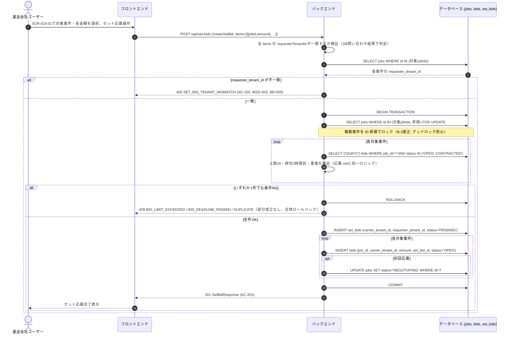

# シーケンス: SEQ-006 セット応募

## ID 凡例

| ID 体系 | 形式例 | 用途 |
|---------|-------|------|
| `SEQ-XXX` | `SEQ-006` | シーケンス ID |

## メタデータ

- シーケンス ID: SEQ-006
- シーケンス名: セット応募
- 対応画面: SCR-014, SCR-015, SCR-015-01（セット応募選択モーダル）
- 対応ユースケース: UC-012
- 対応業務フロー: ACT-001
- 対応 API（operationId）: `createSetBid`
- 関連受け入れ条件: AC-201, AC-202
- 関連業務ルール: BR-005, BR-006, BR-007, BR-009

## 受け入れ条件（Given/When/Then）

| AC-ID | 区分 | Given（前提状態） | When（API 呼び出し） | Then（期待結果） | 関連 BR |
|-------|------|-----------------|-------------------|----------------|--------|
| AC-201 | 境界値 | 同一配送依頼企業の複数の募集中・交渉中案件を選択 | createSetBid | 201 Created、各案件の応募枠を1つずつ消費 | BR-005, BR-006, BR-007, BR-009 |
| AC-202 | 境界値 | 異なる配送依頼企業の案件を混在させようとした | createSetBid | 400 SET_BID_TENANT_MISMATCH（MSG-003） | BR-005 |

## 前提条件

- 認証済み・運送会社ユーザー
- 対象案件が2件以上、すべて同一配送依頼企業

## シーケンス図

## 例外・代替フロー

| 例外区分 | 発生条件 | HTTP / エラーコード | 対応 AC / BR | 振る舞い |
|---------|---------|------------------|------------|---------|
| テナント混在 | 対象案件の requesterTenantId 不一致 | 400 SET_BID_TENANT_MISMATCH | AC-202, BR-005 | UI側で選択不可制御＋API側でも拒否（MSG-003） |
| 部分上限超過 | セット内いずれかの案件で応募20社到達 | 409 BID_LIMIT_EXCEEDED | BR-009 | セット全体ロールバック（部分成立なし） |
| 部分締切超過 | セット内いずれかの案件で締切超過 | 409 BID_DEADLINE_PASSED | BR-010 | 同上 |
| 部分重複 | セット内いずれかの案件に既に自社応募済み | 409 DUPLICATE | BR-004 | 同上 |
| 対象案件不存在 | jobId が存在しない | 404 NOT_FOUND | — | エラー表示 |
| デッドロック回避 | 複数運送会社が重複する案件群へ同時にセット応募 | — | B-3 | 案件ID昇順ロックにより待機順序を固定しデッドロックを回避 |
