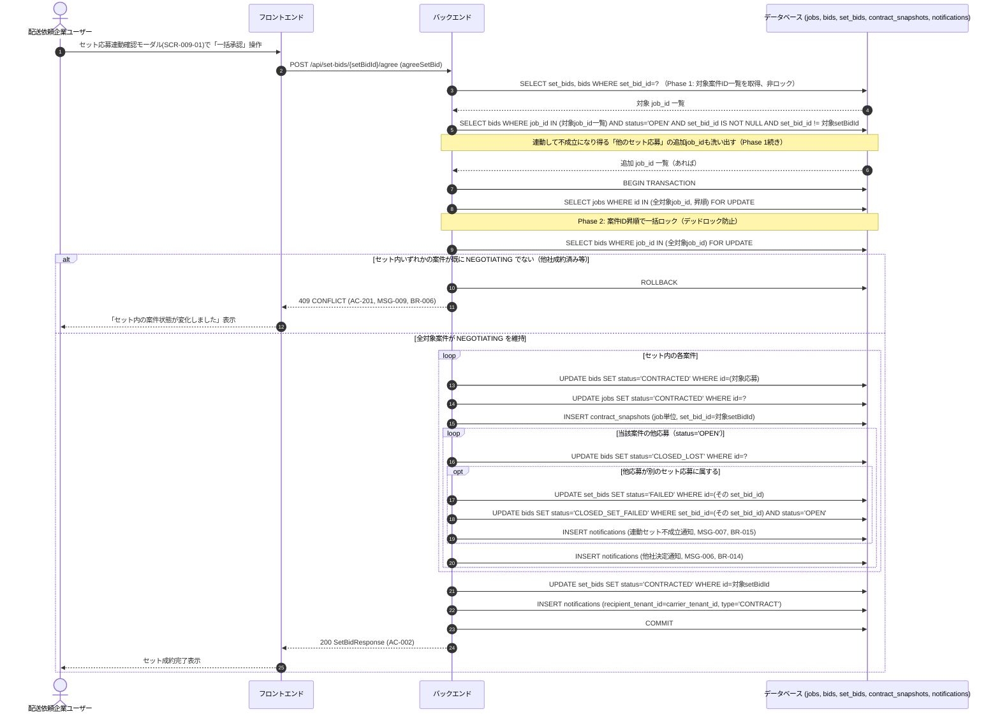

# シーケンス: SEQ-008 セット応募一括合意

## ID 凡例

| ID 体系 | 形式例 | 用途 |
|---------|-------|------|
| `SEQ-XXX` | `SEQ-008` | シーケンス ID |

## メタデータ

- シーケンス ID: SEQ-008
- シーケンス名: セット応募一括合意
- 対応画面: SCR-009 案件詳細（配送依頼企業）, SCR-009-01 セット応募連動確認モーダル
- 対応ユースケース: UC-016（合意する。セット一括承認）
- 対応業務フロー: ACT-001
- 対応 API（operationId）: `agreeSetBid`
- 関連受け入れ条件: AC-002, AC-201
- 関連業務ルール: BR-006, BR-008, BR-013, BR-014, BR-015

## 受け入れ条件（Given/When/Then）

| AC-ID | 区分 | Given（前提状態） | When（API 呼び出し） | Then（期待結果） | 関連 BR |
|-------|------|-----------------|-------------------|----------------|--------|
| AC-002 | 正常系 | セット応募が交渉中の状態 | agreeSetBid | 200 OK、セット内すべての案件が一括で成約済みになる（個別合意は行わない） | BR-008 |
| AC-201 | 境界値 | セット内いずれか1案件が既に他社成約済み | agreeSetBid | 409 CONFLICT、セット全体は不成立のまま維持 | BR-006, BR-015 |

## 前提条件

- セット応募の全対象案件が NEGOTIATING（またはいずれかで既に他社成約済みでない）
- 認可: 対象セット応募が参照する全案件の配送依頼企業（自テナント）のみ

## 排他制御方式（2段階ロック）

BR-006（オール・オア・ナッシング）と BR-015（連動クローズ）を1トランザクションで整合させるため、以下の2段階で処理する（B-3是正: ロック順序をシーケンス内で明示）。

1. **Phase 1（影響範囲特定・非ロック）**: セット内の対象案件・応募に加え、連鎖的にクローズされる可能性のある「他のセット応募」（対象案件へ応募している他社のセット応募）を SELECT で洗い出す。この時点ではロックを取得しない。
2. **Phase 2（一括ロック・検証・更新）**: Phase 1 で判明した全案件 ID を昇順ソートし、`FOR UPDATE` で一括ロックを取得する。ロック取得後、各案件が引き続き対象状態であることを再検証してから一括更新する。

## 例外・代替フロー

| 例外区分 | 発生条件 | HTTP / エラーコード | 対応 AC / BR | 振る舞い |
|---------|---------|------------------|------------|---------|
| セット内一部不成立 | セット内いずれかの案件が既に他社成約・削除済み | 409 CONFLICT | AC-201, BR-006 | 全体をロールバックしオール・オア・ナッシングを維持（MSG-009） |
| 個別合意の誤操作 | セット対象の応募に対し `agreeFinalOffer`（個別合意）を試行 | 409 CONFLICT | BR-008 | 「セット一括承認を使用してください」案内（negotiations.yaml 参照） |
| テナント越境 | 対象案件群の配送依頼企業でないテナントによる呼び出し | 404 NOT_FOUND | — | 汎用「該当するデータが見つかりません」表示（`フロントエンド共通設計.md` 3節、MSG未割当） |
| デッドロック回避 | 複数の配送依頼企業が重複するセット応募を同時に一括合意しようとする | — | B-3 | Phase 2 の案件ID昇順ロックにより待機順序を固定 |
| 連鎖の連鎖 | クローズされた他セット応募がさらに別のセット応募を巻き込む | — | BR-015 | Phase 1 を再帰的に実行し全影響範囲を確定してから Phase 2 へ進む（実装ではBFS/DFSで到達不能になるまで走査） |

## 参照系API（専用シーケンス省略）

以下の operationId は分岐業務ロジックを持たない単純参照系（GET）のため、専用のシーケンス図は作成せず本欄で一覧のみ明示する（各画面 md の「API」欄・供給元は別途明記済み）。

| operationId | 対応 API | 用途 | 供給元詳細 |
|---|---|---|---|
| `getSetBidById` | GET /api/set-bids/{setBidId} | セット応募詳細（対象案件・各応募の状態）の表示 | `screens/SCR-009-01-セット応募連動確認モーダル.md`, `screens/SCR-009-案件詳細-配送依頼企業.md` |
