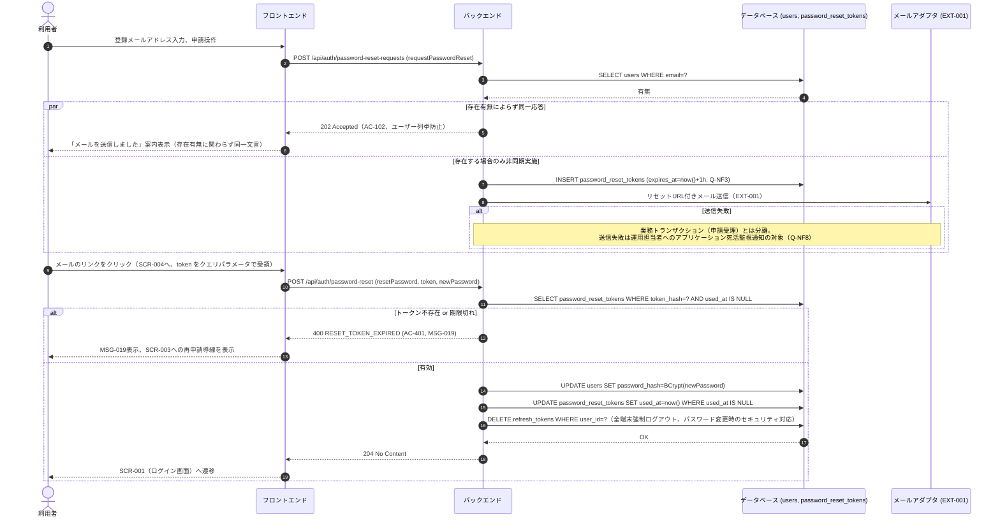

# シーケンス: SEQ-003 パスワードリセット

## ID 凡例

| ID 体系 | 形式例 | 用途 |
|---------|-------|------|
| `SEQ-XXX` | `SEQ-003` | シーケンス ID |

## メタデータ

- シーケンス ID: SEQ-003
- シーケンス名: パスワードリセット
- 対応画面: SCR-003 パスワードリセット申請画面, SCR-004 パスワードリセット再設定画面
- 対応ユースケース: UC-006
- 対応業務フロー: なし
- 対応 API（operationId）: `requestPasswordReset`, `resetPassword`
- 関連受け入れ条件: AC-102, AC-401
- 関連業務ルール: BR-002

## 受け入れ条件（Given/When/Then）

| AC-ID | 区分 | Given（前提状態） | When（API 呼び出し） | Then（期待結果） | 関連 BR |
|-------|------|-----------------|-------------------|----------------|--------|
| AC-102 | 異常系 | 登録されていないメールアドレスで申請 | requestPasswordReset | 202 Accepted（送信有無に関わらず同一応答） | — |
| AC-401 | エッジケース | 再設定URLの有効期限切れ（発行から1時間、Q-NF3） | resetPassword | 400 RESET_TOKEN_EXPIRED（MSG-019） | — |

## 前提条件

- 未認証状態

## シーケンス図

## 例外・代替フロー

| 例外区分 | 発生条件 | HTTP / エラーコード | 対応 AC / BR | 振る舞い |
|---------|---------|------------------|------------|---------|
| ユーザー不存在 | 未登録メールアドレスで申請 | 202（同一応答） | AC-102 | ユーザー列挙防止のため成功と区別しない |
| レート制限超過 | 同一メールへ1時間に5回超の申請 | 429 RATE_LIMITED | — | 「しばらく時間をおいて再試行してください」表示 |
| トークン期限切れ | 発行から1時間経過 | 400 RESET_TOKEN_EXPIRED | AC-401 | MSG-019表示、再申請導線 |
| トークン使用済み | 既に resetPassword 実行済みのトークンで再実行 | 400 RESET_TOKEN_EXPIRED | — | 同上（再利用不可） |
| メール送信失敗 | EXT-001 送信エラー | （API応答には影響なし） | — | 申請自体は202で成功扱い。死活監視で検知しメール通知（Q-NF8） |
