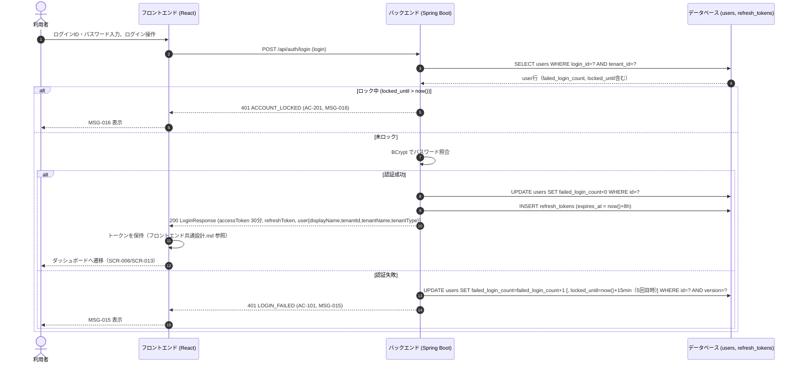
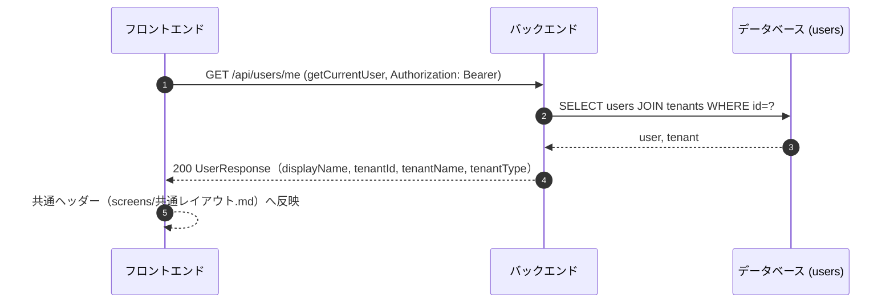

# シーケンス: SEQ-001 ログイン

## ID 凡例

| ID 体系 | 形式例 | 用途 |
|---------|-------|------|
| `SEQ-XXX` | `SEQ-001` | シーケンス ID（3桁ゼロ埋め） |

## メタデータ

- シーケンス ID: SEQ-001
- シーケンス名: ログイン
- 対応画面: SCR-001 ログイン画面, 共通レイアウト（ヘッダー）
- 対応ユースケース: UC-004（ログイン）, UC-005（ログアウト）
- 対応業務フロー: なし（単一操作の完結する機能）
- 対応 API（operationId）: `login`, `getCurrentUser`, `logout`, `refreshAccessToken`
- 関連受け入れ条件: AC-001, AC-101, AC-201（下記「受け入れ条件」参照）
- 関連業務ルール: BR-002

## 受け入れ条件（Given/When/Then）

| AC-ID | 区分 | Given（前提状態） | When（API 呼び出し） | Then（期待結果） | 関連 BR |
|-------|------|-----------------|-------------------|----------------|--------|
| AC-001 | 正常系 | 発行済みの有効なログイン ID・パスワードを持つ状態 | login（POST /api/auth/login） | 200 OK、LoginResponse（アクセストークン・リフレッシュトークン・user情報） | — |
| AC-101 | 異常系 | ログイン ID またはパスワードが誤っている状態 | login | 401 Unauthorized（LOGIN_FAILED, MSG-015） | — |
| AC-201 | 境界値 | ログイン失敗が連続5回に達した状態（Q-NF2） | login | 401 Unauthorized（ACCOUNT_LOCKED, MSG-016）、15分間ロック | — |

## 前提条件

- 未認証状態（SCR-001 は認証前独立レイアウト）
- ユーザーは事前にテナント登録済み（SEQ-002 アカウント登録）

## シーケンス図

## ステップ詳細

| # | ステップ | 担当 | 入力 | 出力 | 関連 AC / BR |
|---|--------|------|------|------|--------------|
| 1 | ログイン操作 | 利用者 | loginId, password | UI イベント | — |
| 2 | POST /api/auth/login | UI → API | LoginRequest | 200 / 401 | AC-001, AC-101, AC-201 |
| 3 | ユーザー検索 | API → DB | login_id, tenant判定 | user行 | — |
| 4 | ロック判定 | API | locked_until | 通過/拒否 | AC-201 |
| 5 | パスワード照合 | API | password, password_hash | 成功/失敗 | AC-001, AC-101 |
| 6 | リフレッシュトークン発行 | API → DB | user_id | refresh_tokens行 | AC-001 |
| 7 | ダッシュボード表示データ取得（D-2） | UI | LoginResponse.user | ヘッダー表示 | — |

## リロード時の /me 取得（D-2 対応）

## 例外・代替フロー

| 例外区分 | 発生条件 | HTTP / エラーコード | 対応 AC / BR | 振る舞い |
|---------|---------|------------------|------------|---------|
| 認証失敗 | ID/パスワード誤り | 401 LOGIN_FAILED | AC-101 | MSG-015 表示、failed_login_count 加算 |
| ロック中 | 連続5回失敗後15分以内 | 401 ACCOUNT_LOCKED | AC-201 | MSG-016 表示 |
| バリデーションエラー | 必須項目欠落 | 400 VALIDATION_ERROR | — | フォームエラー表示 |
| アクセストークン期限切れ | 30分経過後の API 呼び出し | 401 UNAUTHENTICATED | — | `refreshAccessToken` を自動実行、失敗時は SCR-001 へリダイレクト（共通レイアウト.md） |
| リフレッシュトークン失効 | 8時間絶対期限切れ・ログアウト済み | 401 UNAUTHENTICATED | — | SCR-001 へ強制遷移 |
