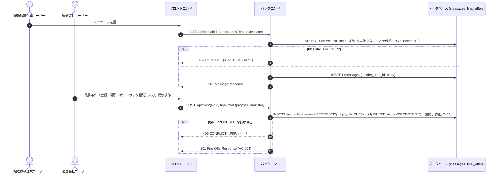
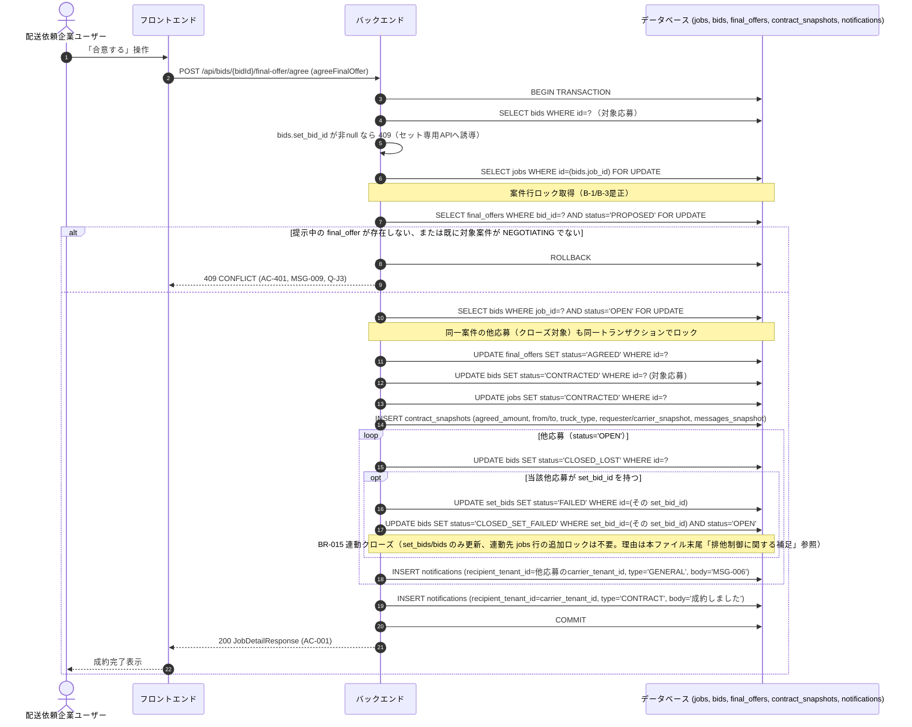
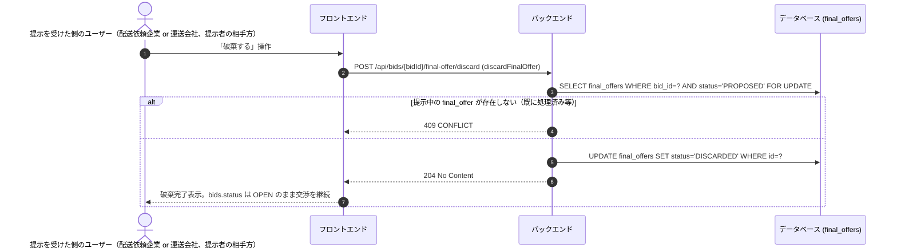

# シーケンス: SEQ-007 交渉合意成約

## ID 凡例

| ID 体系 | 形式例 | 用途 |
|---------|-------|------|
| `SEQ-XXX` | `SEQ-007` | シーケンス ID |

## メタデータ

- シーケンス ID: SEQ-007
- シーケンス名: 交渉合意成約（単体応募）
- 対応画面: SCR-009 案件詳細（配送依頼企業）, SCR-015 案件詳細（運送会社）
- 対応ユースケース: UC-014（連絡）, UC-015（最終条件提示）, UC-016（合意する）
- 対応業務フロー: ACT-001
- 対応 API（operationId）: `createMessage`, `proposeFinalOffer`, `agreeFinalOffer`, `discardFinalOffer`
- 関連受け入れ条件: AC-001, AC-101, AC-301, AC-401
- 関連業務ルール: BR-012, BR-013, BR-014, BR-015, BR-016, BR-020

## 受け入れ条件（Given/When/Then）

| AC-ID | 区分 | Given（前提状態） | When（API 呼び出し） | Then（期待結果） | 関連 BR |
|-------|------|-----------------|-------------------|----------------|--------|
| AC-001 | 正常系 | 交渉中の案件・応募 | proposeFinalOffer → agreeFinalOffer | 200 OK、成約済へ遷移、スナップショット保存、他応募クローズ・通知 | BR-012, BR-013, BR-014 |
| AC-101 | 異常系 | 成約済み以降の案件・応募 | createMessage / proposeFinalOffer | 409 CONFLICT（MSG-021） | BR-016, BR-019 |
| AC-301 | 権限境界 | 自社が当事者でない | createMessage 等 | 403/404 | — |
| AC-401 | エッジケース | 提示中に別応募が先に成約 | agreeFinalOffer | 409 CONFLICT（MSG-009）、提示は INVALIDATED | BR-012, BR-014 |

## 前提条件

- 対象応募が OPEN、案件が NEGOTIATING
- 個別（非セット）応募が対象（セット応募は `sequences/セット応募一括合意.md` を参照）

## シーケンス図（連絡・最終条件提示）

## シーケンス図（合意・成約処理の排他制御詳細）

## シーケンス図（破棄処理）

Q-J2（「合意するか破棄するかのみ選択可能」）に対応する、提示を受けた側（`agreeFinalOffer` を呼べる側と同一のユーザー）の操作。破棄後は `final_offers` の当該行が `PROPOSED` でなくなるため、部分 UNIQUE（`bid_id` かつ `status='PROPOSED'`）に抵触せず、同一応募に対する新たな `proposeFinalOffer` が可能になる。

## 例外・代替フロー

| 例外区分 | 発生条件 | HTTP / エラーコード | 対応 AC / BR | 振る舞い |
|---------|---------|------------------|------------|---------|
| 認可失敗 | 自社が当事者でない | 403/404 | AC-301 | 操作拒否 |
| 状態競合（成約済以降） | メッセージ送信・最終条件提示を成約後に試行 | 409 CONFLICT | AC-101, BR-016, BR-019 | MSG-021表示 |
| 再提示不可 | 既に PROPOSED な final_offer が存在 | 409 CONFLICT | BR-012, Q-J2 | 合意 or 破棄のみ選択可（破棄フローは本ファイル「シーケンス図（破棄処理）」参照） |
| 競合成約による無効化 | 提示中に同一案件の別応募が先に成約 | 409 CONFLICT | AC-401, Q-J3 | 提示中の final_offer を INVALIDATED、MSG-009表示、以後の合意操作拒否 |
| セット応募への誤操作 | bids.set_bid_id が非null で agreeFinalOffer を呼ぶ | 409 CONFLICT | — | set-bids.yaml の agreeSetBid を使用するよう案内 |
| バリデーションエラー | 最終条件の入力不正 | 400 VALIDATION_ERROR | — | MSG-008表示 |
| 楽観ロック競合 | jobs/bids の同時更新 | 409 CONFLICT | — | 悲観ロック（FOR UPDATE）で本フローは直列化されるため、通常は発生しない（保険的にversion検証も残す） |

## 排他制御に関する補足（BR-015 連動クローズのロック範囲が非対称な理由）

`sequences/セット応募一括合意.md` は BR-015 連動クローズの対象になりうる複数案件を Phase 1（非ロック洗い出し）→ Phase 2（案件ID昇順で一括 `FOR UPDATE`）の手順で明示的にロックするのに対し、本シーケンス（単体応募の合意 `agreeFinalOffer`）は BR-015 連動クローズ時に連動先「他案件」の `jobs` 行を `FOR UPDATE` でロックしない。これは設計漏れではなく、以下の理由による意図的な非対称性である。

- 本シーケンスの BR-015 連動クローズ（93-99行目の `opt` ブロック）は `set_bids.status` と、`set_bid_id` に紐づく `bids.status` のみを更新する。連動先案件の `jobs.status` 自体は変更しない（連動先案件は `set_bids` 側で `FAILED` になるのみで、`jobs` テーブルの状態遷移を伴わない）。
- そのため、他トランザクションが連動先の `jobs` 行を同時に読み書きしても、本シーケンスが更新する行（`set_bids` / `bids`）とはテーブル・行が異なり、複数 `jobs` 行を跨いだロック取得順序に起因するデッドロックのリスクは発生しない。本シーケンスが `FOR UPDATE` で取得するのは対象応募自身の案件（80行目）1件のみである。
- 一方 `セット応募一括合意.md` は複数の `jobs` 行そのものを `CONTRACTED` に更新する必要があるため、案件ID昇順の一括ロックが必須となる。

上記のとおり、本シーケンスでは連動先 `jobs` 行の追加ロックは不要と判断する。あわせて `セキュリティテスト観点.md` 5節に、単体応募からの BR-015 連動クローズケース（本シーケンス）の検証項目を追加した（#5）。

## 参照系API（専用シーケンス省略）

以下の operationId は分岐業務ロジックを持たない単純参照系（GET/list）のため、専用のシーケンス図は作成せず本欄で一覧のみ明示する（各画面 md の「API」欄・供給元は別途明記済み）。

| operationId | 対応 API | 用途 | 供給元詳細 |
|---|---|---|---|
| `getBidById` | GET /api/bids/{bidId} | 応募詳細（現在の最終条件提示状況を含む）の表示 | `screens/SCR-009-案件詳細-配送依頼企業.md`, `screens/SCR-015-案件詳細-運送会社.md` |
| `listMessages` | GET /api/bids/{bidId}/messages | 連絡履歴の表示（メッセージ送信前後の再取得を含む） | `screens/SCR-009-案件詳細-配送依頼企業.md`, `screens/SCR-015-案件詳細-運送会社.md` |
