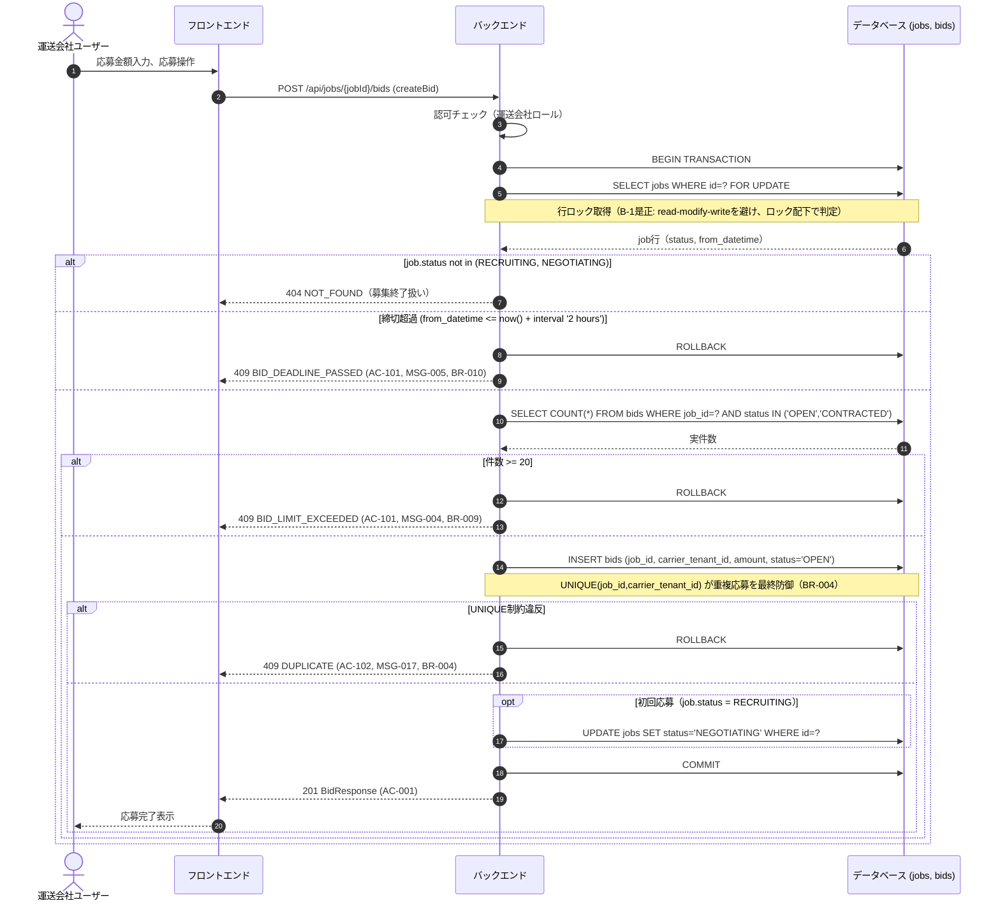
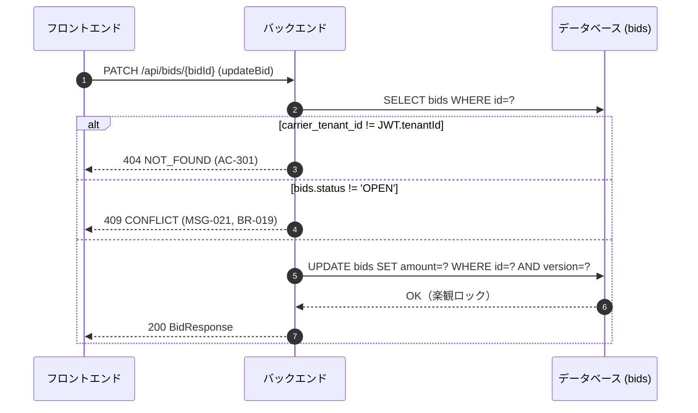

# シーケンス: SEQ-005 応募

## ID 凡例

| ID 体系 | 形式例 | 用途 |
|---------|-------|------|
| `SEQ-XXX` | `SEQ-005` | シーケンス ID |

## メタデータ

- シーケンス ID: SEQ-005
- シーケンス名: 応募（単体）
- 対応画面: SCR-014 募集中案件一覧画面, SCR-015 案件詳細画面（運送会社）
- 対応ユースケース: UC-010, UC-011, UC-013
- 対応業務フロー: ACT-001（案件成約フロー）
- 対応 API（operationId）: `listJobs`, `createBid`, `updateBid`
- 関連受け入れ条件: AC-001, AC-101, AC-102, AC-301
- 関連業務ルール: BR-004, BR-009, BR-010, BR-011, BR-019, BR-021

## 受け入れ条件（Given/When/Then）

| AC-ID | 区分 | Given（前提状態） | When（API 呼び出し） | Then（期待結果） | 関連 BR |
|-------|------|-----------------|-------------------|----------------|--------|
| AC-001 | 正常系 | 募集中案件が応募上限・締切に達していない | createBid | 201 Created、初回応募なら案件が NEGOTIATING へ遷移 | BR-011 |
| AC-101 | 異常系 | 応募数20社到達、または締切超過 | createBid | 409 BID_LIMIT_EXCEEDED / BID_DEADLINE_PASSED | BR-009, BR-010 |
| AC-102 | 異常系 | 自社が既に応募済み | createBid | 409 DUPLICATE（MSG-017） | BR-004 |
| AC-301 | 権限境界 | 自社以外の応募 | updateBid | 404 NOT_FOUND | — |

## 前提条件

- 認証済み・運送会社ユーザー
- 対象案件が募集中または交渉中

## シーケンス図（応募登録・排他制御詳細）

## 応募編集（updateBid, BR-019）

## 例外・代替フロー

| 例外区分 | 発生条件 | HTTP / エラーコード | 対応 AC / BR | 振る舞い |
|---------|---------|------------------|------------|---------|
| 応募上限超過 | 実COUNT >= 20（行ロック下で判定） | 409 BID_LIMIT_EXCEEDED | AC-101, BR-009 | MSG-004表示、応募ボタン非活性 |
| 締切超過 | from_datetime <= now()+2h | 409 BID_DEADLINE_PASSED | AC-101, BR-010 | MSG-005表示 |
| 重複応募 | UNIQUE(job_id, carrier_tenant_id) 違反 | 409 DUPLICATE | AC-102, BR-004 | MSG-017表示 |
| 認可失敗 | 配送依頼企業ユーザーによる応募試行 | 403 FORBIDDEN | — | 応募導線非表示 |
| テナント越境（編集） | 他社の応募を編集 | 404 NOT_FOUND | AC-301 | 汎用「該当するデータが見つかりません」表示（`フロントエンド共通設計.md` 3節、MSG未割当） |
| 楽観ロック競合 | 編集中に他者が同時更新 | 409 CONFLICT | — | 再取得を促す |

## 参照系API（専用シーケンス省略）

以下の operationId は分岐業務ロジックを持たない単純参照系（GET/list）のため、専用のシーケンス図は作成せず本欄で一覧のみ明示する（各画面 md の「API」欄・供給元は別途明記済み）。

| operationId | 対応 API | 用途 | 供給元詳細 |
|---|---|---|---|
| `listBidsForJob` | GET /api/jobs/{jobId}/bids | 案件詳細画面の応募一覧表示 | `screens/SCR-009-案件詳細-配送依頼企業.md`, `screens/SCR-015-案件詳細-運送会社.md` |
| `listMyBids` | GET /api/bids | 自社応募状況・交渉中一覧・取引履歴一覧 | `screens/SCR-013-運送会社ダッシュボード.md`, `screens/SCR-016-交渉中済一覧-運送会社.md`, `screens/SCR-018-取引履歴一覧-運送会社.md` |
| `getJobStatusSummary` | GET /api/jobs/status-summary | ダッシュボードのステータス別件数サマリ | `screens/SCR-006-配送依頼企業ダッシュボード.md`, `screens/SCR-013-運送会社ダッシュボード.md` |
| `getMyTenant` | GET /api/tenants/me | 自社テナント情報参照（第1版は参照のみ、更新 UI は将来拡張） | `概要.md` 前提条件、`api/tenants.yaml` |
