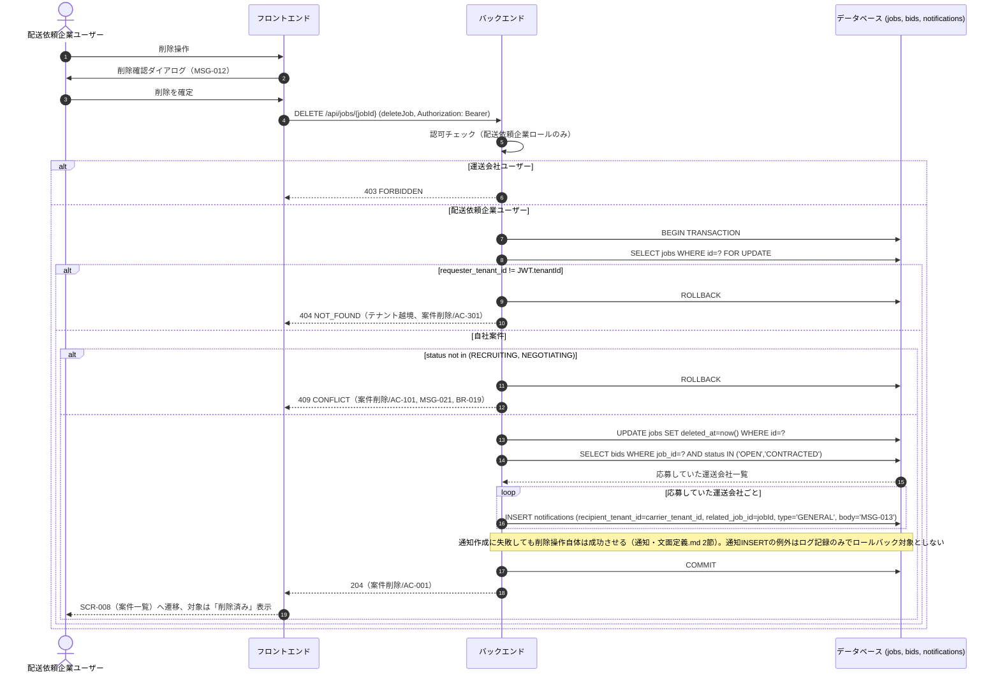
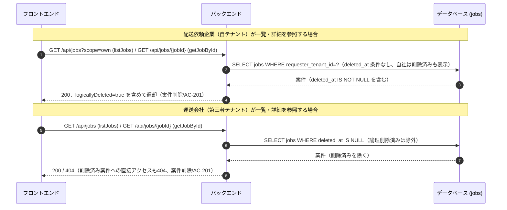
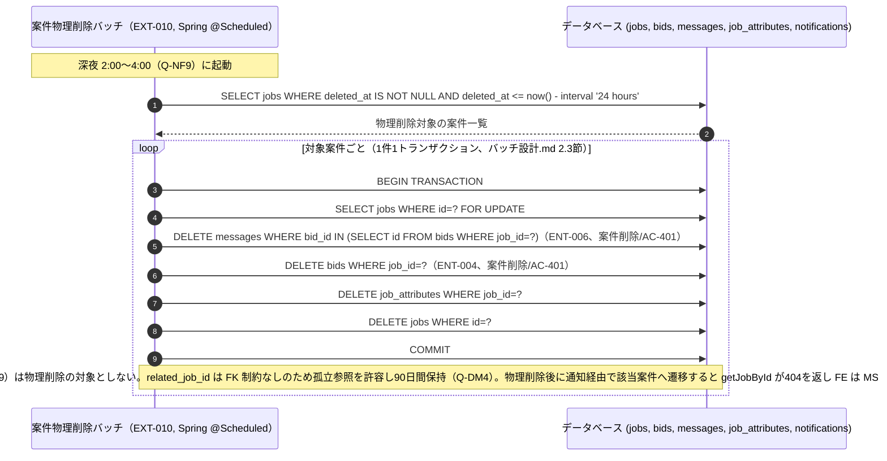

# シーケンス: SEQ-013 案件削除

## ID 凡例

| ID 体系 | 形式例 | 用途 |
|---------|-------|------|
| `SEQ-XXX` | `SEQ-013` | シーケンス ID |

## メタデータ

- シーケンス ID: SEQ-013
- シーケンス名: 案件削除（論理削除→夜間バッチ物理削除）
- 対応画面: SCR-009 案件詳細画面（配送依頼企業）, SCR-008 案件一覧画面
- 対応ユースケース: UC-009
- 対応業務フロー: ACT-005（案件削除フロー・論理削除→物理削除。`docs/requirements/activities/案件削除フロー.md`）
- 対応 API（operationId）: `deleteJob`
- 関連受け入れ条件: 案件削除/AC-001, 案件削除/AC-101, 案件削除/AC-201, 案件削除/AC-301, 案件削除/AC-401
- 関連業務ルール: BR-019, BR-022

## 受け入れ条件（Given/When/Then）

| AC-ID | 区分 | Given（前提状態） | When（API 呼び出し） | Then（期待結果） | 関連 BR |
|-------|------|-----------------|-------------------|----------------|--------|
| 案件削除/AC-001 | 正常系 | 案件ステータスが「募集中」または「交渉中」 | deleteJob | 204、論理削除（`deleted_at` 設定）＋応募していた運送会社へ通知（MSG-013） | BR-022 |
| 案件削除/AC-101 | 異常系 | 案件ステータスが「成約済」「運送中」「完了」「評価済」のいずれか | deleteJob | 導線非表示（UI）＋ API 側は 409 CONFLICT（MSG-021） | BR-019 |
| 案件削除/AC-201 | 境界値 | 論理削除されてから 24 時間未満 | getJobById / listJobs | 配送依頼企業側は「削除済み」表示を残す、運送会社側は非表示（Q-J8） | BR-022 |
| 案件削除/AC-301 | 権限境界 | 自社以外（他テナント）の案件 | deleteJob | 404 NOT_FOUND（テナント越境） | — |
| 案件削除/AC-401 | エッジケース | 論理削除から 24 時間経過 | （夜間バッチ EXT-010） | 物理削除実行、応募・連絡メッセージも同時物理削除、通知は保持（Q-DM4） | BR-022 |

## 前提条件

- 認証済み・配送依頼企業ユーザー
- 対象案件が自社（`requester_tenant_id` = JWT.tenantId）の登録案件

## シーケンス図（削除操作・同期処理）

## 削除済み表示（AC-201、参照系）

## 夜間バッチによる物理削除（AC-401、参照）

物理削除の詳細トランザクション設計（対象抽出条件・1件1トランザクション方針・再実行/冪等性・失敗時の扱い）は `バッチ設計.md` 2節「案件物理削除バッチ」（EXT-010）を正とする。本シーケンスでは同期処理（削除操作〜論理削除〜通知）との境界と、バッチ内の削除順序のみを示す（詳細は `バッチ設計.md` を参照）。

## 例外・代替フロー

| 例外区分 | 発生条件 | HTTP / エラーコード | 対応 AC / BR | 振る舞い |
|---------|---------|------------------|------------|---------|
| 認可失敗 | 運送会社ユーザーによる削除試行 | 403 FORBIDDEN | — | 削除導線自体を非表示（UI側）＋API側でも拒否 |
| テナント越境 | 他テナント案件への直接アクセス | 404 NOT_FOUND | 案件削除/AC-301 | 削除導線非表示、直打ちも404 |
| ステータスガード | 成約済以降の案件を削除 | 409 CONFLICT | 案件削除/AC-101 | MSG-021表示、削除導線自体を非活性（BR-019） |
| 通知作成失敗 | INSERT notifications 時の例外 | — | 案件削除/AC-001 | 削除操作自体は成功させる（204）。ログ記録のみで再送は行わない（通知・文面定義.md 2節） |
| 物理削除未到達 | 論理削除から24時間未満 | — | 案件削除/AC-201 | 配送依頼企業側は「削除済み」表示を残し、運送会社側からは非表示（Q-J8） |
