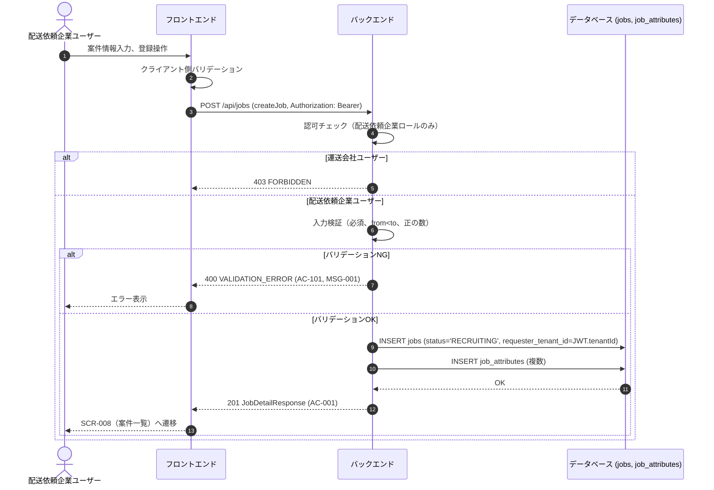
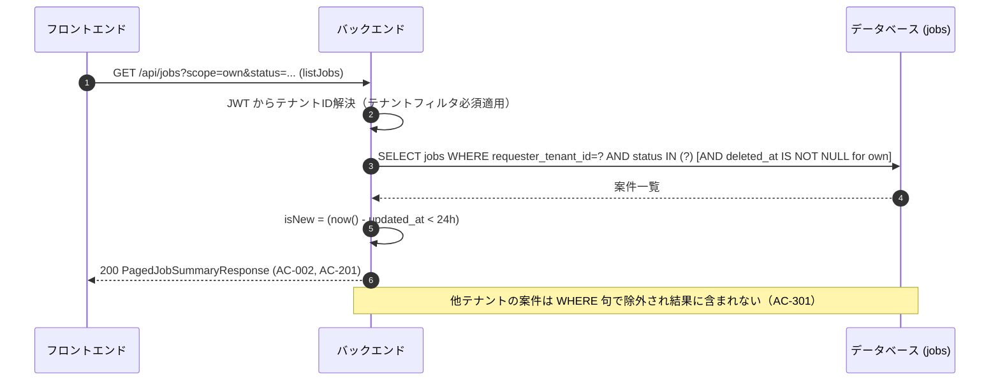

# シーケンス: SEQ-004 案件登録

## ID 凡例

| ID 体系 | 形式例 | 用途 |
|---------|-------|------|
| `SEQ-XXX` | `SEQ-004` | シーケンス ID |

## メタデータ

- シーケンス ID: SEQ-004
- シーケンス名: 案件登録
- 対応画面: SCR-007 案件登録画面, SCR-008 案件一覧画面
- 対応ユースケース: UC-007, UC-008
- 対応業務フロー: ACT-001（案件成約フロー・登録部分）
- 対応 API（operationId）: `createJob`, `listJobs`
- 関連受け入れ条件: AC-001, AC-002, AC-101, AC-201, AC-301
- 関連業務ルール: BR-011, BR-019

## 受け入れ条件（Given/When/Then）

| AC-ID | 区分 | Given（前提状態） | When（API 呼び出し） | Then（期待結果） | 関連 BR |
|-------|------|-----------------|-------------------|----------------|--------|
| AC-001 | 正常系 | 案件登録項目をすべて有効な値で入力した状態 | createJob | 201 Created、ステータス RECRUITING | BR-011 |
| AC-101 | 異常系 | 必須項目未入力、from/to日時不整合 | createJob | 400 VALIDATION_ERROR（MSG-001） | — |
| AC-002 | 正常系 | 自社が複数ステータスの案件を保有 | listJobs | 200 OK、ステータス区分どおり | — |
| AC-201 | 境界値 | 案件が24時間以内に更新 | listJobs | isNew=true | — |
| AC-301 | 権限境界 | 自社以外が登録した案件 | listJobs | 一覧に含まれない | — |

## 前提条件

- 認証済み・配送依頼企業ユーザー

## シーケンス図

## 一覧取得（AC-002, AC-201, AC-301）

## 例外・代替フロー

| 例外区分 | 発生条件 | HTTP / エラーコード | 対応 AC / BR | 振る舞い |
|---------|---------|------------------|------------|---------|
| 認可失敗 | 運送会社ユーザーによる登録試行 | 403 FORBIDDEN | — | 登録導線自体を非表示（UI側）＋API側でも拒否 |
| バリデーションエラー | 必須未入力・日時不整合 | 400 VALIDATION_ERROR | AC-101 | MSG-001表示 |
| テナント越境 | 他テナント案件への直接アクセス | 404 NOT_FOUND | AC-301 | 一覧に非表示、詳細直打ちも404 |
