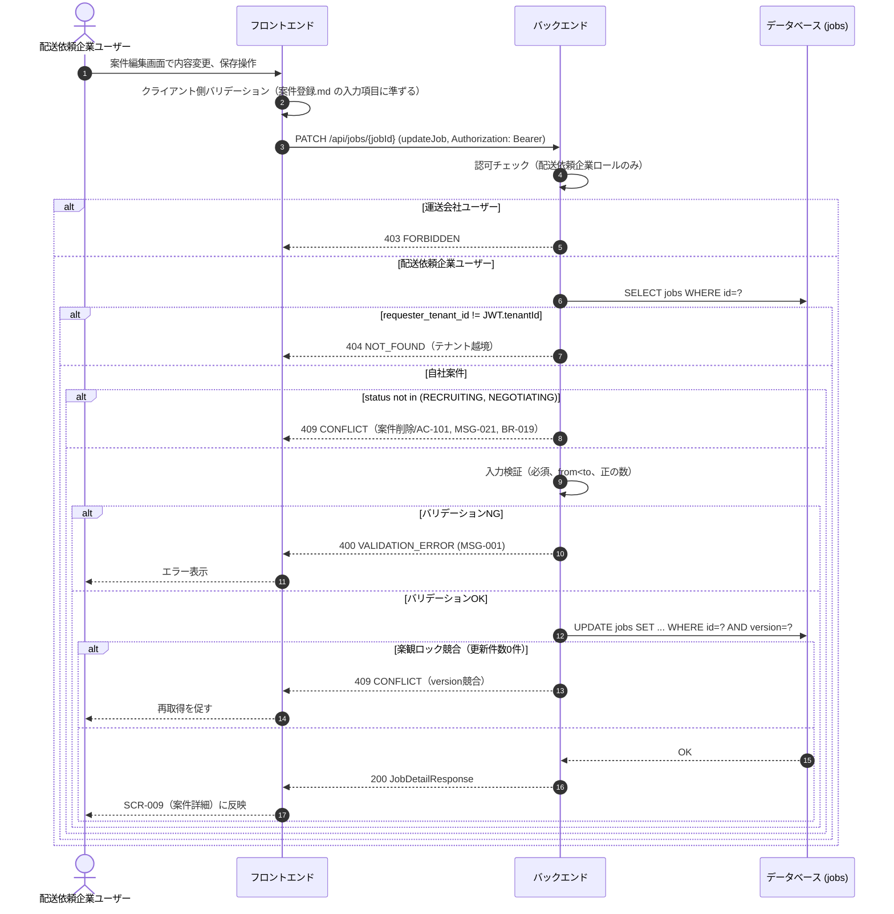

# シーケンス: SEQ-012 案件編集

## ID 凡例

| ID 体系 | 形式例 | 用途 |
|---------|-------|------|
| `SEQ-XXX` | `SEQ-012` | シーケンス ID |

## メタデータ

- シーケンス ID: SEQ-012
- シーケンス名: 案件編集
- 対応画面: SCR-009 案件詳細画面（配送依頼企業）
- 対応ユースケース: UC-009
- 対応業務フロー: ACT-005（案件削除フロー・UC-009「案件編集・削除」のうち編集操作。ACT-005 業務フロー図自体は削除経路を図示するため、編集操作は本シーケンスと BR-019 で規定する）
- 対応 API（operationId）: `updateJob`
- 関連受け入れ条件: 案件削除/AC-101, 案件削除/AC-301
- 関連業務ルール: BR-019

## 受け入れ条件（Given/When/Then）

| AC-ID | 区分 | Given（前提状態） | When（API 呼び出し） | Then（期待結果） | 関連 BR |
|-------|------|-----------------|-------------------|----------------|--------|
| 案件削除/AC-101 | 異常系 | 案件ステータスが「成約済」「運送中」「完了」「評価済」のいずれか | updateJob | 導線非表示（UI）＋ API 側は 409 CONFLICT（MSG-021） | BR-019 |
| 案件削除/AC-301 | 権限境界 | 自社以外（他テナント）の案件 | updateJob | 404 NOT_FOUND（テナント越境） | — |

## 前提条件

- 認証済み・配送依頼企業ユーザー
- 対象案件が自社（`requester_tenant_id` = JWT.tenantId）の登録案件

## シーケンス図

## 例外・代替フロー

| 例外区分 | 発生条件 | HTTP / エラーコード | 対応 AC / BR | 振る舞い |
|---------|---------|------------------|------------|---------|
| 認可失敗 | 運送会社ユーザーによる編集試行 | 403 FORBIDDEN | — | 編集導線自体を非表示（UI側）＋API側でも拒否 |
| テナント越境 | 他テナント案件への直接アクセス | 404 NOT_FOUND | 案件削除/AC-301 | 編集導線非表示、直打ちも404 |
| ステータスガード | 成約済以降の案件を編集 | 409 CONFLICT | 案件削除/AC-101 | MSG-021表示、編集導線自体を非活性（BR-019） |
| バリデーションエラー | 必須未入力・日時不整合 | 400 VALIDATION_ERROR | — | MSG-001表示 |
| 楽観ロック競合 | 編集中に他者が同時更新（version不一致） | 409 CONFLICT | — | 最新内容の再取得を促す（`tables/jobs.md` 排他制御節） |
