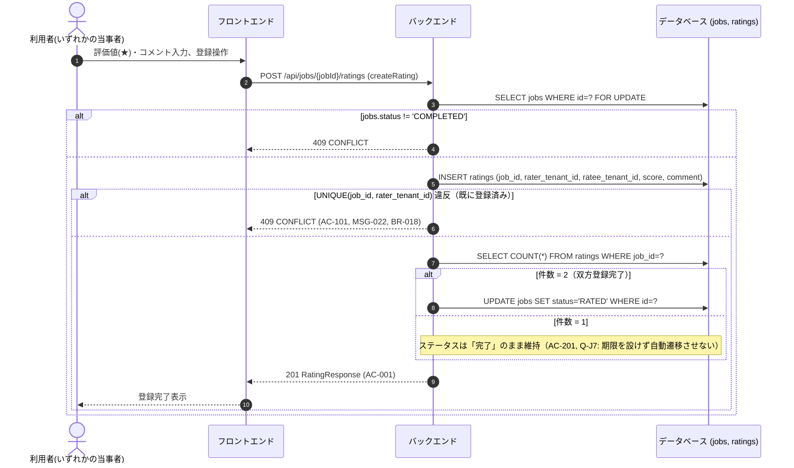

# シーケンス: SEQ-010 評価登録

## ID 凡例

| ID 体系 | 形式例 | 用途 |
|---------|-------|------|
| `SEQ-XXX` | `SEQ-010` | シーケンス ID |

## メタデータ

- シーケンス ID: SEQ-010
- シーケンス名: 評価登録
- 対応画面: SCR-010（配送依頼企業）, SCR-017（運送会社）
- 対応ユースケース: UC-020
- 対応業務フロー: ACT-003（評価フロー）
- 対応 API（operationId）: `createRating`, `listRatingsForJob`
- 関連受け入れ条件: AC-001, AC-101, AC-201, AC-301
- 関連業務ルール: BR-017, BR-018

## 受け入れ条件（Given/When/Then）

| AC-ID | 区分 | Given（前提状態） | When（API 呼び出し） | Then（期待結果） | 関連 BR |
|-------|------|-----------------|-------------------|----------------|--------|
| AC-001 | 正常系 | 案件が「完了」で自身が未評価 | createRating | 201 Created、双方揃えば案件が「評価済」へ | BR-017, BR-018 |
| AC-101 | 異常系 | 既に評価登録済み | createRating | 409 CONFLICT（MSG-022） | BR-018 |
| AC-201 | 境界値 | 一方のみ評価済み | listRatingsForJob | ステータスは「完了」のまま維持 | — |
| AC-301 | 権限境界 | 自社が当事者でない | createRating | 403/404 | — |

## 前提条件

- 案件ステータスが COMPLETED

## シーケンス図

## 例外・代替フロー

| 例外区分 | 発生条件 | HTTP / エラーコード | 対応 AC / BR | 振る舞い |
|---------|---------|------------------|------------|---------|
| 評価済み再登録 | UNIQUE(job_id, rater_tenant_id) 違反 | 409 CONFLICT | AC-101, BR-018 | MSG-022表示、編集導線非表示 |
| ステータス不整合 | 案件が「完了」でない状態で登録試行 | 409 CONFLICT | — | 評価登録導線を非表示 |
| 認可失敗 | 自社が当事者でない案件への評価試行 | 403/404 | AC-301 | 操作拒否 |
| 片方未評価の長期滞留 | もう一方が長期間未登録 | — | AC-201, Q-J7 | 督促・自動確認は行わず「完了」のまま保持 |
