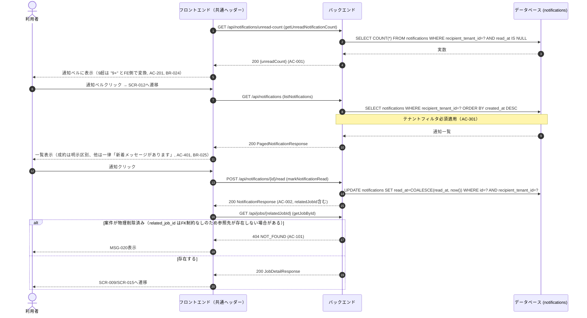

# シーケンス: SEQ-011 通知確認

## ID 凡例

| ID 体系 | 形式例 | 用途 |
|---------|-------|------|
| `SEQ-XXX` | `SEQ-011` | シーケンス ID |

## メタデータ

- シーケンス ID: SEQ-011
- シーケンス名: 通知確認
- 対応画面: SCR-012 通知一覧画面, 共通レイアウト（通知ベル）
- 対応ユースケース: UC-021
- 対応業務フロー: なし（横断機能）
- 対応 API（operationId）: `getUnreadNotificationCount`, `listNotifications`, `markNotificationRead`, `getJobById`
- 関連受け入れ条件: AC-001, AC-002, AC-101, AC-201, AC-301, AC-401
- 関連業務ルール: BR-014, BR-015, BR-024, BR-025

## 受け入れ条件（Given/When/Then）

| AC-ID | 区分 | Given（前提状態） | When（API 呼び出し） | Then（期待結果） | 関連 BR |
|-------|------|-----------------|-------------------|----------------|--------|
| AC-001 | 正常系 | 未読通知が存在 | getUnreadNotificationCount | 200 OK、unreadCount返却 | BR-024 |
| AC-002 | 正常系 | 通知一覧を開いた状態 | markNotificationRead | 200 OK、既読化・未読数減算 | — |
| AC-101 | 異常系 | 関連案件が物理削除済み | getJobById（既読化後の遷移） | 404 NOT_FOUND（MSG-020） | — |
| AC-201 | 境界値 | 未読件数が9件超 | getUnreadNotificationCount | unreadCount>9をFE側で「9+」表示 | BR-024 |
| AC-301 | 権限境界 | 自社宛てでない通知 | listNotifications | 表示されない | — |
| AC-401 | エッジケース | 「成約」以外の通知 | listNotifications | 「新着メッセージがあります」一律表示 | BR-025 |

## 前提条件

- 認証済み（本シーケンスは横断機能。共通レイアウト.md のヘッダー・SCR-012 の両方から使用される）

## シーケンス図（通知ベル・一覧・既読化）

## 例外・代替フロー

| 例外区分 | 発生条件 | HTTP / エラーコード | 対応 AC / BR | 振る舞い |
|---------|---------|------------------|------------|---------|
| 関連案件の物理削除 | related_job_id が指す案件が既に物理削除済み | 404 NOT_FOUND | AC-101, MSG-020 | 通知自体は既読化済みのまま維持（通知データはQ-DM4により物理削除対象外） |
| テナント越境 | 他テナント宛て通知IDを直打ちで既読化しようとする | 404 NOT_FOUND | AC-301 | 拒否 |
| 上限表示 | unreadCount > 9 | — | AC-201, BR-024 | FE側で「9+」に変換（API自体は実数を返す） |
