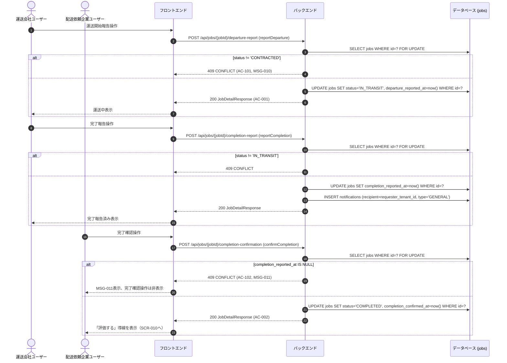

# シーケンス: SEQ-009 運送ステータス報告

## ID 凡例

| ID 体系 | 形式例 | 用途 |
|---------|-------|------|
| `SEQ-XXX` | `SEQ-009` | シーケンス ID |

## メタデータ

- シーケンス ID: SEQ-009
- シーケンス名: 運送ステータス報告
- 対応画面: SCR-009（完了確認）, SCR-015（運送開始・完了報告）
- 対応ユースケース: UC-017, UC-018, UC-019
- 対応業務フロー: ACT-002（運送実施フロー）
- 対応 API（operationId）: `reportDeparture`, `reportCompletion`, `confirmCompletion`
- 関連受け入れ条件: AC-001, AC-002, AC-101, AC-102, AC-301, AC-401
- 関連業務ルール: BR-017, BR-019

## 受け入れ条件（Given/When/Then）

| AC-ID | 区分 | Given（前提状態） | When（API 呼び出し） | Then（期待結果） | 関連 BR |
|-------|------|-----------------|-------------------|----------------|--------|
| AC-001 | 正常系 | 案件ステータスが「成約済」 | reportDeparture | 200 OK、ステータスが「運送中」に遷移 | BR-017 |
| AC-002 | 正常系 | 「運送中」で完了報告済み | confirmCompletion | 200 OK、ステータスが「完了」に遷移 | BR-017 |
| AC-101 | 異常系 | 案件ステータスが「成約済」でない | reportDeparture | 409 CONFLICT（MSG-010） | BR-017 |
| AC-102 | 異常系 | 完了報告未実施 | confirmCompletion | 409 CONFLICT（MSG-011） | BR-017 |
| AC-301 | 権限境界 | 自社が当事者でない | reportDeparture 等 | 403/404 | — |
| AC-401 | エッジケース | 報告済みへの取消操作 | — | 取消不可（API自体に取消エンドポイントを設けない） | — |

## 前提条件

- 認証済み。reportDeparture/reportCompletion は当該案件の成約応募を持つ運送会社ユーザー、confirmCompletion は配送依頼企業ユーザー

## シーケンス図

## 例外・代替フロー

| 例外区分 | 発生条件 | HTTP / エラーコード | 対応 AC / BR | 振る舞い |
|---------|---------|------------------|------------|---------|
| ステータス不整合（開始報告） | 案件が「成約済」でない状態で報告 | 409 CONFLICT | AC-101, BR-017 | MSG-010表示、導線非表示 |
| ステータス不整合（完了確認） | 完了報告未実施 | 409 CONFLICT | AC-102, BR-017 | MSG-011表示、操作非表示 |
| 認可失敗 | 自社が当事者でない案件への操作 | 403/404 | AC-301 | 操作拒否 |
| 取消操作 | 報告後の取消操作 | — | AC-401, Q-J4 | API自体に取消エンドポイントを設けない（誤操作時は連絡機能で相手と調整） |
| 差戻し | 完了報告内容に相違がある場合 | — | Q-J5 | 差戻し機能は提供しない。連絡機能で調整のうえ完了確認の実施要否を担当者が判断 |
