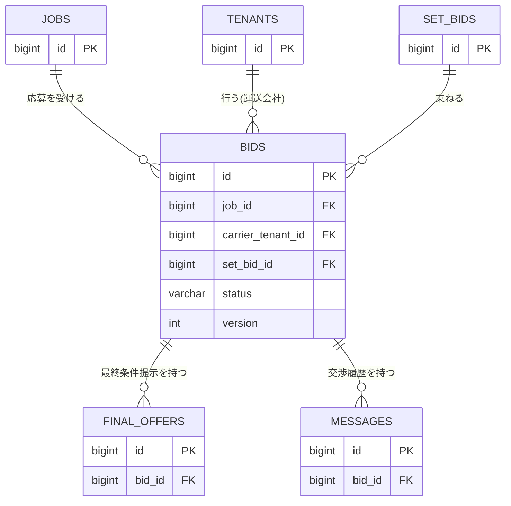

# テーブル定義: bids

- 説明: 運送会社が1案件に対して行う1提案（応募、ENT-004）。
- Entity クラス名: Bid
- 関連要件: `docs/requirements/functional/応募.md`

## カラム定義

| カラム名 | 型 | NOT NULL | デフォルト | 説明 |
|---------|----|---------|----------|------|
| id | BIGINT | YES | IDENTITY | 主キー |
| job_id | BIGINT | YES | なし | 対象案件（FK） |
| carrier_tenant_id | BIGINT | YES | なし | 応募した運送会社（FK） |
| set_bid_id | BIGINT | NO | なし | 所属するセット応募（FK、単体応募は NULL） |
| amount | INTEGER | YES | なし | 提示金額（円・税別） |
| status | VARCHAR(20) | YES | 'OPEN' | 応募ステータス（`_common.yaml` BidStatus、ST-101〜ST-104） |
| version | INTEGER | YES | 0 | 楽観ロック用バージョン（@Version） |
| created_at | TIMESTAMP | YES | CURRENT_TIMESTAMP | 応募日時 |
| updated_at | TIMESTAMP | YES | CURRENT_TIMESTAMP | 更新日時 |

## 制約

| 制約種別 | 対象カラム | 説明 |
|--------|---------|------|
| PRIMARY KEY | id | |
| FOREIGN KEY | job_id → jobs.id | ON DELETE RESTRICT（物理削除バッチが明示的に先に bids を削除する） |
| FOREIGN KEY | carrier_tenant_id → tenants.id | ON DELETE RESTRICT |
| FOREIGN KEY | set_bid_id → set_bids.id | ON DELETE RESTRICT、NULL 可 |
| UNIQUE | job_id, carrier_tenant_id | 応募の一意性（BR-004: 1社1案件につき1提案） |
| CHECK | status | `IN ('OPEN','CONTRACTED','CLOSED_LOST','CLOSED_SET_FAILED')` |
| CHECK | amount > 0 | |

## インデックス

| インデックス名 | 対象カラム | 種別 | 理由 |
|------------|---------|------|------|
| uq_bids_job_id_carrier_tenant_id | job_id, carrier_tenant_id | UNIQUE | BR-004 の一意性保証（上記制約と同一） |
| idx_bids_job_id_status | job_id, status | 複合 | 応募上限カウント（BR-009、`status IN ('OPEN','CONTRACTED')` の実 COUNT）を高速化 |
| idx_bids_carrier_tenant_id_status | carrier_tenant_id, status | 複合 | SCR-016/SCR-018（listMyBids）の自社応募一覧・ステータス絞り込み |
| idx_bids_set_bid_id | set_bid_id | 通常 | セット応募の連鎖クローズ処理（BR-006, BR-015）でのメンバー検索 |

## 排他制御

| 操作 | 方式 | 根拠 |
|------|------|------|
| 応募登録（上限・締切・重複判定） | jobs.md の排他制御節を参照（job 行の悲観ロック配下で bids へ INSERT） | B-1 是正。本テーブル単独では制御しない |
| 成約・クローズ状態への遷移 | 悲観ロック（成約処理トランザクション内で対象 bids 行を `SELECT ... FOR UPDATE`、案件 ID 昇順に対応する応募 ID 順でロック） | BR-014（他応募者クローズ）・BR-015（セット連動クローズ）を単一トランザクションで整合させるため |
| 応募内容編集（updateBid） | 楽観ロック（version） | 編集競合頻度は低い |

## リレーション

| 種別 | 相手テーブル | カラム | カーディナリティ | 削除時挙動 |
|------|----------|------|-------------|----------|
| N:1 | jobs | job_id | 多数応募 : 1 案件 | RESTRICT |
| N:1 | tenants | carrier_tenant_id | 多数応募 : 1 運送会社 | RESTRICT |
| N:1 | set_bids | set_bid_id | 多数応募 : 1 セット応募（任意） | RESTRICT |
| 1:N | final_offers | final_offers.bid_id | 1 応募 : 複数最終条件提示（履歴） | RESTRICT |
| 1:N | messages | messages.bid_id | 1 応募 : 多数メッセージ | RESTRICT |
| 0:1 | contract_snapshots | contract_snapshots.bid_id | 1 応募 : 0または1スナップショット | RESTRICT |

## 部分 ER 図（このテーブル + 周辺）

