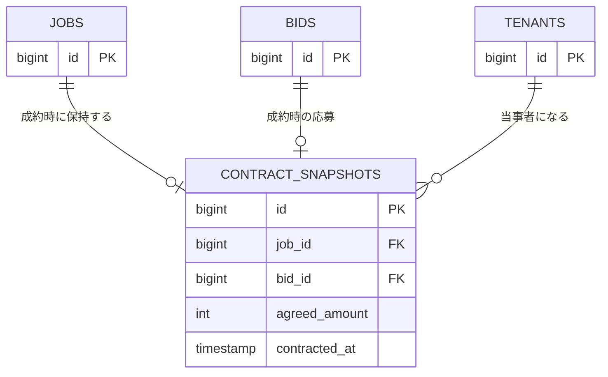

# テーブル定義: contract_snapshots

- 説明: 合意成立時点の合意内容の複製（成約スナップショット、ENT-007）。以後編集不可。
- Entity クラス名: ContractSnapshot
- 関連要件: `docs/requirements/functional/交渉合意成約.md`, `取引履歴.md`

## カラム定義

| カラム名 | 型 | NOT NULL | デフォルト | 説明 |
|---------|----|---------|----------|------|
| id | BIGINT | YES | IDENTITY | 主キー |
| job_id | BIGINT | YES | なし | 対象案件（FK、1案件1スナップショット） |
| bid_id | BIGINT | YES | なし | 成約した応募（FK） |
| set_bid_id | BIGINT | NO | なし | セット応募経由の成約の場合のみ設定（FK） |
| requester_tenant_id | BIGINT | YES | なし | 配送依頼企業（FK） |
| carrier_tenant_id | BIGINT | YES | なし | 運送会社（FK） |
| agreed_amount | INTEGER | YES | なし | 合意金額（円・税別） |
| from_location | VARCHAR(500) | YES | なし | 合意 from 場所 |
| from_datetime | TIMESTAMP | YES | なし | 合意 from 日時 |
| to_location | VARCHAR(500) | YES | なし | 合意 to 場所 |
| to_datetime | TIMESTAMP | YES | なし | 合意 to 日時 |
| truck_type | VARCHAR(20) | YES | なし | 合意トラック種別 |
| requester_snapshot | JSONB | YES | なし | 合意時点の配送依頼企業側企業情報・担当者情報の複製（会社名・住所・電話・メール・担当者名等） |
| carrier_snapshot | JSONB | YES | なし | 合意時点の運送会社側企業情報・担当者情報の複製（個人ドライバー連絡先を含む、BR-020） |
| messages_snapshot | JSONB | YES | なし | 合意時点までの連絡履歴の複製（送信者名・本文・送信日時の配列） |
| contracted_at | TIMESTAMP | YES | なし | 成約日時 |
| created_at | TIMESTAMP | YES | CURRENT_TIMESTAMP | 保存日時（= contracted_at と同値運用） |

> 以後編集不可のため `version`／`updated_at` は付与しない（UPDATE 自体をアプリ層で禁止する）。JSONB を用いる理由: 企業/担当者情報・メッセージ履歴は合意時点の任意個数・可変構造のスナップショットであり、正規化テーブルに分解すると「以後編集不可」の意味論（元テーブルの更新に追従しない複製である点）が崩れるため。主要な検索・表示項目（金額・場所日時・トラック種別）は個別カラムとして typed に保持し、JSONB は補助情報に限定する。

## 制約

| 制約種別 | 対象カラム | 説明 |
|--------|---------|------|
| PRIMARY KEY | id | |
| FOREIGN KEY | job_id → jobs.id | ON DELETE RESTRICT |
| FOREIGN KEY | bid_id → bids.id | ON DELETE RESTRICT |
| FOREIGN KEY | set_bid_id → set_bids.id | ON DELETE RESTRICT、NULL 可 |
| FOREIGN KEY | requester_tenant_id → tenants.id | ON DELETE RESTRICT |
| FOREIGN KEY | carrier_tenant_id → tenants.id | ON DELETE RESTRICT |
| UNIQUE | job_id | 1 案件につき成約スナップショットは1件のみ |
| CHECK | agreed_amount > 0 | |

## インデックス

| インデックス名 | 対象カラム | 種別 | 理由 |
|------------|---------|------|------|
| uq_contract_snapshots_job_id | job_id | UNIQUE | 上記制約と同一。getJobById の JOIN 検索にも使用 |
| idx_contract_snapshots_requester_tenant_id | requester_tenant_id | 通常 | SCR-011 取引履歴一覧のテナントフィルタ |
| idx_contract_snapshots_carrier_tenant_id | carrier_tenant_id | 通常 | SCR-018 取引履歴一覧のテナントフィルタ |

## 排他制御

- 排他制御不要（理由: 成約処理トランザクション内で一度だけ INSERT され、以後 UPDATE を行わない不変レコードのため。INSERT 自体の排他は jobs.md／bids.md の悲観ロックに従う）。

## リレーション

| 種別 | 相手テーブル | カラム | カーディナリティ | 削除時挙動 |
|------|----------|------|-------------|----------|
| 0:1 | jobs | job_id | 1 スナップショット : 1 案件 | RESTRICT |
| 0:1 | bids | bid_id | 1 スナップショット : 1 応募 | RESTRICT |
| N:1 | set_bids | set_bid_id | 多数スナップショット : 1 セット応募（任意） | RESTRICT |
| N:1 | tenants (requester) | requester_tenant_id | 多数スナップショット : 1 配送依頼企業 | RESTRICT |
| N:1 | tenants (carrier) | carrier_tenant_id | 多数スナップショット : 1 運送会社 | RESTRICT |

## 部分 ER 図（このテーブル + 周辺）

