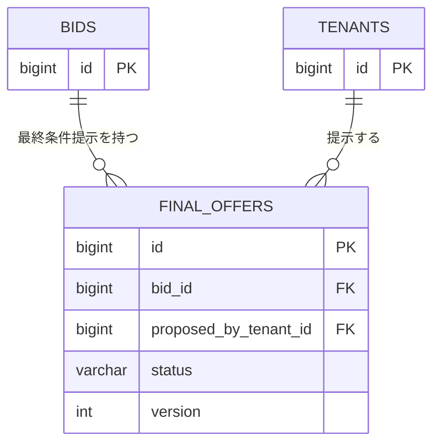

# テーブル定義: final_offers

- 説明: 最終条件提示（BR-012 合意成立要件の状態表現。設計新設テーブル。要件上は成約スナップショット（ENT-007）の前段階にあたる「最終条件を提示」操作の履歴を保持する）。
- Entity クラス名: FinalOffer
- 関連要件: `docs/requirements/functional/交渉合意成約.md`

## カラム定義

| カラム名 | 型 | NOT NULL | デフォルト | 説明 |
|---------|----|---------|----------|------|
| id | BIGINT | YES | IDENTITY | 主キー |
| bid_id | BIGINT | YES | なし | 対象応募（FK） |
| proposed_by_tenant_id | BIGINT | YES | なし | 提示元テナント（配送依頼企業 or 運送会社） |
| amount | INTEGER | YES | なし | 提示金額（円・税別） |
| from_location | VARCHAR(500) | YES | なし | 提示 from 場所 |
| from_datetime | TIMESTAMP | YES | なし | 提示 from 日時 |
| to_location | VARCHAR(500) | YES | なし | 提示 to 場所 |
| to_datetime | TIMESTAMP | YES | なし | 提示 to 日時 |
| truck_type | VARCHAR(20) | YES | なし | 提示トラック種別 |
| status | VARCHAR(20) | YES | 'PROPOSED' | `_common.yaml` FinalOfferStatus（PROPOSED/AGREED/INVALIDATED/DISCARDED） |
| version | INTEGER | YES | 0 | 楽観ロック用バージョン（@Version） |
| created_at | TIMESTAMP | YES | CURRENT_TIMESTAMP | 提示日時 |
| updated_at | TIMESTAMP | YES | CURRENT_TIMESTAMP | 更新日時 |

## 制約

| 制約種別 | 対象カラム | 説明 |
|--------|---------|------|
| PRIMARY KEY | id | |
| FOREIGN KEY | bid_id → bids.id | ON DELETE RESTRICT |
| FOREIGN KEY | proposed_by_tenant_id → tenants.id | ON DELETE RESTRICT |
| CHECK | status | `IN ('PROPOSED','AGREED','INVALIDATED','DISCARDED')` |
| CHECK | amount > 0 | |
| PARTIAL UNIQUE | bid_id WHERE status = 'PROPOSED' | 1 応募につき「提示中」の最終条件は同時に1件のみ（Q-J2: 取消・再提示不可）。PostgreSQL の部分一意インデックスで実現 |

## インデックス

| インデックス名 | 対象カラム | 種別 | 理由 |
|------------|---------|------|------|
| uq_final_offers_bid_id_proposed | bid_id | UNIQUE（部分, `WHERE status='PROPOSED'`） | 上記制約と同一。DB レベルで二重提示を防止する（B-1 是正） |
| idx_final_offers_bid_id | bid_id | 通常 | 履歴表示（提示→破棄→再提示は発生しないが、提示→無効化の履歴参照用） |

## 排他制御

| 操作 | 方式 | 根拠 |
|------|------|------|
| 提示（proposeFinalOffer） | 部分 UNIQUE 制約による DB レベル重複防止＋対象 bid 行の楽観ロック確認 | Q-J2（再提示不可）の保証 |
| 合意（agreeFinalOffer） / 破棄（discardFinalOffer） | 悲観ロック（成約処理トランザクション内で `SELECT ... FOR UPDATE`） | 合意と同時に他応募のクローズ・スナップショット保存が連鎖するため（jobs.md 排他制御節参照） |
| 無効化（Q-J3: 競合成約によるカスケード） | 同上（成約処理トランザクションに含める） | 合意フェーズ進行中の他応募先行成約時に、提示中の final_offers 行を INVALIDATED へ更新する |

## リレーション

| 種別 | 相手テーブル | カラム | カーディナリティ | 削除時挙動 |
|------|----------|------|-------------|----------|
| N:1 | bids | bid_id | 多数提示履歴 : 1 応募 | RESTRICT |
| N:1 | tenants | proposed_by_tenant_id | 多数提示履歴 : 1 テナント | RESTRICT |

## 部分 ER 図（このテーブル + 周辺）

