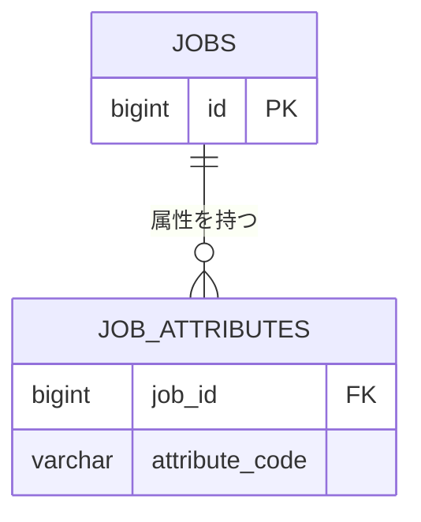

# テーブル定義: job_attributes

- 説明: 案件の複数選択属性（危険物・要冷蔵・要冷凍・割れ物、ENT-003 の属性）。1 案件に 0〜複数件。
- Entity クラス名: JobAttributeEntry
- 関連要件: `docs/requirements/functional/案件登録.md`, `コード値定義.md` 6節

## カラム定義

| カラム名 | 型 | NOT NULL | デフォルト | 説明 |
|---------|----|---------|----------|------|
| job_id | BIGINT | YES | なし | 対象案件（FK、複合 PK の一部） |
| attribute_code | VARCHAR(20) | YES | なし | 属性コード（`_common.yaml` JobAttribute: HAZARDOUS_ATTR / REFRIGERATED / FROZEN / FRAGILE） |

## 制約

| 制約種別 | 対象カラム | 説明 |
|--------|---------|------|
| PRIMARY KEY | job_id, attribute_code | 複合主キー（同一属性の重複登録を防止） |
| FOREIGN KEY | job_id → jobs.id | ON DELETE CASCADE |
| CHECK | attribute_code | `IN ('HAZARDOUS_ATTR','REFRIGERATED','FROZEN','FRAGILE')` |

## インデックス

| インデックス名 | 対象カラム | 種別 | 理由 |
|------------|---------|------|------|
| idx_job_attributes_attribute_code | attribute_code | 通常 | 属性による案件絞り込み検索（将来拡張。第1版の必須要件ではないが低コストのため付与） |

## 排他制御

- 排他制御不要（理由: 案件作成時に案件本体と同一トランザクションで一括 INSERT する追記専用テーブルであり、更新は発生しない。編集時は既存行を全削除して再 INSERT する）。
- 一意制約: PRIMARY KEY (job_id, attribute_code) が同一属性の重複登録防止を兼ねる一意制約（追加の UNIQUE 制約は不要）。
- 並行制御列(version): なし（追記専用テーブルであり、更新は既存行削除→再 INSERT のため楽観ロック用 `version` カラムを必要としない）。

## リレーション

| 種別 | 相手テーブル | カラム | カーディナリティ | 削除時挙動 |
|------|----------|------|-------------|----------|
| N:1 | jobs | job_id | 多数属性行 : 1 案件 | CASCADE |

## 部分 ER 図（このテーブル + 周辺）

