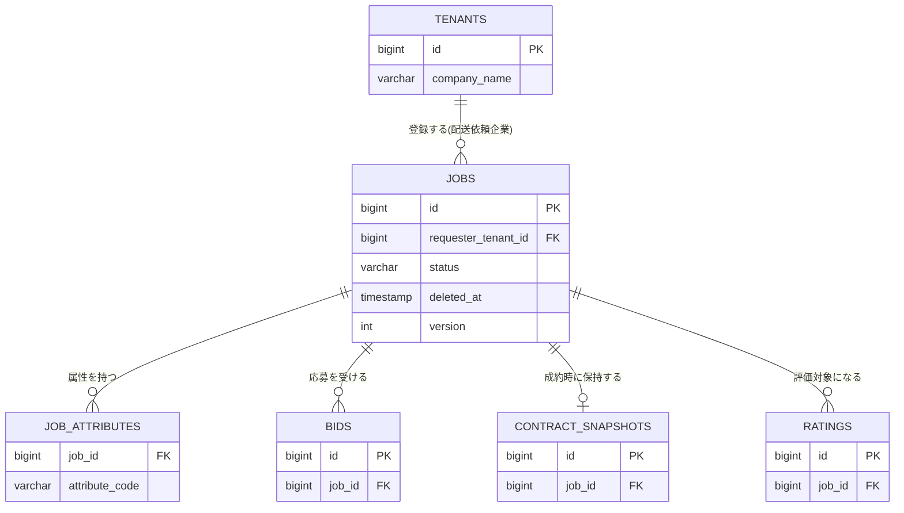

# テーブル定義: jobs

- 説明: 配送依頼企業が登録する積荷1件分の依頼（案件、ENT-003）。
- Entity クラス名: Job
- 関連要件: `docs/requirements/functional/案件登録.md`, `案件削除.md`, `運送ステータス報告.md`

## カラム定義

| カラム名 | 型 | NOT NULL | デフォルト | 説明 |
|---------|----|---------|----------|------|
| id | BIGINT | YES | IDENTITY | 主キー |
| requester_tenant_id | BIGINT | YES | なし | 登録した配送依頼企業（FK） |
| from_location | VARCHAR(500) | YES | なし | 積み地 |
| from_datetime | TIMESTAMP | YES | なし | 出発希望日時 |
| to_location | VARCHAR(500) | YES | なし | 卸し地 |
| to_datetime | TIMESTAMP | YES | なし | 到着希望日時 |
| volume_m3 | NUMERIC(10,2) | YES | なし | 容積（m3、Q-DM3） |
| cargo_type | VARCHAR(20) | YES | なし | 物品種別（`_common.yaml` CargoType） |
| truck_type | VARCHAR(20) | YES | なし | 希望トラック種別（`_common.yaml` TruckType） |
| desired_amount | INTEGER | YES | なし | 希望金額（円・税別、整数、Q-DM3） |
| remarks | VARCHAR(2000) | NO | なし | 備考 |
| status | VARCHAR(20) | YES | 'RECRUITING' | 案件ステータス（`_common.yaml` JobStatus、ST-001〜ST-007） |
| deleted_at | TIMESTAMP | NO | なし | 論理削除日時（NULL=未削除。BR-022） |
| departure_reported_at | TIMESTAMP | NO | なし | 運送開始報告日時 |
| completion_reported_at | TIMESTAMP | NO | なし | 完了報告日時 |
| completion_confirmed_at | TIMESTAMP | NO | なし | 完了確認日時 |
| version | INTEGER | YES | 0 | 楽観ロック用バージョン（@Version）。応募数上限・締切判定は本カラムに依らず後述の行ロック＋実 COUNT で保証する |
| created_at | TIMESTAMP | YES | CURRENT_TIMESTAMP | 作成日時 |
| updated_at | TIMESTAMP | YES | CURRENT_TIMESTAMP | 更新日時（24時間以内判定＝new 表示の判定に使用、SC-002） |

> 応募件数の表示用カウンタ（`bid_count` 等）は**意図的に持たない**（B-2 是正）。一覧・詳細表示時に `bids` テーブルへの実 COUNT クエリ、または JOIN 集計で都度算出する。

## 制約

| 制約種別 | 対象カラム | 説明 |
|--------|---------|------|
| PRIMARY KEY | id | |
| FOREIGN KEY | requester_tenant_id → tenants.id | ON DELETE RESTRICT |
| CHECK | status | `IN ('RECRUITING','NEGOTIATING','CONTRACTED','IN_TRANSIT','COMPLETED','RATED','CANCELLED')` |
| CHECK | volume_m3 > 0 | |
| CHECK | desired_amount > 0 | |
| CHECK | from_datetime < to_datetime | AC-101（案件登録.md）の不整合検知に対応 |

## インデックス

| インデックス名 | 対象カラム | 種別 | 理由 |
|------------|---------|------|------|
| idx_jobs_requester_tenant_id | requester_tenant_id | 通常 | SCR-008/SCR-011 の自社案件一覧（テナントフィルタ） |
| idx_jobs_status | status | 通常 | SCR-014 募集中一覧・ステータス別サマリ集計 |
| idx_jobs_status_from_datetime | status, from_datetime | 複合 | BR-010 自動締切判定（`from_datetime <= now() + 2h`）と絞り込み検索の複合条件 |
| idx_jobs_updated_at | updated_at | 通常 | new 表示判定（24時間以内） |

## 排他制御

| 操作 | 方式 | 根拠 |
|------|------|------|
| 応募受付（createBid, BR-009 上限20・BR-010 締切） | 悲観ロック（`SELECT ... FOR UPDATE` で対象 job 行をロック）＋実 COUNT | 応募枠の先着判定は競合頻度が高く、read-modify-write では二重許可・上限超過が起きる（B-1 是正）。ロック取得後に `status`・`from_datetime` を再検証し、`bids` の実件数を COUNT してから INSERT する。加えて `bids(job_id, carrier_tenant_id)` の UNIQUE 制約で重複応募（BR-004）を最終防御する |
| 案件編集・削除（BR-019） | 楽観ロック（version）で同時編集検知。ステータスガードは行ロック内で再検証 | 編集・削除自体の競合頻度は低いが、成約直前の状態変化を取りこぼさないよう、状態遷移系操作（成約・削除）とは別トランザクションで独立して version チェックする |
| 成約処理（agreeFinalOffer / agreeSetBid） | 悲観ロック（`SELECT ... FOR UPDATE`、対象案件群を ID 昇順で一括ロック） | セット応募の連鎖クローズを含むため、ロック順序を固定してデッドロックを防止する（B-3 是正、詳細は `sequences/交渉合意成約.md`, `sequences/セット応募一括合意.md`） |

## リレーション

| 種別 | 相手テーブル | カラム | カーディナリティ | 削除時挙動 |
|------|----------|------|-------------|----------|
| N:1 | tenants | requester_tenant_id | 多数案件 : 1 配送依頼企業 | RESTRICT |
| 1:N | job_attributes | job_attributes.job_id | 1 案件 : 多数属性 | CASCADE（物理削除バッチ内で明示的に一括削除。アプリ層制御であり DB カスケードにも設定して整合性を二重化） |
| 1:N | bids | bids.job_id | 1 案件 : 多数応募 | RESTRICT（応募は物理削除バッチが明示的に削除。BR-022, Q-DM4） |
| 0:1 | contract_snapshots | contract_snapshots.job_id | 1 案件 : 0または1スナップショット | RESTRICT |
| 1:N | ratings | ratings.job_id | 1 案件 : 最大2評価（双方向） | RESTRICT |
| 0:N | notifications | notifications.related_job_id | 1 案件 : 多数通知 | 外部キー制約なし（理由: 通知は案件物理削除後も90日間保持するため。tables/notifications.md 参照） |

## 部分 ER 図（このテーブル + 周辺）

