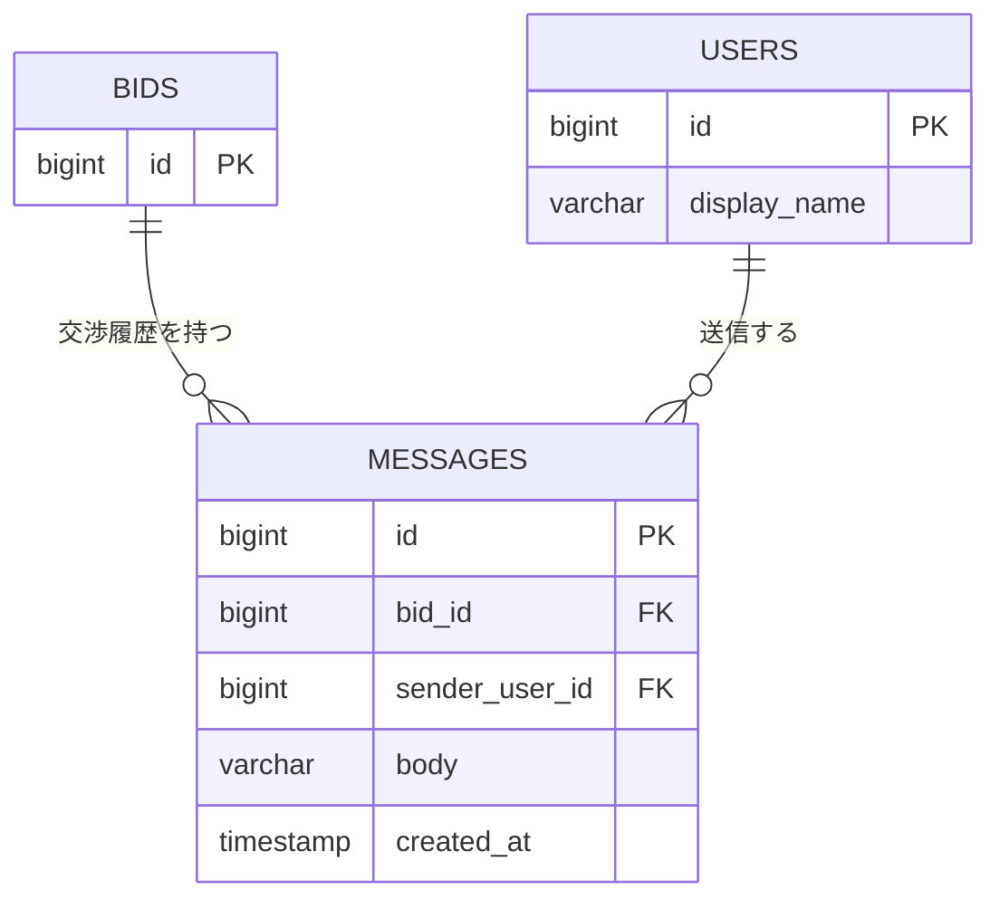

# テーブル定義: messages

- 説明: 応募（案件）単位の交渉メッセージ（定型文/自由入力、ENT-006）。
- Entity クラス名: Message
- 関連要件: `docs/requirements/functional/交渉合意成約.md`

## カラム定義

| カラム名 | 型 | NOT NULL | デフォルト | 説明 |
|---------|----|---------|----------|------|
| id | BIGINT | YES | IDENTITY | 主キー |
| bid_id | BIGINT | YES | なし | 対象応募（FK。案件は bids 経由で辿る） |
| sender_user_id | BIGINT | YES | なし | 送信ユーザー（FK） |
| sender_tenant_id | BIGINT | YES | なし | 送信テナント（非正規化。テナントフィルタの高速化・監査用） |
| body | VARCHAR(2000) | YES | なし | メッセージ本文 |
| template_code | VARCHAR(50) | NO | なし | 定型文コード（自由入力時は NULL） |
| created_at | TIMESTAMP | YES | CURRENT_TIMESTAMP | 送信日時 |

> 更新・削除を行わない追記専用テーブルのため `version`／`updated_at` は付与しない。

## 制約

| 制約種別 | 対象カラム | 説明 |
|--------|---------|------|
| PRIMARY KEY | id | |
| FOREIGN KEY | bid_id → bids.id | ON DELETE RESTRICT（物理削除バッチが明示的に先に messages を削除する） |
| FOREIGN KEY | sender_user_id → users.id | ON DELETE RESTRICT |
| FOREIGN KEY | sender_tenant_id → tenants.id | ON DELETE RESTRICT |
| CHECK | body <> '' | 空文字送信の防止（API 側 `x-validate-not-blank` と二重化） |

## インデックス

| インデックス名 | 対象カラム | 種別 | 理由 |
|------------|---------|------|------|
| idx_messages_bid_id_created_at | bid_id, created_at | 複合 | 連絡履歴の時系列表示（listMessages） |

## 排他制御

- 排他制御不要（理由: 追記専用（INSERT のみ）で更新・削除が発生しないため、同時実行の競合が起こらない）。
- 一意制約: なし（同一応募内で同一内容のメッセージが複数送信されることを禁止する業務ルールが無いため、id 主キー以外の一意制約は不要）。

## リレーション

| 種別 | 相手テーブル | カラム | カーディナリティ | 削除時挙動 |
|------|----------|------|-------------|----------|
| N:1 | bids | bid_id | 多数メッセージ : 1 応募 | RESTRICT |
| N:1 | users | sender_user_id | 多数メッセージ : 1 送信ユーザー | RESTRICT |
| N:1 | tenants | sender_tenant_id | 多数メッセージ : 1 送信テナント | RESTRICT |

## 部分 ER 図（このテーブル + 周辺）

