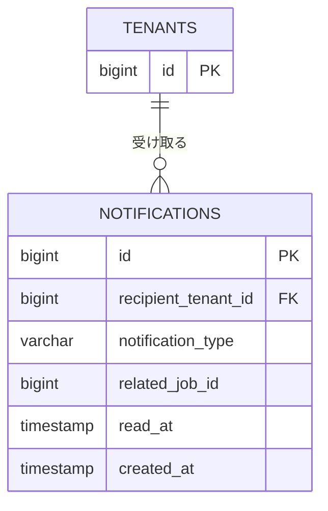

# テーブル定義: notifications

- 説明: テナント宛てのアプリ内通知（ENT-009）。
- Entity クラス名: Notification
- 関連要件: `docs/requirements/functional/通知.md`, `データモデル.md`（保持期間90日、Q-NF10）

> **宛先粒度の設計決定**: 通知の宛先はユーザー単位ではなく**テナント単位**とする（`recipient_tenant_id`）。
> 第1版はテナント内「同権限のみ」（BR-003）であり、業務イベント（成約・削除等）はテナント（企業）が主体であるため、
> テナント配下の全ユーザーが同一の通知・既読状態を共有する設計とする。将来ロール分離を導入する際にユーザー単位へ
> 分離することを課題として残す（`docs/design/概要.md`「前提条件」参照）。

## カラム定義

| カラム名 | 型 | NOT NULL | デフォルト | 説明 |
|---------|----|---------|----------|------|
| id | BIGINT | YES | IDENTITY | 主キー |
| recipient_tenant_id | BIGINT | YES | なし | 宛先テナント（FK） |
| notification_type | VARCHAR(20) | YES | なし | 通知種別（`_common.yaml` NotificationType: CONTRACT / GENERAL） |
| body | VARCHAR(500) | YES | なし | 通知本文（MSG-006/MSG-007/MSG-013、または一律「新着メッセージがあります」BR-025） |
| related_job_id | BIGINT | NO | なし | 関連案件 ID。**外部キー制約なし**（下記参照） |
| read_at | TIMESTAMP | NO | なし | 既読日時（NULL=未読） |
| created_at | TIMESTAMP | YES | CURRENT_TIMESTAMP | 作成日時（90日後に物理削除バッチで削除、Q-NF10） |

> 通知は既読フラグの単純更新のみで内容更新は発生しないため `version` は付与しない。

## 制約

| 制約種別 | 対象カラム | 説明 |
|--------|---------|------|
| PRIMARY KEY | id | |
| FOREIGN KEY | recipient_tenant_id → tenants.id | ON DELETE RESTRICT |
| CHECK | notification_type | `IN ('CONTRACT','GENERAL')` |
| （外部キー制約なし） | related_job_id | 理由: 通知は案件が物理削除された後も90日間保持する要件（データモデル.md 4節、Q-DM4）があり、
        jobs への FK を張ると物理削除時に CASCADE/SET NULL のいずれでも「削除済みへのリンク切れ」を意図通りに表現できないため、
        アプリケーション層でのみ整合性を扱う（削除済み参照時は getJobById が 404 を返し FE が MSG-020 を表示する。通知.md AC-101） |

## インデックス

| インデックス名 | 対象カラム | 種別 | 理由 |
|------------|---------|------|------|
| idx_notifications_recipient_tenant_id_created_at | recipient_tenant_id, created_at | 複合 | listNotifications の一覧表示（テナントフィルタ＋新着順） |
| idx_notifications_recipient_tenant_id_read_at | recipient_tenant_id, read_at | 複合 | getUnreadNotificationCount（`read_at IS NULL` の COUNT） |
| idx_notifications_created_at | created_at | 通常 | 90日経過後の物理削除バッチ（Q-NF10）の対象抽出 |

## 排他制御

- 排他制御不要（理由: `read_at` の更新は「未読→既読」の一方向・冪等な更新であり、同時実行で複数ユーザーが同一通知を既読化しても結果が収束するため（`UPDATE ... SET read_at = COALESCE(read_at, now())`）。作成は追記のみ）。
- 一意制約: なし（同一テナントに対する同種・同時刻の通知が複数存在してよいため、id 主キー以外の一意制約は不要）。

## リレーション

| 種別 | 相手テーブル | カラム | カーディナリティ | 削除時挙動 |
|------|----------|------|-------------|----------|
| N:1 | tenants | recipient_tenant_id | 多数通知 : 1 宛先テナント | RESTRICT |
| N:0..1 | jobs | related_job_id（FK制約なし） | 多数通知 : 0または1関連案件 | 対象外（上記参照） |

## 部分 ER 図（このテーブル + 周辺）

