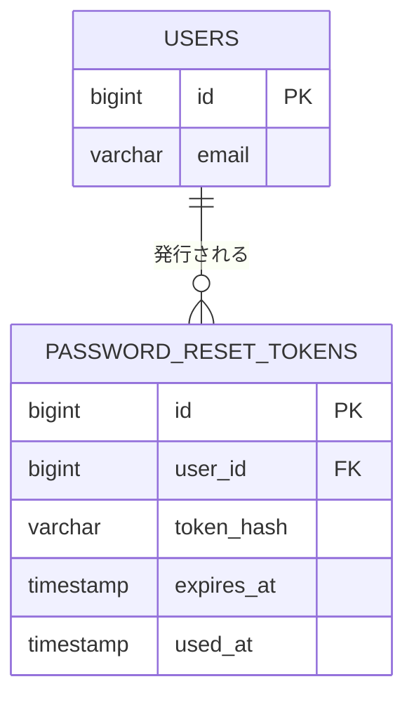

# テーブル定義: password_reset_tokens

- 説明: パスワードリセット用の再設定トークン（EXT-001, UC-006）。
- Entity クラス名: PasswordResetToken
- 関連要件: `docs/requirements/functional/認証.md`, `外部インターフェース一覧.md`（EXT-001）

## カラム定義

| カラム名 | 型 | NOT NULL | デフォルト | 説明 |
|---------|----|---------|----------|------|
| id | BIGINT | YES | IDENTITY | 主キー |
| user_id | BIGINT | YES | なし | 対象ユーザー（FK） |
| token_hash | VARCHAR(255) | YES | なし | トークンのハッシュ値（平文はメール送信時のみ生成しDBには保存しない） |
| expires_at | TIMESTAMP | YES | なし | 有効期限（発行から1時間、Q-NF3） |
| used_at | TIMESTAMP | NO | なし | 使用済み日時（使用済みトークンの再利用防止） |
| created_at | TIMESTAMP | YES | CURRENT_TIMESTAMP | 発行日時 |

## 制約

| 制約種別 | 対象カラム | 説明 |
|--------|---------|------|
| PRIMARY KEY | id | |
| FOREIGN KEY | user_id → users.id | ON DELETE CASCADE（ユーザー削除機能は第1版に無いため実質発生しない） |
| UNIQUE | token_hash | トークン検索・一意性保証 |

## インデックス

| インデックス名 | 対象カラム | 種別 | 理由 |
|------------|---------|------|------|
| uq_password_reset_tokens_token_hash | token_hash | UNIQUE | 再設定 API でのトークン検索（上記制約と同一） |
| idx_password_reset_tokens_user_id | user_id | 通常 | ユーザー単位のトークン失効処理（新規発行時に旧トークンを無効化する場合の検索） |

## 排他制御

- 排他制御不要（理由: 追記＋使用済みフラグの単純更新のみで、同時実行競合が業務上致命的でないため。`used_at IS NULL` の条件付き UPDATE で二重使用を防止する）。
- 並行制御列(version): なし（`WHERE used_at IS NULL` の条件付き UPDATE で二重使用を防止できるため、楽観ロック用 `version` カラムを必要としない）。

## リレーション

| 種別 | 相手テーブル | カラム | カーディナリティ | 削除時挙動 |
|------|----------|------|-------------|----------|
| N:1 | users | user_id | 多数トークン : 1 ユーザー | CASCADE |

## 部分 ER 図（このテーブル + 周辺）

