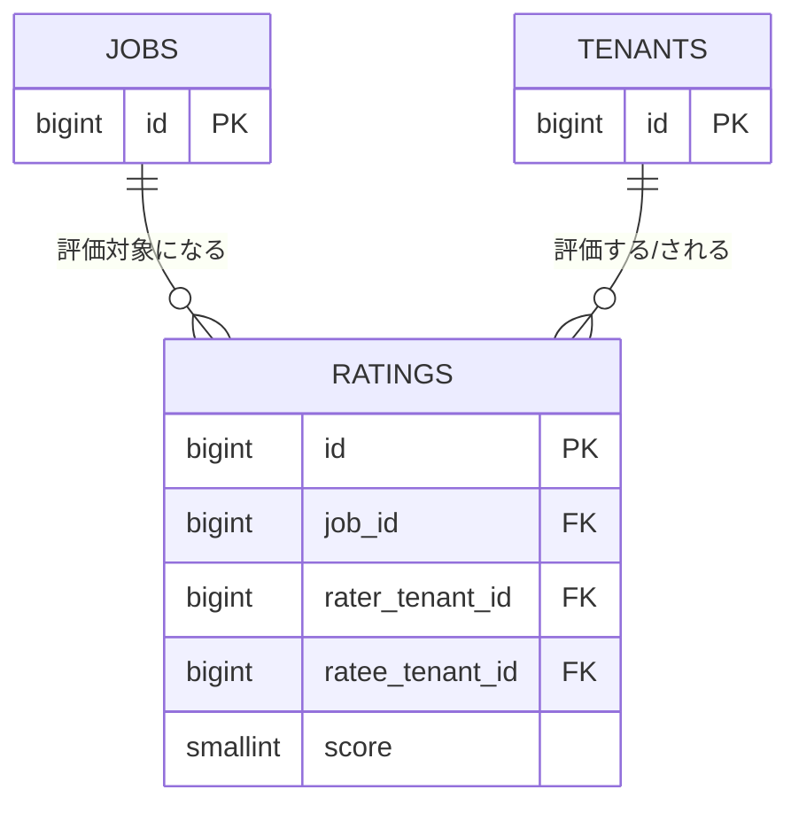

# テーブル定義: ratings

- 説明: 完了案件について当事者双方が相手に付ける評価（ENT-008）。一度登録すると編集不可。
- Entity クラス名: Rating
- 関連要件: `docs/requirements/functional/評価.md`

## カラム定義

| カラム名 | 型 | NOT NULL | デフォルト | 説明 |
|---------|----|---------|----------|------|
| id | BIGINT | YES | IDENTITY | 主キー |
| job_id | BIGINT | YES | なし | 対象案件（FK） |
| rater_tenant_id | BIGINT | YES | なし | 評価者テナント（FK） |
| rater_user_id | BIGINT | YES | なし | 評価を登録した担当ユーザー（FK） |
| ratee_tenant_id | BIGINT | YES | なし | 被評価者テナント（FK） |
| score | SMALLINT | YES | なし | 評価値（1〜5の5段階、Q-DM5） |
| comment | VARCHAR(1000) | NO | なし | 補足コメント |
| created_at | TIMESTAMP | YES | CURRENT_TIMESTAMP | 登録日時 |

> 登録後編集不可（BR-018）のため `version`／`updated_at` は付与しない（UPDATE 自体をアプリ層で禁止する）。

## 制約

| 制約種別 | 対象カラム | 説明 |
|--------|---------|------|
| PRIMARY KEY | id | |
| FOREIGN KEY | job_id → jobs.id | ON DELETE RESTRICT |
| FOREIGN KEY | rater_tenant_id → tenants.id | ON DELETE RESTRICT |
| FOREIGN KEY | rater_user_id → users.id | ON DELETE RESTRICT |
| FOREIGN KEY | ratee_tenant_id → tenants.id | ON DELETE RESTRICT |
| UNIQUE | job_id, rater_tenant_id | 評価の一意性（BR-018: 1案件につき評価者ごとに1回のみ） |
| CHECK | score BETWEEN 1 AND 5 | Q-DM5 |

## インデックス

| インデックス名 | 対象カラム | 種別 | 理由 |
|------------|---------|------|------|
| uq_ratings_job_id_rater_tenant_id | job_id, rater_tenant_id | UNIQUE | 上記制約と同一。評価済み判定（MSG-022 の 409 判定）にも使用 |
| idx_ratings_ratee_tenant_id | ratee_tenant_id | 通常 | 将来の「受けた評価一覧」拡張に備える（第1版の必須要件ではないが低コストのため付与） |

## 排他制御

| 操作 | 方式 | 根拠 |
|------|------|------|
| 評価登録（createRating） | UNIQUE 制約（job_id, rater_tenant_id）による DB レベル重複防止＋条件付き INSERT | BR-018 の一意性は競合頻度が低いためアプリ層の事前チェック＋UNIQUE 制約の二重防御で十分（悲観ロック不要） |
| 双方評価完了判定（案件ステータス COMPLETED → RATED） | 評価 INSERT 後に同一トランザクション内で jobs 行を `SELECT ... FOR UPDATE` し、双方の rating 件数を実 COUNT してから status を更新する | 2件目の評価登録と1件目の評価登録が同時に発生した場合の判定漏れを防止する |

## リレーション

| 種別 | 相手テーブル | カラム | カーディナリティ | 削除時挙動 |
|------|----------|------|-------------|----------|
| N:1 | jobs | job_id | 多数評価（最大2） : 1 案件 | RESTRICT |
| N:1 | tenants (rater) | rater_tenant_id | 多数評価 : 1 評価者テナント | RESTRICT |
| N:1 | tenants (ratee) | ratee_tenant_id | 多数評価 : 1 被評価者テナント | RESTRICT |
| N:1 | users | rater_user_id | 多数評価 : 1 担当ユーザー | RESTRICT |

## 部分 ER 図（このテーブル + 周辺）

