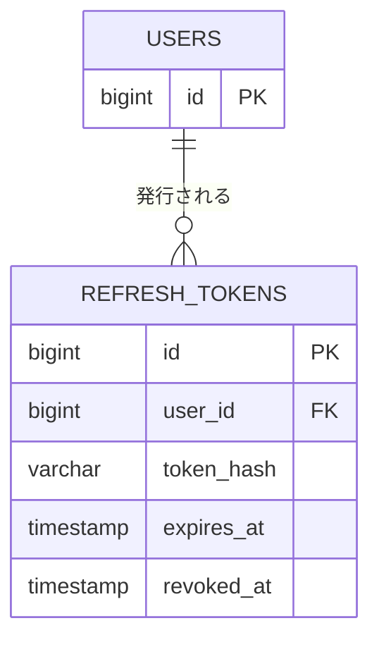

# テーブル定義: refresh_tokens

- 説明: JWT リフレッシュトークン（ログアウト・失効管理のため DB 保存、セキュリティ設計.md の JWT ライフサイクル参照）。
- Entity クラス名: RefreshToken
- 関連要件: `docs/requirements/functional/認証.md`（セッション有効時間 Q-NF5 の実現手段）

## カラム定義

| カラム名 | 型 | NOT NULL | デフォルト | 説明 |
|---------|----|---------|----------|------|
| id | BIGINT | YES | IDENTITY | 主キー |
| user_id | BIGINT | YES | なし | 対象ユーザー（FK） |
| token_hash | VARCHAR(255) | YES | なし | リフレッシュトークンのハッシュ値 |
| expires_at | TIMESTAMP | YES | なし | 絶対有効期限（発行=ログインから8時間、Q-NF5「最大セッション長8時間」に対応） |
| revoked_at | TIMESTAMP | NO | なし | 失効日時（ログアウト操作で設定） |
| created_at | TIMESTAMP | YES | CURRENT_TIMESTAMP | 発行日時 |

## 制約

| 制約種別 | 対象カラム | 説明 |
|--------|---------|------|
| PRIMARY KEY | id | |
| FOREIGN KEY | user_id → users.id | ON DELETE CASCADE |
| UNIQUE | token_hash | トークン検索・一意性保証 |

## インデックス

| インデックス名 | 対象カラム | 種別 | 理由 |
|------------|---------|------|------|
| uq_refresh_tokens_token_hash | token_hash | UNIQUE | リフレッシュ API でのトークン検索（上記制約と同一） |
| idx_refresh_tokens_user_id | user_id | 通常 | ユーザー単位の一括失効（全端末ログアウト等、将来拡張の検索用） |

## 排他制御

- 排他制御不要（理由: 追記＋失効フラグの単純更新のみ。同時リフレッシュはトークンローテーションを第1版では行わないため競合しない）。同時ログイン制御は行わない方針（Q-NF5）と整合し、1 ユーザーが複数の有効な refresh_tokens 行を同時に持つことを許容する。
- 並行制御列(version): なし（失効判定は `revoked_at` の単純更新のみで同時実行の競合が業務上発生しないため、楽観ロック用 `version` カラムを必要としない）。

## リレーション

| 種別 | 相手テーブル | カラム | カーディナリティ | 削除時挙動 |
|------|----------|------|-------------|----------|
| N:1 | users | user_id | 多数トークン : 1 ユーザー | CASCADE |

## 部分 ER 図（このテーブル + 周辺）

