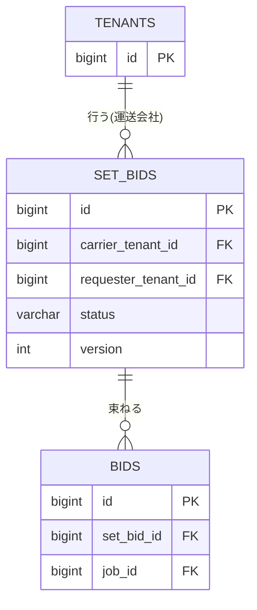

# テーブル定義: set_bids

- 説明: 複数の応募を束ね、オール・オア・ナッシングで扱う提案単位（セット応募、ENT-005）。
- Entity クラス名: SetBid
- 関連要件: `docs/requirements/functional/応募.md`

## カラム定義

| カラム名 | 型 | NOT NULL | デフォルト | 説明 |
|---------|----|---------|----------|------|
| id | BIGINT | YES | IDENTITY | 主キー |
| carrier_tenant_id | BIGINT | YES | なし | セット応募を行った運送会社（FK） |
| requester_tenant_id | BIGINT | YES | なし | 対象案件群の配送依頼企業（FK。BR-005: 全対象案件が同一テナントであることの非正規化保持） |
| status | VARCHAR(20) | YES | 'PENDING' | 表示用の集約ステータス（PENDING/CONTRACTED/FAILED）。**業務上の真の状態は内包する bids の状態から導出**され、本カラムは成約処理と同一トランザクションで更新する表示用の非正規化値（B-2 の対象外：上限・可否判定には使用しない） |
| version | INTEGER | YES | 0 | 楽観ロック用バージョン（@Version） |
| created_at | TIMESTAMP | YES | CURRENT_TIMESTAMP | 作成日時 |
| updated_at | TIMESTAMP | YES | CURRENT_TIMESTAMP | 更新日時 |

## 制約

| 制約種別 | 対象カラム | 説明 |
|--------|---------|------|
| PRIMARY KEY | id | |
| FOREIGN KEY | carrier_tenant_id → tenants.id | ON DELETE RESTRICT |
| FOREIGN KEY | requester_tenant_id → tenants.id | ON DELETE RESTRICT |
| CHECK | status | `IN ('PENDING','CONTRACTED','FAILED')` |

## インデックス

| インデックス名 | 対象カラム | 種別 | 理由 |
|------------|---------|------|------|
| idx_set_bids_carrier_tenant_id | carrier_tenant_id | 通常 | 運送会社の自社セット応募一覧 |
| idx_set_bids_requester_tenant_id | requester_tenant_id | 通常 | 配送依頼企業のセット応募連動確認（SCR-009-01） |

## 排他制御

| 操作 | 方式 | 根拠 |
|------|------|------|
| セット一括合意（agreeSetBid） | 悲観ロック（本行および対象 bids・jobs を ID 昇順で `SELECT ... FOR UPDATE` 一括ロック） | BR-006/BR-008 のオール・オア・ナッシング・一括承認を単一トランザクションで整合させる（B-3 是正、詳細は `sequences/セット応募一括合意.md`） |
| 連動クローズ（他セットの成約による不成立） | 同上（成約処理トランザクションに含める） | BR-015 |

- 一意制約: なし（本テーブル自体に重複禁止の業務ルールは無い。個々の応募の重複防止〔BR-004: 1社1案件につき1提案〕は `bids.job_id, carrier_tenant_id` の UNIQUE 制約で保証する）。

## リレーション

| 種別 | 相手テーブル | カラム | カーディナリティ | 削除時挙動 |
|------|----------|------|-------------|----------|
| N:1 | tenants (carrier) | carrier_tenant_id | 多数セット応募 : 1 運送会社 | RESTRICT |
| N:1 | tenants (requester) | requester_tenant_id | 多数セット応募 : 1 配送依頼企業 | RESTRICT |
| 1:N | bids | bids.set_bid_id | 1 セット応募 : 2以上の応募 | RESTRICT |

## 部分 ER 図（このテーブル + 周辺）

