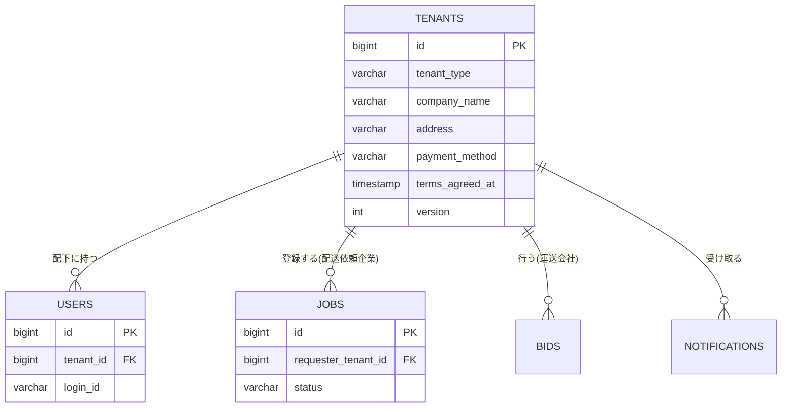

# テーブル定義: tenants

- 説明: 企業アカウント（テナント）。配送依頼企業・運送会社のいずれも同じテーブルで表現する（ENT-001）。
- Entity クラス名: Tenant
- 関連要件: `docs/requirements/functional/アカウント登録.md`

## カラム定義

| カラム名 | 型 | NOT NULL | デフォルト | 説明 |
|---------|----|---------|----------|------|
| id | BIGINT | YES | IDENTITY | 主キー |
| tenant_type | VARCHAR(20) | YES | なし | 企業種別（`_common.yaml` TenantType: REQUESTER / CARRIER） |
| company_name | VARCHAR(200) | YES | なし | 法人名（重複判定キーの一部、Q-A1） |
| address | VARCHAR(500) | YES | なし | 住所（重複判定キーの一部、Q-A1） |
| company_phone | VARCHAR(20) | YES | なし | 代表電話番号 |
| company_email | VARCHAR(255) | YES | なし | 代表メールアドレス |
| payment_method | VARCHAR(20) | YES | なし | 支払方法種別（`_common.yaml` PaymentMethod: INVOICE / BANK_TRANSFER） |
| terms_agreed_at | TIMESTAMP | YES | なし | 利用規約・プライバシーポリシー同意日時 |
| version | INTEGER | YES | 0 | 楽観ロック用バージョン（@Version） |
| created_at | TIMESTAMP | YES | CURRENT_TIMESTAMP | 作成日時 |
| updated_at | TIMESTAMP | YES | CURRENT_TIMESTAMP | 更新日時 |

## 制約

| 制約種別 | 対象カラム | 説明 |
|--------|---------|------|
| PRIMARY KEY | id | |
| UNIQUE | company_name, address | 法人重複判定キー（Q-A1）。登録前のアプリ層事前チェック（正規化後完全一致判定）に加え、DB 制約で最終防御する（AC-201） |
| CHECK | tenant_type | `IN ('REQUESTER','CARRIER')` |
| CHECK | payment_method | `IN ('INVOICE','BANK_TRANSFER')` |

## インデックス

| インデックス名 | 対象カラム | 種別 | 理由 |
|------------|---------|------|------|
| uq_tenants_company_name_address | company_name, address | UNIQUE | 法人重複判定（上記制約と同一） |
| idx_tenants_tenant_type | tenant_type | 通常 | 募集中案件の運送会社向け閲覧等でテナント種別によるフィルタが発生するため |

## 排他制御

| 操作 | 方式 | 根拠 |
|------|------|------|
| テナント情報の同時編集 | 楽観ロック（version カラム / @Version） | 第 1 版はテナント情報の更新 API 自体を持たない（参照のみ、tenants.yaml 参照）。将来の更新機能追加に備え version は付与する |

## リレーション

| 種別 | 相手テーブル | カラム | カーディナリティ | 削除時挙動 |
|------|----------|------|-------------|----------|
| 1:N | users | users.tenant_id | 1 テナント : 多数ユーザー | RESTRICT（テナント削除機能は第1版に無いため実質発生しない） |
| 1:N | jobs | jobs.requester_tenant_id | 1 配送依頼企業 : 多数案件 | RESTRICT |
| 1:N | bids | bids.carrier_tenant_id | 1 運送会社 : 多数応募 | RESTRICT |
| 1:N | notifications | notifications.recipient_tenant_id | 1 テナント : 多数通知 | RESTRICT |

## 部分 ER 図（このテーブル + 周辺）

