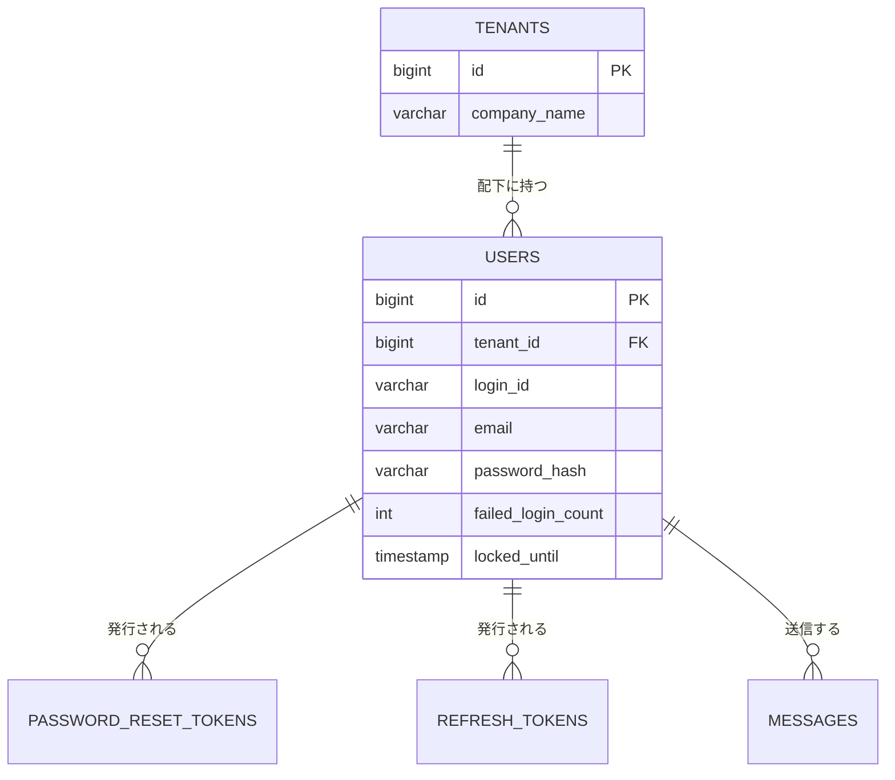

# テーブル定義: users

- 説明: テナント配下のログイン単位ユーザー（ENT-002）。
- Entity クラス名: User
- 関連要件: `docs/requirements/functional/アカウント登録.md`, `認証.md`

## カラム定義

| カラム名 | 型 | NOT NULL | デフォルト | 説明 |
|---------|----|---------|----------|------|
| id | BIGINT | YES | IDENTITY | 主キー |
| tenant_id | BIGINT | YES | なし | 所属テナント（FK） |
| display_name | VARCHAR(100) | YES | なし | ユーザー名（識別名）。連絡履歴の送信者表示に使用 |
| login_id | VARCHAR(50) | YES | なし | ログイン ID（テナント内一意、Q-NF1） |
| email | VARCHAR(255) | YES | なし | 登録メールアドレス（システム全体で一意、Q-NF1。パスワードリセット送付先） |
| password_hash | VARCHAR(255) | YES | なし | BCrypt ハッシュ（コスト12、セキュリティ設計.md） |
| failed_login_count | INTEGER | YES | 0 | 連続ログイン失敗回数（Q-NF2 のロック判定に使用） |
| locked_until | TIMESTAMP | NO | なし | ロック解除日時（失敗5回でここから15分後を設定、Q-NF2） |
| version | INTEGER | YES | 0 | 楽観ロック用バージョン（@Version） |
| created_at | TIMESTAMP | YES | CURRENT_TIMESTAMP | 作成日時 |
| updated_at | TIMESTAMP | YES | CURRENT_TIMESTAMP | 更新日時 |

## 制約

| 制約種別 | 対象カラム | 説明 |
|--------|---------|------|
| PRIMARY KEY | id | |
| FOREIGN KEY | tenant_id → tenants.id | ON DELETE RESTRICT |
| UNIQUE | tenant_id, login_id | ログイン ID はテナント内一意（Q-NF1, BR-002） |
| UNIQUE | email | 登録メールアドレスはシステム全体で一意（Q-NF1） |

## インデックス

| インデックス名 | 対象カラム | 種別 | 理由 |
|------------|---------|------|------|
| uq_users_tenant_id_login_id | tenant_id, login_id | UNIQUE | ログイン処理での検索・一意性保証（上記制約と同一） |
| uq_users_email | email | UNIQUE | パスワードリセット申請時の検索・一意性保証 |
| idx_users_tenant_id | tenant_id | 通常 | ユーザー追加・テナント配下一覧のテナントフィルタ |

## 排他制御

| 操作 | 方式 | 根拠 |
|------|------|------|
| ログイン失敗カウンタ更新 | 悲観ロック不要（同一ユーザーへの同時ログイン試行は低頻度。`UPDATE users SET failed_login_count = failed_login_count + 1 WHERE id = ? AND version = ?` の条件付き UPDATE＋楽観ロックで十分） | 更新件数0件（version不一致）時はリトライせず現在値を再取得して判定（ロックアウト判定の厳密性より可用性を優先） |

## リレーション

| 種別 | 相手テーブル | カラム | カーディナリティ | 削除時挙動 |
|------|----------|------|-------------|----------|
| N:1 | tenants | tenant_id | 多数ユーザー : 1 テナント | RESTRICT |
| 1:N | password_reset_tokens | password_reset_tokens.user_id | 1 ユーザー : 多数トークン | RESTRICT |
| 1:N | refresh_tokens | refresh_tokens.user_id | 1 ユーザー : 多数トークン | RESTRICT |
| 1:N | messages | messages.sender_user_id | 1 ユーザー : 多数メッセージ | RESTRICT |

## 部分 ER 図（このテーブル + 周辺）

