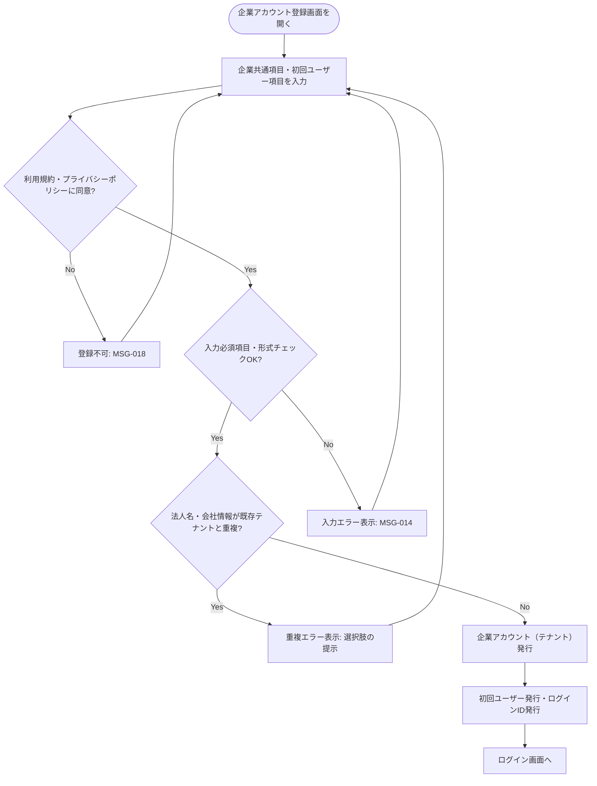

# 業務アクティビティ: アカウント登録フロー（法人重複判定）

## ID 凡例

| ID 体系 | 形式例 | 用途 |
|---------|-------|------|
| `ACT-004` | ACT-004 | 業務アクティビティ ID（フロー単位、3 桁ゼロ埋め） |

## メタデータ

- アクティビティ ID: ACT-004
- 主アクター: 配送依頼企業ユーザー、運送会社ユーザー
- 関連ユースケース（UC-XXX）: UC-001, UC-002, UC-003
- 関連業務ルール（BR-XXX）: BR-001, BR-002, BR-003
- 関連受け入れ条件（AC-XXX）: アカウント登録/AC-001, アカウント登録/AC-101, アカウント登録/AC-201
- トリガー（開始条件）: 未登録の企業が企業アカウント登録画面から登録操作を行う
- 終了条件（成功 / 失敗）: 成功＝企業アカウント（テナント）と初回ユーザーが発行される／失敗＝重複と判定され登録が拒否される、または入力不備で登録できない

## 業務フロー図

## ステップ詳細

| # | ステップ | 担当アクター | 入力 | 出力 | 関連 UC / BR / AC |
|---|--------|------------|------|------|------------------|
| 1 | 企業共通項目・ユーザー項目入力 | 配送依頼企業/運送会社ユーザー | 法人名・住所・電話・メール・支払方法種別・利用規約同意、ユーザー名・ログインID・パスワード | 入力データ | UC-001, UC-002 / アカウント登録/AC-001 |
| 2 | 利用規約同意チェック | システム | 同意チェック状態 | 同意済 or 拒否 | BR-001 / アカウント登録/AC-101 |
| 3 | 入力検証 | システム | 入力データ | 検証結果 | アカウント登録/AC-101 |
| 4 | 法人重複判定 | システム | 法人名等の照合キー | 重複あり/なし | アカウント登録/AC-201 |
| 5 | テナント発行 | システム | 検証済みの企業情報 | 企業アカウント（テナント） | BR-001 |
| 6 | 初回ユーザー発行 | システム | ユーザー個別項目 | ユーザー・ログインID | BR-002 |

## 例外フロー・代替フロー

- 例外1（法人重複判定の照合キー）: 法人名＋住所の組み合わせ（完全一致、正規化後）で重複と判定する（選択肢B採用、Q-A1 決定済み）。
- 例外2（重複時の代替手段）: 重複時は登録不可のみとし、既存テナント管理者への連絡を利用者に案内する（システム上の参加申請機能は第 1 版では提供しない、選択肢A採用、Q-A2 決定済み）。
- 代替1: 既存テナントへのユーザー追加（UC-003）は法人重複判定を伴わず、ログイン後の管理操作として行う。
