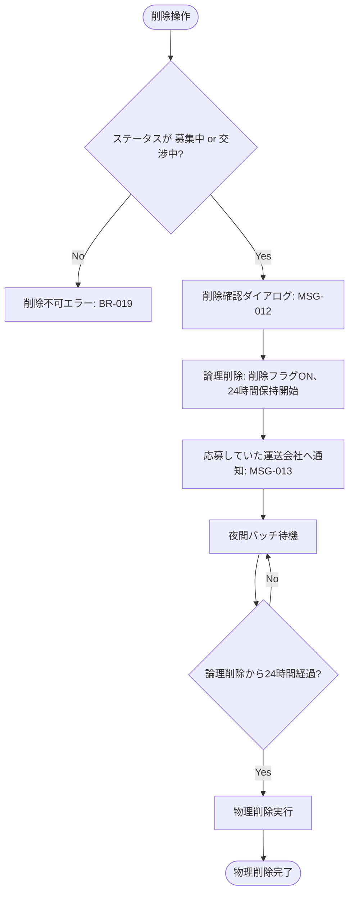

# 業務アクティビティ: 案件削除フロー（論理削除→物理削除）

## ID 凡例

| ID 体系 | 形式例 | 用途 |
|---------|-------|------|
| `ACT-005` | ACT-005 | 業務アクティビティ ID（フロー単位、3 桁ゼロ埋め） |

## メタデータ

- アクティビティ ID: ACT-005
- 主アクター: 配送依頼企業ユーザー、システム（夜間バッチ）
- 関連ユースケース（UC-XXX）: UC-009
- 関連業務ルール（BR-XXX）: BR-019, BR-022
- 関連受け入れ条件（AC-XXX）: 案件削除/AC-001, 案件削除/AC-101, 案件削除/AC-401
- トリガー（開始条件）: 配送依頼企業が募集中・交渉中の案件の削除操作を行う
- 終了条件（成功 / 失敗）: 成功＝24 時間後の夜間バッチで物理削除が完了する／失敗＝ステータスが成約済以降のため削除不可

## 業務フロー図

## ステップ詳細

| # | ステップ | 担当アクター | 入力 | 出力 | 関連 UC / BR / AC |
|---|--------|------------|------|------|------------------|
| 1 | 削除操作・ステータス判定 | 配送依頼企業ユーザー / システム | 削除対象案件、現在ステータス | 削除可否判定 | UC-009 / BR-019, BR-022 / 案件削除/AC-001 |
| 2 | 削除確認・論理削除実行 | 配送依頼企業ユーザー | 削除確認操作 | 論理削除フラグON | BR-022 / 案件削除/AC-001 |
| 3 | 応募運送会社への通知 | システム | 論理削除イベント | MSG-013 通知 | BR-022 |
| 4 | 夜間バッチによる物理削除 | システム（EXT-010） | 24 時間経過した論理削除データ | 物理削除完了 | BR-022 / 案件削除/AC-401 |

## 例外フロー・代替フロー

- 例外1（削除不可対象）: ステータスが「成約済」「運送中」「完了」「評価済」の案件は削除不可（BR-019）。画面上は削除操作自体を非活性にする。
- 例外2（論理削除中の表示方針）: 論理削除〜物理削除までの 24 時間、配送依頼企業側の一覧・詳細には「削除済み」として表示を残し、運送会社側の一覧・詳細からは非表示にする（Q-J8 決定済み）。
- 例外3（物理削除後の関連データ）: 物理削除時、紐づく応募（ENT-004）・連絡メッセージ（ENT-006）は案件と同時に物理削除する。通知（ENT-009）は物理削除の対象とせず保持する（Q-DM4 決定済み）。
- 代替1: 復元機能（論理削除からの取消）は第 1 版では提供しない（スコープ外、Q-J9 決定済み）。
