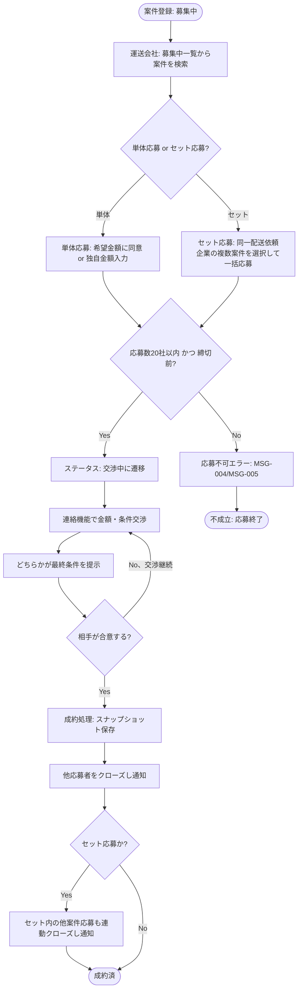

# 業務アクティビティ: 案件成約フロー

## ID 凡例

| ID 体系 | 形式例 | 用途 |
|---------|-------|------|
| `ACT-001` | ACT-001 | 業務アクティビティ ID（フロー単位、3 桁ゼロ埋め） |

## メタデータ

- アクティビティ ID: ACT-001
- 主アクター: 配送依頼企業ユーザー、運送会社ユーザー
- 関連ユースケース（UC-XXX）: UC-007, UC-010, UC-011, UC-012, UC-013, UC-014, UC-015, UC-016
- 関連業務ルール（BR-XXX）: BR-004, BR-005, BR-006, BR-007, BR-008, BR-009, BR-010, BR-011, BR-012, BR-013, BR-014, BR-015, BR-016, BR-021
- 関連受け入れ条件（AC-XXX）: 応募/AC-001, 応募/AC-201, 交渉合意成約/AC-001, 交渉合意成約/AC-101
- トリガー（開始条件）: 配送依頼企業が案件を登録する（ステータス「募集中」）
- 終了条件（成功 / 失敗）: 成功＝合意成立により案件ステータスが「成約済」に遷移する／失敗＝応募上限到達・自動締切・セット不成立等により当該応募が成立しない

## 業務フロー図

## ステップ詳細

| # | ステップ | 担当アクター | 入力 | 出力 | 関連 UC / BR / AC |
|---|--------|------------|------|------|------------------|
| 1 | 案件登録 | 配送依頼企業ユーザー | 案件登録項目一式 | 案件（ステータス: 募集中） | UC-007 / BR-011 / 案件登録/AC-001 |
| 2 | 募集中案件の検索・閲覧 | 運送会社ユーザー | 検索条件（都道府県・時間帯等） | 募集中案件一覧 | UC-010 / 応募/AC-001 |
| 3 | 応募（単体 or セット） | 運送会社ユーザー | 希望金額 or 独自金額、セット対象案件（同一配送依頼企業のみ） | 応募（ステータス: 応募中） | UC-011, UC-012 / BR-004, BR-005, BR-009 / 応募/AC-001, 応募/AC-201 |
| 4 | 応募上限・締切判定 | システム | 現在の応募数、現在時刻 | 受理 or MSG-004/MSG-005 | BR-009, BR-010 / 応募/AC-101 |
| 5 | 交渉中への遷移 | システム | 初回応募発生イベント | 案件ステータス: 交渉中 | BR-011 |
| 6 | 連絡・金額交渉 | 配送依頼企業ユーザー、運送会社ユーザー | メッセージ、金額提示 | 連絡履歴 | UC-014 / 交渉合意成約/AC-001 |
| 7 | 最終条件提示 | いずれか一方 | 最終金額・条件 | 最終条件提示状態 | UC-015 / BR-012 |
| 8 | 合意する | 相手側 | 合意操作 | 合意成立イベント | UC-016 / BR-012 |
| 9 | 成約処理（スナップショット保存） | システム | 合意内容一式 | 成約スナップショット、案件ステータス: 成約済 | BR-013 / 交渉合意成約/AC-001 |
| 10 | 他応募者クローズ・通知 | システム | 成約イベント | 他応募のクローズ、MSG-006 通知 | BR-014 |
| 11 | セット連動クローズ・通知 | システム | セット応募情報 | セット内他案件応募のクローズ、MSG-007 通知 | BR-006, BR-015 |

## 例外フロー・代替フロー

- 例外1（応募枠満了）: 応募実行時点で 20 社に達していた場合、MSG-004 を表示し応募を拒否する（ステップ4）。
- 例外2（自動締切超過）: from 時刻の 2 時間前を過ぎている場合、MSG-005 を表示し応募を拒否する（ステップ4）。
- 例外3（セット応募の一部不成立）: セット内のいずれか 1 案件が他社成約・削除等で不成立になった場合、セット応募全体が自動的に不成立となり、応募済み各案件から当該セット応募がクローズされる（BR-006）。
- 例外4（合意フェーズ中の競合成約）: 合意フェーズ中（最終条件提示済み・未合意）に同一案件の別応募が先に成約した場合、進行中の合意フェーズは自動的に不成立とし、BR-014 と同様に「他社に決定しました」通知（MSG-006 相当）を送る。提示中であった最終条件提示は無効化し、以後の合意操作は拒否する（選択肢A採用、Q-J3 決定済み）。
- 代替1: 独自金額を入力せず「希望金額に同意」する場合は交渉をスキップして最終条件提示に進むことも可能とする（要件素材の想定）。
