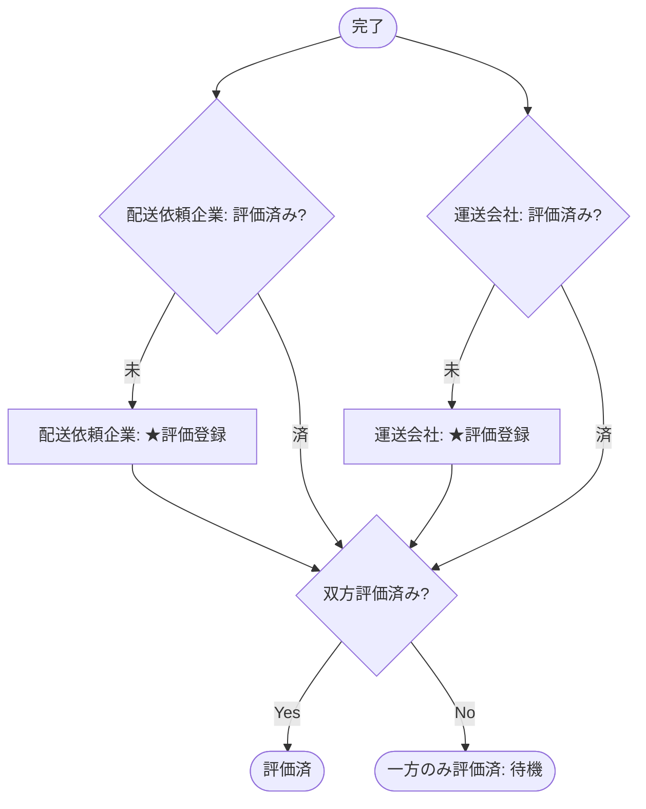

# 業務アクティビティ: 評価フロー

## ID 凡例

| ID 体系 | 形式例 | 用途 |
|---------|-------|------|
| `ACT-003` | ACT-003 | 業務アクティビティ ID（フロー単位、3 桁ゼロ埋め） |

## メタデータ

- アクティビティ ID: ACT-003
- 主アクター: 配送依頼企業ユーザー、運送会社ユーザー
- 関連ユースケース（UC-XXX）: UC-020
- 関連業務ルール（BR-XXX）: BR-017, BR-018
- 関連受け入れ条件（AC-XXX）: 評価/AC-001, 評価/AC-101
- トリガー（開始条件）: 案件ステータスが「完了」になった時点
- 終了条件（成功 / 失敗）: 成功＝双方の評価登録が完了しステータス「評価済」に遷移する／片方のみ評価済の状態は中間状態として継続する

## 業務フロー図

## ステップ詳細

| # | ステップ | 担当アクター | 入力 | 出力 | 関連 UC / BR / AC |
|---|--------|------------|------|------|------------------|
| 1 | 完了報告・完了確認の完了検知 | システム | 案件ステータス: 完了 | 評価登録受付開始 | ACT-002 と連動 |
| 2 | ★評価登録（配送依頼企業） | 配送依頼企業ユーザー | 評価値（★）、コメント（任意） | 評価データ（配送依頼企業分） | UC-020 / BR-018 / 評価/AC-001 |
| 3 | ★評価登録（運送会社） | 運送会社ユーザー | 評価値（★）、コメント（任意） | 評価データ（運送会社分） | UC-020 / BR-018 / 評価/AC-001 |
| 4 | 評価済への遷移判定 | システム | 双方の評価データ有無 | 案件ステータス: 評価済（双方揃った場合） | BR-017, BR-018 |

## 例外フロー・代替フロー

- 例外1（片方のみ評価）: 一方のみが評価を登録した場合、案件ステータスは「完了」のまま留まり、もう一方の評価登録を待つ。督促は行わない（Q-J7 決定済み）。
- 例外2（評価未登録のまま長期経過）: 期限は設けず、評価未登録のまま「完了」に留め続ける（選択肢A採用、自動的な「評価済（未評価）」への遷移は行わない。Q-J7 決定済み）。
- 代替1: 評価は一度登録すると編集不可（BR-018）。将来的に編集可能へ拡張予定だが第 1 版では対象外。
