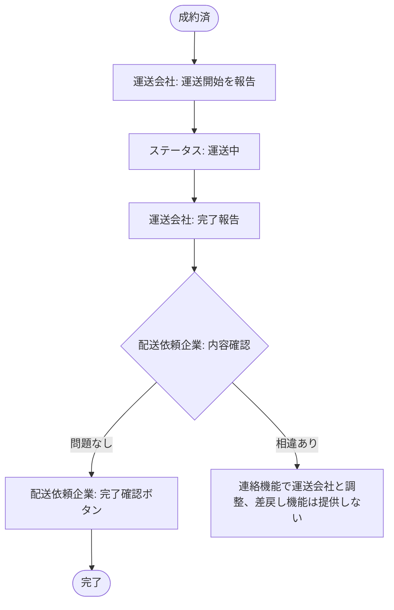

# 業務アクティビティ: 運送実施フロー

## ID 凡例

| ID 体系 | 形式例 | 用途 |
|---------|-------|------|
| `ACT-002` | ACT-002 | 業務アクティビティ ID（フロー単位、3 桁ゼロ埋め） |

## メタデータ

- アクティビティ ID: ACT-002
- 主アクター: 運送会社ユーザー、配送依頼企業ユーザー
- 関連ユースケース（UC-XXX）: UC-017, UC-018, UC-019
- 関連業務ルール（BR-XXX）: BR-017, BR-019
- 関連受け入れ条件（AC-XXX）: 運送ステータス報告/AC-001, 運送ステータス報告/AC-101
- トリガー（開始条件）: 案件ステータスが「成約済」になった時点
- 終了条件（成功 / 失敗）: 成功＝配送依頼企業が完了確認しステータス「完了」に遷移する／異常系＝完了確認が長期未実施のまま滞留する（自動督促は行わない、Q-J6 決定済み）

## 業務フロー図

## ステップ詳細

| # | ステップ | 担当アクター | 入力 | 出力 | 関連 UC / BR / AC |
|---|--------|------------|------|------|------------------|
| 1 | 運送開始報告 | 運送会社ユーザー | 「運送開始」操作 | 案件ステータス: 運送中 | UC-017 / BR-017 / 運送ステータス報告/AC-001 |
| 2 | 完了報告 | 運送会社ユーザー | 「完了報告」操作 | 完了報告データ（報告待ち状態） | UC-018 / BR-017 |
| 3 | 内容確認 | 配送依頼企業ユーザー | 完了報告内容 | 確認結果 | UC-019 |
| 4 | 完了確認 | 配送依頼企業ユーザー | 「完了確認」操作 | 案件ステータス: 完了 | UC-019 / BR-017 / 運送ステータス報告/AC-001 |

## 例外フロー・代替フロー

- 例外1（運送開始・完了報告の取消可否）: 報告後は取消不可とする（選択肢A採用）。誤操作時は連絡機能で配送依頼企業と調整する（Q-J4 決定済み）。
- 例外2（完了報告後の差戻し）: 差戻し機能は第 1 版では提供しない。内容に相違がある場合は連絡機能での交渉のみで解決し、完了確認の実施要否は配送依頼企業の担当者が判断する（Q-J5 決定済み）。
- 代替1: 完了確認が長期間行われない場合の自動督促・自動確認は第 1 版では実施しない（将来課題、Q-J6 決定済み）。
