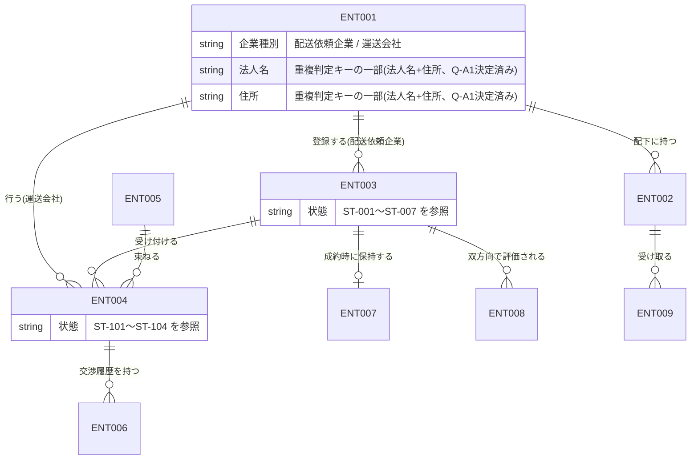
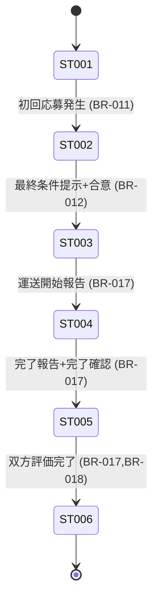
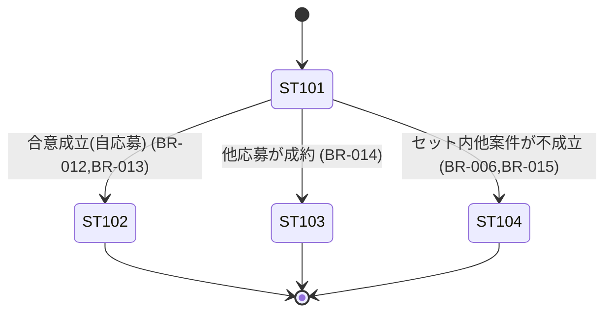

# データモデル（概念モデル）

> ID 凡例: [docs/凡例.md](../凡例.md) 参照
> 案件ステータスの名称・意味の正典は `用語集.md`「ステータス定義（正典）」。本ファイルの ST-001〜ST-007 は同表の名称と完全一致させる。

## 1. 主要エンティティ一覧

| ENT ID | エンティティ名 | 概要 | 主要属性（業務観点） | 関連機能 / UC | 関連業務ルール |
|--------|------------|------|----------------|-------------|------------|
| ENT-001 | テナント（企業アカウント） | 配送依頼企業 or 運送会社の企業単位アカウント | 企業種別、法人名、住所、会社電話番号、会社メールアドレス、支払方法種別、規約同意状態 | アカウント登録 / UC-001, UC-002 | BR-001 |
| ENT-002 | ユーザー | テナント配下のログイン単位 | ユーザー名（識別名）、ログイン ID（テナント内一意）、登録メールアドレス（パスワードリセット用・システム全体で一意、Q-NF1決定済み）、パスワード（ハッシュ化） | アカウント登録 / UC-003, UC-004 | BR-002, BR-003 |
| ENT-003 | 案件（Job） | 配送依頼企業が登録する積荷 1 件分の依頼 | from/to 場所・時刻、容積、属性、物品種別、希望トラック種別、希望金額、備考、ステータス | 案件登録・応募・交渉合意成約 / UC-007〜UC-016 | BR-011, BR-013, BR-017, BR-019 |
| ENT-004 | 応募（Bid） | 運送会社が 1 案件に対して行う 1 提案 | 提示金額、ステータス、応募日時 | 応募 / UC-011〜UC-013 | BR-004, BR-009, BR-010 |
| ENT-005 | セット応募（SetBid） | 複数の応募を束ね、オール・オア・ナッシングで扱う提案単位 | 対象応募一覧、対象配送依頼企業（同一テナント制約） | 応募 / UC-012 | BR-005, BR-006, BR-007, BR-008 |
| ENT-006 | 連絡メッセージ（Message） | 案件・応募単位の交渉メッセージ（定型文/自由入力） | 送信者、本文、送信日時 | 交渉合意成約 / UC-014 | BR-013（成約時スナップショットへの取り込み） |
| ENT-007 | 成約スナップショット（ContractSnapshot） | 合意成立時点の合意内容の複製（以後編集不可） | 合意金額、from/to 場所・日時、トラック種別、双方の企業/担当者情報、合意時点のメッセージ情報 | 交渉合意成約 / UC-016 | BR-013 |
| ENT-008 | 評価（Rating） | 完了案件について当事者双方が相手に付ける評価 | 評価者、被評価者、評価値（★1〜5の5段階、Q-DM5決定済み）、コメント | 評価 / UC-020 | BR-017, BR-018 |
| ENT-009 | 通知（Notification） | ユーザー宛のアプリ内通知 | 種別（成約 / その他一律）、本文、既読状態、関連案件 ID | 通知 / UC-021 | BR-014, BR-015, BR-024, BR-025 |

## 2. 概念 ER 図

## 3. エンティティ状態と状態遷移

### ENT-003 案件 の状態遷移

> 名称・意味の正典は `用語集.md`。ここでは状態 ID（ST-XXX）と遷移条件のみを扱う。

| ST ID | 状態名 | 説明 | 遷移先（ST-XXX） | 遷移条件（BR-XXX 等） |
|-------|------|------|------------------|--------------------|
| ST-001 | 募集中 | 登録直後。誰でも応募可能 | ST-002 | 初回応募の発生（BR-011） |
| ST-002 | 交渉中 | 1 社以上が応募し交渉開始 | ST-003 | 最終条件提示＋合意（BR-012） |
| ST-003 | 成約済 | 双方合意により契約成立 | ST-004 | 運送会社の運送開始報告（BR-017） |
| ST-004 | 運送中 | 運送会社が運送開始を報告中 | ST-005 | 完了報告＋完了確認（BR-017） |
| ST-005 | 完了 | 運送会社完了報告＋配送依頼企業確認済 | ST-006 | 双方の評価登録完了（BR-017, BR-018） |
| ST-006 | 評価済 | 双方の評価が完了 | なし（終端） | — |
| ST-007 | キャンセル | 成約前キャンセル | — | **第 1 版では未使用（将来用）。ST-001/ST-002 からの遷移条件は定義しない** |

> ST-007（キャンセル）は将来拡張用として ID のみ予約し、第 1 版の状態遷移図には接続しない（`用語集.md` の注記と整合）。

### ENT-004 応募 の状態遷移

| ST ID | 状態名 | 説明 | 遷移先（ST-XXX） | 遷移条件（BR-XXX 等） |
|-------|------|------|------------------|--------------------|
| ST-101 | 応募中 | 応募が登録され交渉が可能な状態 | ST-102 / ST-103 / ST-104 | — |
| ST-102 | 成約 | 当該応募が合意成立し案件が成約済になった | 終端 | 最終条件提示+合意（BR-012, BR-013） |
| ST-103 | クローズ（他社成約） | 同一案件の他応募が成約したためクローズ | 終端 | BR-014 |
| ST-104 | クローズ（セット連動不成立） | 自身が属するセット応募の他案件が不成立になったためクローズ | 終端 | BR-006, BR-015 |

> セット応募（ENT-005）自体は独立した状態 ID を持たず、内包する応募（ENT-004）群の状態から導出される（すべて ST-102 でセット成立、いずれかが ST-103/ST-104 相当になった時点でセット全体が不成立）。

## 4. データ保持・スナップショット方針

| 対象エンティティ（ENT-XXX） | 保持期間 | スナップショット要否 | 関連業務ルール |
|---------------------------|---------|-------------------|------------|
| ENT-003 案件（募集中・交渉中） | 論理削除後 24 時間、その後物理削除 | 不要 | BR-022 |
| ENT-003 案件（成約済〜評価済） | 無期限（将来期間制限を追加予定） | 成約時に ENT-007 として保持 | BR-013, BR-023 |
| ENT-004 応募 | 案件（募集中・交渉中）の物理削除に合わせて同時に物理削除する（Q-DM4 決定済み） | 不要（内容は ENT-007 に転記） | BR-013 |
| ENT-006 連絡メッセージ | 案件（募集中・交渉中）の物理削除に合わせて同時に物理削除する（Q-DM4 決定済み） | 不要（成約済み案件のメッセージは ENT-007 に転記済み） | BR-013, BR-022 |
| ENT-007 成約スナップショット | 案件の取引履歴保存期間に準ずる（無期限） | 該当（本体） | BR-013, BR-023 |
| ENT-008 評価 | 無期限、登録後編集不可 | 不要 | BR-018 |
| ENT-009 通知 | 90 日間、経過後は自動削除（Q-NF10 決定済み）。案件の物理削除時も通知自体は物理削除の対象としない（Q-DM4 決定済み） | 不要 | BR-024, BR-025 |

## 5. 開かれた論点（クローズ済み）

> Q-A1・Q-DM2・Q-DM3・Q-DM4・Q-DM5・Q-NF10 は closed 済み（`オープン課題.md` 参照）。決定内容は本ファイルの ENT-001（法人名+住所）・ENT-008（★1〜5）・4 節データ保持表（ENT-004/ENT-006/ENT-009）に反映済み。物品種別・希望トラック種別・属性（Q-DM2）、容積・希望金額の単位（Q-DM3）の確定値は `functional/案件登録.md` および `コード値定義.md` を参照。

| # | 論点 | 影響範囲（ENT-XXX / 機能） | 対応する Q-ID | 状態 |
|---|------|------------------------|--------------|------|
| 1 | 法人重複判定の照合キー | ENT-001 / アカウント登録 | Q-A1 | closed |
| 2 | 容積・希望金額の単位 | ENT-003 / 案件登録 | Q-DM3 | closed |
| 3 | 物品種別・希望トラック種別・属性のマスタ初期値 | ENT-003 / 案件登録 | Q-DM2 | closed |
| 4 | 案件物理削除時の関連データ（応募・連絡履歴・通知）の扱い | ENT-003, ENT-004, ENT-006, ENT-009 / 案件削除 | Q-DM4 | closed |
| 5 | 評価値のスケール（★の段階数） | ENT-008 / 評価 | Q-DM5 | closed |
| 6 | 通知の保持期間 | ENT-009 / 通知 | Q-NF10 | closed |
