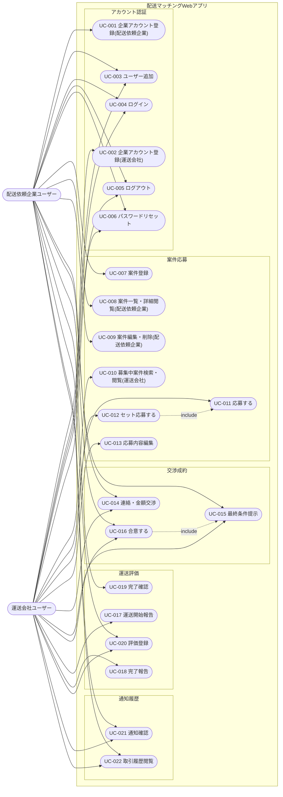

# ユースケース図

> ID 凡例: [docs/凡例.md](../凡例.md) 参照

## アクター一覧

| アクター | 種別（人/外部システム） | 説明 |
|---------|------------------|------|
| 配送依頼企業ユーザー | 人 | 配送を依頼する企業のテナントに所属するユーザー。案件登録・審査・交渉・合意・評価を行う。 |
| 運送会社ユーザー | 人 | 運送を担う企業のテナントに所属するユーザー。応募・交渉・運送実施報告・評価を行う。 |

## ユースケース図

## ユースケース一覧

| UC ID | ユースケース名 | 主アクター | 関連機能 | 関連業務フロー（ACT-XXX） | 概要 |
|-------|------------|----------|---------|------------------------|------|
| UC-001 | 企業アカウント登録（配送依頼企業） | 配送依頼企業ユーザー | アカウント登録 | ACT-004 | 企業共通項目＋初回ユーザー情報を登録しテナントを発行する |
| UC-002 | 企業アカウント登録（運送会社） | 運送会社ユーザー | アカウント登録 | ACT-004 | 同上（運送会社側） |
| UC-003 | ユーザー追加 | 両者 | アカウント登録 | - | 既存テナント配下に新規ユーザーを追加する |
| UC-004 | ログイン | 両者 | 認証 | - | ログイン ID・パスワードで認証する |
| UC-005 | ログアウト | 両者 | 認証 | - | セッションを終了する |
| UC-006 | パスワードリセット | 両者 | 認証 | - | メールで再設定 URL を受け取りパスワードを再設定する |
| UC-007 | 案件登録 | 配送依頼企業ユーザー | 案件登録 | ACT-001 | 積荷情報を入力し案件を「募集中」で登録する |
| UC-008 | 案件一覧・詳細閲覧（配送依頼企業） | 配送依頼企業ユーザー | 案件登録 | ACT-001 | 自社案件の一覧・詳細・応募状況を確認する |
| UC-009 | 案件編集・削除（配送依頼企業） | 配送依頼企業ユーザー | 案件削除 | ACT-005 | 募集中・交渉中の案件を編集・削除する |
| UC-010 | 募集中案件検索・閲覧（運送会社） | 運送会社ユーザー | 応募 | ACT-001 | 募集中案件を検索・絞り込みして閲覧する |
| UC-011 | 応募する | 運送会社ユーザー | 応募 | ACT-001 | 案件に対して金額・条件を応募する |
| UC-012 | セット応募する | 運送会社ユーザー | 応募 | ACT-001 | 複数案件をまとめて 1 つの提案として応募する（UC-011 を内包） |
| UC-013 | 応募内容編集 | 運送会社ユーザー | 応募 | ACT-001 | 成約前の応募内容を編集する |
| UC-014 | 連絡・金額交渉 | 両者 | 交渉合意成約 | ACT-001 | 定型文・自由入力メッセージで交渉する |
| UC-015 | 最終条件提示 | 両者 | 交渉合意成約 | ACT-001 | 合意に向けた最終条件を提示する |
| UC-016 | 合意する | 両者 | 交渉合意成約 | ACT-001 | 提示された最終条件に合意し成約処理を発生させる（UC-015 を前提とする） |
| UC-017 | 運送開始報告 | 運送会社ユーザー | 運送ステータス報告 | ACT-002 | 運送開始をステータス報告する |
| UC-018 | 完了報告 | 運送会社ユーザー | 運送ステータス報告 | ACT-002 | 運送完了をステータス報告する |
| UC-019 | 完了確認 | 配送依頼企業ユーザー | 運送ステータス報告 | ACT-002 | 完了報告内容を確認し完了とする |
| UC-020 | 評価登録 | 両者 | 評価 | ACT-003 | 相手に対する★評価を登録する |
| UC-021 | 通知確認 | 両者 | 通知 | - | 通知一覧を確認し既読にする |
| UC-022 | 取引履歴閲覧 | 両者 | 取引履歴 | - | 成約済〜評価済の過去案件を閲覧する |
