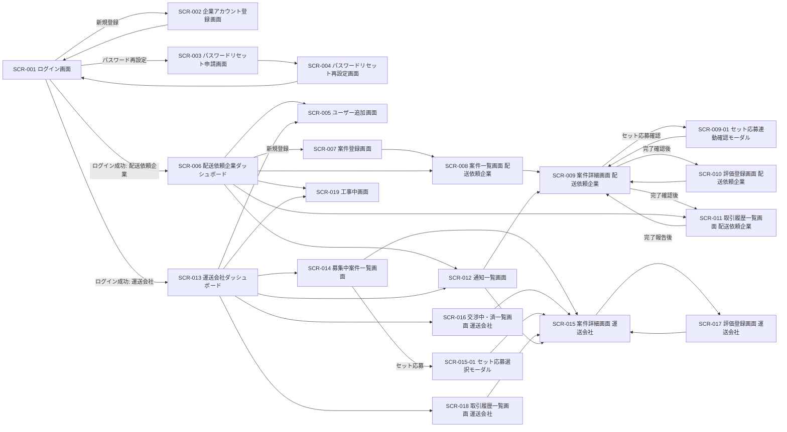

# 画面一覧と画面遷移

> ID 凡例: [docs/凡例.md](../凡例.md) 参照

## 画面一覧

| 画面 ID | 画面名 | 目的 | 主要遷移元 | 主要遷移先 | 認証 |
|--------|------|------|----------|----------|------|
| SCR-001 | ログイン画面 | ログイン ID・パスワードによる認証 | SCR-002, SCR-004, ログアウト操作 | SCR-006（配送依頼企業）/ SCR-013（運送会社） | 不要 |
| SCR-002 | 企業アカウント登録画面 | 企業アカウント（テナント）と初回ユーザーの登録 | SCR-001 | SCR-001 | 不要 |
| SCR-003 | パスワードリセット申請画面 | 登録メールアドレス宛にリセット URL を送付 | SCR-001 | SCR-001（案内表示） | 不要 |
| SCR-004 | パスワードリセット再設定画面 | メールのリンクから新パスワードを設定 | リセットメールのリンク | SCR-001 | 不要（リンクトークンで一時認証） |
| SCR-005 | ユーザー追加画面 | 既存テナント配下への新規ユーザー追加 | SCR-006, SCR-013 | SCR-006, SCR-013 | 必要 |
| SCR-006 | 配送依頼企業ダッシュボード | 案件のステータス別一覧・new 表示・通知アイコン | SCR-001 | SCR-007, SCR-008, SCR-009, SCR-012 | 必要 |
| SCR-007 | 案件登録画面 | 案件（積荷）情報の新規登録 | SCR-006, SCR-008 | SCR-008 | 必要 |
| SCR-008 | 案件一覧画面（配送依頼企業） | 「募集中（未受注）」「交渉中・済」の一覧 | SCR-006 | SCR-009, SCR-007 | 必要 |
| SCR-009 | 案件詳細画面（配送依頼企業） | 案件情報・応募運送会社一覧・連絡履歴・最終条件提示/合意・完了確認・評価登録・削除 | SCR-008, SCR-012 | SCR-008, SCR-009-01, SCR-010, SCR-011 | 必要 |
| SCR-009-01 | セット応募連動確認モーダル（配送依頼企業向け） | セット応募の連動案件を確認しセット一括承認する | SCR-009 | SCR-009 | 必要 |
| SCR-010 | 評価登録画面（配送依頼企業） | 完了案件について運送会社を★評価 | SCR-009 | SCR-009, SCR-011 | 必要 |
| SCR-011 | 取引履歴一覧画面（配送依頼企業） | 成約済〜評価済の過去案件一覧 | SCR-006 | SCR-009（読み取り専用） | 必要 |
| SCR-012 | 通知一覧画面 | 通知の一覧・既読化・該当案件への遷移（配送依頼企業/運送会社共通） | SCR-006, SCR-013 | SCR-009, SCR-015 | 必要 |
| SCR-013 | 運送会社ダッシュボード | 募集中案件サマリ・自社応募状況・new 表示・通知アイコン | SCR-001 | SCR-014, SCR-016, SCR-018 | 必要 |
| SCR-014 | 募集中案件一覧画面（運送会社） | 募集中案件の検索・絞り込み・応募 | SCR-013 | SCR-015 | 必要 |
| SCR-015 | 案件詳細画面（運送会社） | 案件詳細・応募/応募編集・セット応募・交渉・運送ステータス報告・評価登録 | SCR-014, SCR-016, SCR-012 | SCR-014, SCR-015-01, SCR-016, SCR-017, SCR-018 | 必要 |
| SCR-015-01 | セット応募選択モーダル（運送会社向け） | 同一配送依頼企業の複数案件を選択して一括応募 | SCR-014, SCR-015 | SCR-015 | 必要 |
| SCR-016 | 交渉中・済一覧画面（運送会社） | 自社が応募済みの案件一覧 | SCR-013 | SCR-015 | 必要 |
| SCR-017 | 評価登録画面（運送会社） | 完了案件について配送依頼企業を★評価 | SCR-015 | SCR-015, SCR-018 | 必要 |
| SCR-018 | 取引履歴一覧画面（運送会社） | 自社の成約案件履歴（無期限保存） | SCR-013 | SCR-015（読み取り専用） | 必要 |
| SCR-019 | 工事中画面（問い合わせ案内） | 本格的な問い合わせフォーム未整備時の案内表示 | 共通ヘッダーの問い合わせ導線 | 直前の画面 | 必要 |

> サブ画面・モーダルは `SCR-009-01`・`SCR-015-01` のように枝番で表現している。

## 画面遷移図

## 画面ごとの目的・主要操作

### SCR-001 ログイン画面

- 目的: 発行済みのログイン ID・パスワードで認証する
- 主要操作: ログイン、新規登録画面への遷移、パスワードリセット申請画面への遷移
- 表示する主要情報: ログイン ID 入力欄、パスワード入力欄、エラーメッセージ（MSG-015, MSG-016）
- 関連機能要件: `functional/認証.md`

### SCR-002 企業アカウント登録画面

- 目的: 企業共通項目・初回ユーザー項目を入力し企業アカウント（テナント）を発行する
- 主要操作: 企業種別選択、各種項目入力、利用規約同意チェック、登録
- 表示する主要情報: 入力フォーム、重複エラー・入力エラー表示（MSG-014, MSG-018）
- 関連機能要件: `functional/アカウント登録.md`

### SCR-006 配送依頼企業ダッシュボード

- 目的: 自社案件のステータス別サマリ・new 表示・未読通知件数を俯瞰する
- 主要操作: 案件登録画面・一覧・詳細・通知一覧への遷移
- 表示する主要情報: ステータス別件数、24 時間以内更新の new 表示、通知アイコン（未読件数、上限 9+）
- 関連機能要件: `functional/案件登録.md`、`functional/通知.md`

### SCR-008 案件一覧画面（配送依頼企業）

- 目的: 自社案件を「募集中（未受注）」「交渉中・済」の 2 区分で一覧する
- 主要操作: 一覧からの詳細遷移、新規登録画面への遷移
- 表示する主要情報: 案件ステータス、new 表示
- 関連機能要件: `functional/案件登録.md`

### SCR-009 案件詳細画面（配送依頼企業）

- 目的: 案件情報・応募運送会社一覧と提示条件・連絡履歴を確認し、交渉・最終条件提示・合意・完了確認・評価・削除までを行う
- 主要操作: メッセージ送信、最終条件提示、合意する、完了確認、評価登録画面への遷移、削除（募集中・交渉中のみ）
- 表示する主要情報: 応募一覧（セット応募は連動案件を明示）、連絡履歴（各メッセージに送信者のユーザー名を表示）、ステータス、成約後は成約スナップショット
- 関連機能要件: `functional/交渉合意成約.md`、`functional/運送ステータス報告.md`、`functional/案件削除.md`

### SCR-012 通知一覧画面

- 目的: 通知の一覧表示・既読化・該当案件への遷移
- 主要操作: 通知クリックによる該当案件への遷移（既読化）
- 表示する主要情報: 通知種別（成約 / その他）、既読・未読状態
- 関連機能要件: `functional/通知.md`

### SCR-013 運送会社ダッシュボード

- 目的: 募集中案件のサマリ・自社応募案件の状況・new 表示・未読通知件数を俯瞰する
- 主要操作: 募集中一覧・交渉中一覧・取引履歴・通知一覧への遷移
- 表示する主要情報: 募集中案件サマリ、自社応募状況、通知アイコン
- 関連機能要件: `functional/応募.md`、`functional/通知.md`

### SCR-014 募集中案件一覧画面（運送会社）

- 目的: 募集中案件をソート・絞り込み・自由入力検索で探し応募する
- 主要操作: 絞り込み条件指定、案件詳細への遷移、セット応募モーダルの起動
- 表示する主要情報: 絞り込み例（都道府県、時間帯 等）
- 関連機能要件: `functional/応募.md`

### SCR-015 案件詳細画面（運送会社）

- 目的: 案件詳細・応募/応募編集・セット応募・競合表示・連絡・運送ステータス報告・評価登録を行う
- 主要操作: 応募、応募編集（成約前）、セット応募、メッセージ送信、最終条件提示、合意する、運送開始/完了報告、評価登録画面への遷移
- 表示する主要情報: 競合表示（他社金額のみ匿名表示、成約後は非表示）、連絡先表示（段階制御）、連絡履歴（各メッセージに送信者のユーザー名を表示）
- 関連機能要件: `functional/応募.md`、`functional/交渉合意成約.md`、`functional/運送ステータス報告.md`

### SCR-019 工事中画面（問い合わせ案内）

- 目的: 本格的な問い合わせフォームを整備していない第 1 版において、不具合報告・問い合わせの導線を簡易に案内する
- 主要操作: なし（案内表示のみ）
- 表示する主要情報: 案内文言
- 関連機能要件: なし（非機能要件.md のサポート方針を参照）
